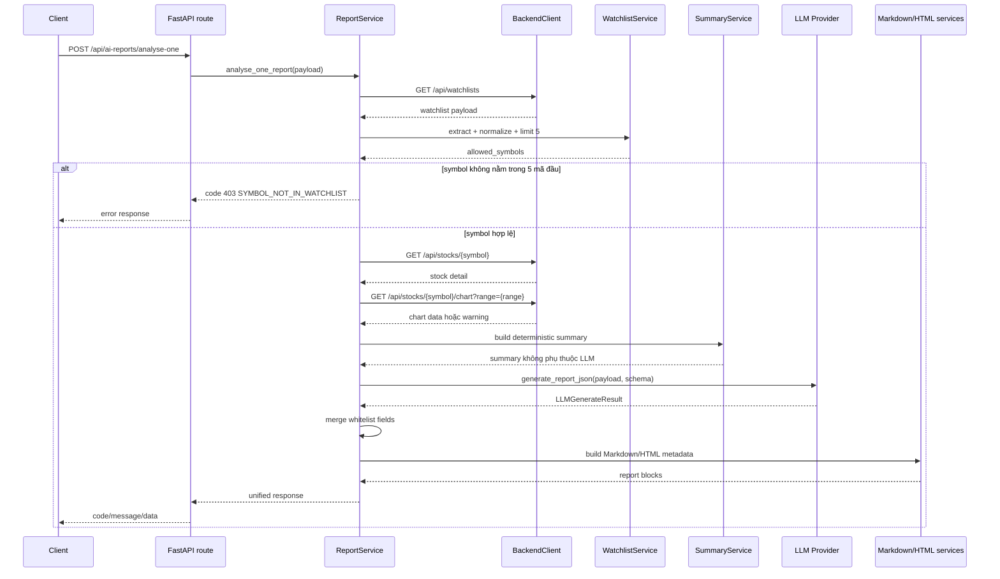

# Báo cáo hợp nhất `analyse-gemini` và `analyse-openai`

## 1. Mục tiêu thực hiện

Mục tiêu là hợp nhất hai hướng triển khai `analyse-gemini` và `analyse-openai` thành một service FastAPI thống nhất trong thư mục `analyse/`.

Kết quả sau chỉnh sửa:

- Chỉ còn một service source chính: `analyse/`.
- Endpoint chính dùng chung: `POST /api/ai-reports/analyse-one`.
- OpenAI và Gemini dùng cùng request schema, response schema, provider metadata và flow xử lý Backend.
- Provider chỉ xử lý gọi model, parse output và trả `LLMGenerateResult`.
- Business logic nằm trong `services`, route vẫn mỏng, schema nằm trong `schemas`, cấu hình nằm trong `config/settings.py`.
- LLM chỉ được merge các field diễn giải; dữ liệu định lượng vẫn do Backend/code quyết định.

## 2. Phạm vi source code đã đọc

Đã kiểm tra và so sánh các phần sau trước khi chỉnh sửa:

- `analyse/`
- `analyse-gemini/`
- `analyse-openai/`
- `README.md` ở root
- `analyse/README.md`
- `analyse/.env.example`
- `analyse/env_example`
- `analyse/requirements.txt`
- `analyse/pyproject.toml`
- `analyse/run.py`
- toàn bộ file dưới `analyse/src/analyse`
- toàn bộ file dưới `analyse/tests`
- toàn bộ file dưới `analyse/src/analyse/examples`
- tài liệu bổ sung `C:\Users\phuck\Downloads\ANALYSE_SOURCE_CODE_REPORT.md` sau khi user cung cấp đường dẫn
- prompt gốc `C:\Users\phuck\Downloads\implementation_prompt_merge_analyse.md` sau khi user cung cấp đường dẫn
- các file Backend liên quan đến API contract:
  - `api/src/modules/watchlists/watchlists.service.js`
  - `api/src/modules/watchlists/watchlists.controller.js`
  - `api/src/modules/watchlists/watchlists.routes.js`
  - `api/src/modules/stocks/stocks.service.js`
  - `api/src/modules/stocks/stocks.controller.js`
  - `api/src/common/utils/response.util.js`

Ghi chú: ở lần quét ban đầu, `ANALYSE_SOURCE_CODE_REPORT.md` **chưa thấy trong source code** tại workspace root `D:\SWD\BE_AI_Stock_Trend_Prediction`. Sau khi user cung cấp đường dẫn, đã đọc file từ `C:\Users\phuck\Downloads\ANALYSE_SOURCE_CODE_REPORT.md`. Nội dung báo cáo nguồn này mô tả hiện trạng trước merge và khớp với các vấn đề đã xử lý: OpenAI provider placeholder, LLM output chưa được merge, `env_example` trùng `.env.example`, chart API chưa được dùng trong flow chính, external research/scoring/HTML còn placeholder.

## 3. Hiện trạng trước khi chỉnh sửa

Trước khi chỉnh sửa:

- `analyse/` và `analyse-gemini/` giống nhau theo hash source chính; `analyse/` được xem là baseline Gemini.
- `analyse-openai/` có OpenAI provider thật hơn nhưng thiếu Gemini dependency trong `pyproject.toml`.
- `C:\Users\phuck\Downloads\ANALYSE_SOURCE_CODE_REPORT.md` xác nhận hiện trạng trước merge: service đã có endpoint `/api/ai-reports/analyse-one`, Gemini có gọi SDK thật, OpenAI còn placeholder, output LLM chưa đi vào response cuối, external research/scoring/HTML còn scaffold.
- `analyse/src/analyse/providers/openai_provider.py` trong service chính vẫn là placeholder `not_implemented`.
- `analyse/src/analyse/providers/gemini_provider.py` có gọi Gemini, nhưng có logic bảo vệ/ghi đè field định lượng nằm trong provider.
- `ReportService.analyse_one_report()` có gọi LLM nhưng chưa merge `llm_result.data` vào `summary` hoặc Markdown.
- `AnalyseOneReportRequest` chưa có field top-level `model`.
- `Settings` chưa có `DEFAULT_LLM_PROVIDER` và `ALLOW_REQUEST_MODEL_OVERRIDE`.
- Có hai file env mẫu: `.env.example` và `env_example`.
- README còn mô tả nhiều phần là skeleton/placeholder và model dạng `*-model-configurable`.

## 4. Kiến trúc sau khi hợp nhất

Kiến trúc sau chỉnh sửa:

```text
Client/Frontend
  -> FastAPI route
  -> ReportService
  -> BackendClient
  -> WatchlistService / StockDataService / SummaryService / ScoringService
  -> OpenAIProvider hoặc GeminiProvider
  -> merge output LLM theo whitelist
  -> Markdown/HTML metadata
  -> response JSON thống nhất
```

Nguyên tắc tách trách nhiệm:

- `api/routes.py`: chỉ khai báo route và gọi service.
- `services/report_service.py`: điều phối flow chính.
- `services/summary_service.py`: tạo summary deterministic.
- `services/scoring_service.py`: giữ scoring placeholder an toàn.
- `services/markdown_service.py`: tạo Markdown fallback và đảm bảo disclaimer.
- `providers/*`: chỉ gọi model, parse output, trả `LLMGenerateResult`.
- `schemas/*`: định nghĩa request/response/LLM schema.
- `config/settings.py`: đọc toàn bộ biến môi trường.

## 5. Các folder/file đã hợp nhất

| Nhóm | File/Folder cũ | File/Folder mới | Ghi chú |
|---|---|---|---|
| Service Gemini | `analyse-gemini/` | `analyse/` | Baseline Gemini đã được merge vào `analyse`; folder cũ đã xóa khỏi workspace. |
| Service OpenAI | `analyse-openai/` | `analyse/` | OpenAI provider và schema output được đưa vào service chung; folder cũ đã xóa khỏi workspace. |
| Env mẫu | `analyse/env_example` | `analyse/.env.example` | Xóa file duplicate, giữ một env mẫu sạch đúng yêu cầu. |
| Provider Gemini | `analyse-gemini/src/analyse/providers/gemini_provider.py` | `analyse/src/analyse/providers/gemini_provider.py` | Giữ gọi Gemini, bỏ business merge khỏi provider. |
| Provider OpenAI | `analyse-openai/src/analyse/providers/openai_provider.py` | `analyse/src/analyse/providers/openai_provider.py` | Thay placeholder bằng OpenAI provider thật. |
| LLM schema | `analyse-openai/src/analyse/schemas/llm.py` | `analyse/src/analyse/schemas/llm.py` | Bổ sung schema output narrative-only dùng chung. |
| README | README cũ trong `analyse/` | `analyse/README.md` | Viết lại theo trạng thái unified service. |

## 6. Các file đã chỉnh sửa/tạo mới

| File | Thay đổi chính | Lý do |
|---|---|---|
| `.gitignore` | Thêm rule unignore `.env.example` và `**/.env.example`. | Đảm bảo env sample bắt buộc có thể được track, trong khi `.env` thật vẫn bị ignore. |
| `analyse/.env.example` | Viết lại env mẫu sạch, thêm `DEFAULT_LLM_PROVIDER`, `ALLOW_REQUEST_MODEL_OVERRIDE`, OpenAI/Gemini defaults. | Đáp ứng cấu hình unified service. |
| `analyse/env_example` | Xóa. | Tránh hai file env mẫu song song. |
| `analyse/README.md` | Viết lại bằng tiếng Việt: cài đặt, provider/model, request/response, Backend API, merge strategy, test, giới hạn. | Tài liệu hóa service sau hợp nhất. |
| `analyse/pyproject.toml` | Thêm `pytest`, `tzdata`; giữ `openai`, `google-genai`. | Hỗ trợ `uv run pytest` và timezone trên Windows. |
| `analyse/uv.lock` | Cập nhật bằng `uv run pytest`. | Đồng bộ lockfile với `pyproject.toml`. |
| `analyse/src/analyse/config/settings.py` | Thêm `default_llm_provider`, `allow_request_model_override`; cập nhật model defaults; external research default false. | Hỗ trợ toàn bộ biến trong `.env.example`. |
| `analyse/src/analyse/schemas/common.py` | Đặt `ProviderName = Literal["openai", "gemini"]`. | Chuẩn hóa provider được hỗ trợ. |
| `analyse/src/analyse/schemas/report.py` | Thêm `model: str | None`; cho `provider` optional để dùng env default. | Hỗ trợ request-level model override và default provider. |
| `analyse/src/analyse/schemas/llm.py` | Thêm `LLMSystemDecisionOutput`, `LLMMarkdownOutput`, `LLMReportOutput`. | Chuẩn hóa output narrative-only từ LLM. |
| `analyse/src/analyse/providers/base.py` | Giữ `BaseLLMProvider`; thêm `normalize_llm_report_output()`. | Ép mọi provider về cùng schema output. |
| `analyse/src/analyse/providers/openai_provider.py` | Thay placeholder bằng provider gọi `AsyncOpenAI.responses.parse`. | OpenAI chạy cùng contract với Gemini. |
| `analyse/src/analyse/providers/gemini_provider.py` | Refactor provider: disabled/missing key/fail safe, parse JSON, không merge business. | Giữ provider mỏng và thống nhất. |
| `analyse/src/analyse/providers/provider_factory.py` | Thêm tham số `model`. | Hỗ trợ request-level model override. |
| `analyse/src/analyse/prompts/system_prompts.py` | Cập nhật prompt chỉ cho LLM sinh field diễn giải. | Ngăn LLM sửa số liệu. |
| `analyse/src/analyse/prompts/report_prompts.py` | Thêm schema instruction vào prompt builder. | Dùng chung cho OpenAI/Gemini. |
| `analyse/src/analyse/services/report_service.py` | Cập nhật flow chính, provider/model selection, chart fetch, LLM merge whitelist, risk defaults. | Hợp nhất business flow. |
| `analyse/src/analyse/services/stock_data_service.py` | Thêm `normalize_stock_chart()` và `merge_chart_history()`. | Dùng chart API Backend nếu có dữ liệu. |
| `analyse/src/analyse/services/summary_service.py` | Thêm momentum đơn giản từ chart và `data_quality_notes`. | Summary deterministic hơn. |
| `analyse/src/analyse/services/watchlist_service.py` | Parse symbol từ `stock`, `stock_id`, `stock_code`. | Phù hợp payload Backend watchlist hiện tại. |
| `analyse/src/analyse/services/markdown_service.py` | Thêm `finalize_content()` để đảm bảo disclaimer trong Markdown LLM. | Giữ disclaimer bắt buộc. |
| `analyse/src/analyse/examples/sample_analyse_one_request.json` | Tạo request mẫu endpoint chính. | Minh họa contract mới. |
| `analyse/src/analyse/examples/sample_analysis_result.json` | Cập nhật provider status/model mẫu. | Phản ánh unified response. |
| `analyse/tests/test_provider_factory.py` | Test OpenAI, Gemini, invalid provider, model override. | Phủ provider factory. |
| `analyse/tests/test_settings.py` | Test các biến LLM selection/model. | Phủ settings mới. |
| `analyse/tests/test_report_schema.py` | Test provider, model, `scopeExchange`, options aliases. | Phủ request schema. |
| `analyse/tests/test_analyse_one_flow.py` | Test watchlist limit, symbol ngoài watchlist, provider chọn đúng, fallback model, merge LLM, không overwrite số. | Phủ ReportService. |
| `analyse/tests/test_endpoint_contract.py` | Test endpoint trả cùng shape cho OpenAI/Gemini. | Phủ API contract. |
| `analyse/tests/test_backend_client.py` | Bổ sung test URL config. | Phủ BackendClient nhẹ. |

## 7. Chuẩn request/response chung

### 7.1. Request chuẩn

```json
{
  "provider": "openai",
  "model": "gpt-4.1-mini",
  "symbol": "FPT",
  "scopeExchange": "HOSE",
  "options": {
    "language": "vi",
    "riskProfile": "medium",
    "timeHorizon": "medium_term",
    "includeExternalResearch": true,
    "renderMarkdown": true,
    "renderHtml": true,
    "capitalVnd": 100000000,
    "riskPerTradePct": 1.0,
    "maxPositionPct": 12.0
  }
}
```

Ghi chú:

- `provider` hỗ trợ `openai` và `gemini`.
- `provider` có thể bỏ trống; khi đó service dùng `DEFAULT_LLM_PROVIDER`.
- `model` optional.
- `scopeExchange` alias được giữ.
- Các alias trong `options` được giữ.

### 7.2. Response chuẩn

```json
{
  "code": 200,
  "message": "Tạo dữ liệu report thành công",
  "data": {
    "report_id": "FPT_HOSE_20260622_153000",
    "generated_at": "2026-06-22T15:30:00+07:00",
    "symbol": "FPT",
    "company": "Công ty Cổ phần FPT",
    "scope_exchange": "HOSE",
    "language": "vi",
    "summary_schema_version": "1.0",
    "provider": {
      "name": "openai",
      "model": "gpt-4.1-mini",
      "status": "success",
      "latency_ms": 1200
    },
    "data_sources": [],
    "summary": {},
    "markdown_report": {
      "available": true,
      "output_path": "reports/FPT_HOSE_20260622_153000.md",
      "content": "# Báo cáo phân tích cổ phiếu FPT..."
    },
    "html_report": {
      "available": true,
      "output_path": "reports/FPT_HOSE_20260622_153000.html",
      "content": null,
      "template_name": "src/analyse/services/html_service.py::build_metadata"
    },
    "warnings": []
  }
}
```

## 8. Cơ chế chọn provider/model

Code liên quan:

- `analyse/src/analyse/schemas/report.py::AnalyseOneReportRequest`
- `analyse/src/analyse/config/settings.py::Settings`
- `analyse/src/analyse/providers/provider_factory.py::get_llm_provider`
- `analyse/src/analyse/services/report_service.py::ReportService.analyse_one_report`

Cơ chế:

1. Nếu request có `provider`, dùng provider đó.
2. Nếu request không có `provider`, dùng `Settings.default_llm_provider`.
3. Nếu request có `model` và `ALLOW_REQUEST_MODEL_OVERRIDE=true`, truyền model đó vào `get_llm_provider()`.
4. Nếu request không có `model`, provider dùng model env:
   - OpenAI: `OPENAI_MODEL`
   - Gemini: `GEMINI_MODEL`
5. Nếu request có `model` nhưng `ALLOW_REQUEST_MODEL_OVERRIDE=false`, service dùng model env và thêm warning.

## 9. Cấu hình `.env.example` mới

| Biến môi trường | Mục đích | Provider liên quan | Bắt buộc | Giá trị mặc định |
|---|---|---|---|---|
| `ANALYSE_ENV` | Môi trường chạy app | Chung | Không | `development` |
| `ANALYSE_HOST` | Host FastAPI bind | Chung | Không | `0.0.0.0` |
| `ANALYSE_PORT` | Port FastAPI | Chung | Không | `5100` |
| `ANALYSE_LOG_LEVEL` | Mức log | Chung | Không | `INFO` |
| `ANALYSE_TIMEZONE` | Timezone tạo timestamp | Chung | Không | `Asia/Ho_Chi_Minh` |
| `PYTHONPATH` | Đường dẫn import local | Chung | Không | `src` |
| `BACKEND_API_BASE_URL` | Base URL Backend API | Chung | Có khi gọi Backend thật | `http://localhost:5000` |
| `BACKEND_API_TIMEOUT_MS` | Timeout Backend | Chung | Không | `30000` |
| `BACKEND_API_TOKEN` | Bearer token gọi Backend | Chung | Có nếu Backend yêu cầu auth | rỗng |
| `BACKEND_WATCHLIST_ENDPOINT` | Endpoint watchlist | Chung | Không | `/api/watchlists` |
| `BACKEND_STOCK_DETAIL_ENDPOINT` | Endpoint stock detail | Chung | Không | `/api/stocks/{symbol}` |
| `BACKEND_STOCK_CHART_ENDPOINT` | Endpoint chart | Chung | Không | `/api/stocks/{symbol}/chart?range={range}` |
| `REPORT_OUTPUT_DIR` | Thư mục output report | Chung | Không | `reports` |
| `REPORT_LANGUAGE` | Ngôn ngữ mặc định | Chung | Không | `vi` |
| `SUMMARY_SCHEMA_VERSION` | Version summary schema | Chung | Không | `1.0` |
| `MAX_WATCHLIST_SYMBOLS` | Số symbol watchlist tối đa xét | Chung | Không | `5` |
| `ANALYSE_ONE_SYMBOL_ONLY` | Bật rule phân tích một symbol | Chung | Không | `true` |
| `DEFAULT_LLM_PROVIDER` | Provider mặc định khi request không truyền | OpenAI/Gemini | Không | `openai` |
| `ALLOW_REQUEST_MODEL_OVERRIDE` | Cho phép request override model | OpenAI/Gemini | Không | `true` |
| `OPENAI_ENABLED` | Bật/tắt OpenAI provider | OpenAI | Không | `true` |
| `OPENAI_API_KEY` | API key OpenAI | OpenAI | Có khi gọi OpenAI thật | rỗng |
| `OPENAI_MODEL` | Model OpenAI mặc định | OpenAI | Không | `gpt-4.1-mini` |
| `OPENAI_TEMPERATURE` | Nhiệt độ OpenAI | OpenAI | Không | `0.2` |
| `OPENAI_MAX_OUTPUT_TOKENS` | Token output tối đa | OpenAI | Không | `8192` |
| `OPENAI_TIMEOUT_MS` | Timeout OpenAI | OpenAI | Không | `60000` |
| `OPENAI_JSON_MODE` | Cấu hình JSON mode | OpenAI | Không | `true` |
| `GEMINI_ENABLED` | Bật/tắt Gemini provider | Gemini | Không | `true` |
| `GEMINI_API_KEY` | API key Gemini | Gemini | Có khi gọi Gemini thật | rỗng |
| `GEMINI_MODEL` | Model Gemini mặc định | Gemini | Không | `gemini-1.5-flash` |
| `GEMINI_TEMPERATURE` | Nhiệt độ Gemini | Gemini | Không | `0.2` |
| `GEMINI_TOP_P` | Top-p Gemini | Gemini | Không | `0.9` |
| `GEMINI_MAX_OUTPUT_TOKENS` | Token output tối đa | Gemini | Không | `8192` |
| `GEMINI_TIMEOUT_MS` | Timeout Gemini | Gemini | Không | `60000` |
| `GEMINI_JSON_MODE` | Ép Gemini trả JSON | Gemini | Không | `true` |
| `ENABLE_EXTERNAL_RESEARCH` | Bật research ngoài | Chung | Không | `false` |
| `ENABLE_VIETSTOCK` | Bật adapter Vietstock | Chung | Không | `false` |
| `ENABLE_CAFEF` | Bật adapter CafeF | Chung | Không | `false` |
| `ENABLE_GOOGLE_NEWS_RSS` | Bật adapter Google News RSS | Chung | Không | `false` |
| `RESEARCH_CACHE_DIR` | Thư mục cache research | Chung | Không | `.research_cache` |
| `RESEARCH_CACHE_TTL_SECONDS` | TTL cache research | Chung | Không | `21600` |
| `RESEARCH_TIMEOUT_MS` | Timeout research | Chung | Không | `20000` |
| `MAX_RESEARCH_ITEMS` | Số item research tối đa | Chung | Không | `10` |
| `DEFAULT_CAPITAL_VND` | Vốn mặc định tính sizing | Chung | Không | `100000000` |
| `DEFAULT_RISK_PER_TRADE_PCT` | Rủi ro/lệnh mặc định | Chung | Không | `1.0` |
| `DEFAULT_MAX_POSITION_PCT` | Tỷ trọng tối đa mặc định | Chung | Không | `12.0` |

## 10. Luồng xử lý `/api/ai-reports/analyse-one`



## 11. Luồng provider OpenAI

File chính: `analyse/src/analyse/providers/openai_provider.py`

Luồng:

1. `OpenAIProvider.__init__()` nhận `settings`, `model` optional và `client` optional.
2. Nếu `OPENAI_ENABLED=false`, trả `LLMGenerateResult.status="disabled"`.
3. Nếu thiếu `OPENAI_API_KEY` và không inject client test, trả `status="failed"` với warning an toàn.
4. Gọi `build_report_prompt(context=payload, schema=schema)`.
5. Gọi `AsyncOpenAI.responses.parse()` với `text_format=LLMReportOutput`.
6. Parse output bằng `normalize_llm_report_output()`.
7. Trả `LLMGenerateResult(provider="openai", model=selected_model, status="success", latency_ms=...)`.
8. Nếu lỗi SDK/API, trả `status="failed"` và không lộ secret.

## 12. Luồng provider Gemini

File chính: `analyse/src/analyse/providers/gemini_provider.py`

Luồng:

1. `GeminiProvider.__init__()` nhận `settings`, `model` optional và `client` optional.
2. Nếu `GEMINI_ENABLED=false`, trả `LLMGenerateResult.status="disabled"`.
3. Nếu thiếu `GEMINI_API_KEY` và không inject client test, trả `status="failed"` với warning an toàn.
4. Gọi `build_report_prompt(context=payload, schema=schema)`.
5. Gọi `google.genai.Client.models.generate_content()`.
6. Extract text từ `response.text` hoặc candidates/parts.
7. Parse JSON bằng `safe_json_loads()`.
8. Chuẩn hóa output bằng `normalize_llm_report_output()`.
9. Trả `LLMGenerateResult(provider="gemini", model=selected_model, status="success", latency_ms=...)`.
10. Nếu timeout/API lỗi, trả `status="failed"` và không lộ secret.

## 13. Cách merge LLM output vào report

Code chính: `ReportService._merge_llm_output()`.

Chỉ merge các field:

- `strengths`
- `weaknesses`
- `system_decision.reasons`
- `markdown_report.content`
- `data_quality_notes`

Cơ chế:

- List text được merge kiểu append-unique.
- `system_decision.status`, `system_decision.action`, `blockers`, `note` không bị LLM thay.
- `data_quality_notes` được đưa vào `summary["data_quality_notes"]` và `summary["bctc_3q"]["data_quality_notes"]`.
- Nếu LLM có Markdown hợp lệ, `MarkdownService.finalize_content()` dùng nội dung đó và tự thêm disclaimer nếu thiếu.
- Nếu LLM lỗi hoặc không có Markdown, `MarkdownService.build()` tạo fallback.

## 14. Cách bảo vệ dữ liệu định lượng không bị LLM sửa

Dữ liệu định lượng được bảo vệ bằng whitelist merge ở service layer.

LLM có trả các field như sau cũng không được dùng:

- `latest_market`
- `scores`
- `financial_balance`
- `bctc_3q.periods`
- `investment_plan.reference_levels`
- `investment_plan.position_sizing`
- `raw Backend data`

Test liên quan:

- `analyse/tests/test_analyse_one_flow.py::test_llm_output_is_merged_without_overwriting_numeric_fields`

Test này cho LLM giả trả `latest_market.close_price=999999` và `scores.overall_score=100`, nhưng response cuối vẫn giữ:

- `summary.latest_market.close_price == 100.0`
- `summary.scores.overall_score is None`

## 15. Backend API được sử dụng

Backend APIs được dùng qua `BackendClient`:

- `GET /api/watchlists`
- `GET /api/stocks/{symbol}`
- `GET /api/stocks/{symbol}/chart?range={range}`

Mapping env:

- `BACKEND_WATCHLIST_ENDPOINT`
- `BACKEND_STOCK_DETAIL_ENDPOINT`
- `BACKEND_STOCK_CHART_ENDPOINT`

Payload Backend watchlist hiện tại có thể chứa symbol ở:

- `item.symbol`
- `item.code`
- `item.stockSymbol`
- `item.stock_code`
- `item.stock.symbol`
- `item.stock_id.symbol`

Đã cập nhật `WatchlistService._extract_symbol()` để hỗ trợ các dạng này.

## 16. Test đã thêm/chỉnh sửa

| Test file | Nội dung phủ |
|---|---|
| `analyse/tests/test_provider_factory.py` | OpenAI provider, Gemini provider, invalid provider, request-level model override. |
| `analyse/tests/test_settings.py` | `DEFAULT_LLM_PROVIDER`, `ALLOW_REQUEST_MODEL_OVERRIDE`, `OPENAI_MODEL`, `GEMINI_MODEL`. |
| `analyse/tests/test_report_schema.py` | Provider, optional model, `scopeExchange`, options aliases. |
| `analyse/tests/test_analyse_one_flow.py` | Watchlist max 5, symbol ngoài watchlist, provider selection, model fallback, LLM merge, numeric protection. |
| `analyse/tests/test_endpoint_contract.py` | Endpoint `/api/ai-reports/analyse-one` trả unified response shape cho OpenAI và Gemini. |
| `analyse/tests/test_backend_client.py` | Header token và URL config. |

## 17. Kết quả chạy test

Đã chạy:

```powershell
cd analyse
python -m pytest
```

Kết quả:

```text
18 passed
```

Đã chạy thêm:

```powershell
cd analyse
uv run pytest
```

Kết quả:

```text
18 passed, 1 warning
```

Warning còn lại:

- `StarletteDeprecationWarning` từ `fastapi.testclient`/`starlette.testclient`, liên quan khuyến nghị `httpx2`. Test vẫn pass.

## 18. Các lỗi/bất nhất đã xử lý

| Vấn đề | Cách xử lý |
|---|---|
| `analyse` và `analyse-gemini` trùng nhau, `analyse-openai` tách riêng | Chọn `analyse` làm folder unified, merge phần OpenAI vào. |
| OpenAI provider trong `analyse` là placeholder | Thay bằng provider gọi OpenAI SDK. |
| Gemini provider có logic ghi đè/bảo vệ số liệu bên trong provider | Chuyển trách nhiệm bảo vệ số liệu sang `ReportService._merge_llm_output()`. |
| LLM output bị gọi nhưng chưa dùng | Merge `strengths`, `weaknesses`, `system_decision.reasons`, `markdown_report.content`, `data_quality_notes`. |
| Request chưa có `model` | Thêm `model: str | None`. |
| Provider default bị hard-code ở schema | Cho `provider` optional và chọn bằng `DEFAULT_LLM_PROVIDER` trong service. |
| `.env.example` và `env_example` tồn tại song song | Giữ `.env.example`, xóa `env_example`. |
| Root `.gitignore` ignore cả `.env.example` do pattern `.env.*` | Thêm unignore rule cho `.env.example`. |
| README còn nói skeleton/provider placeholder | Viết lại README theo unified implementation. |
| Watchlist parser chưa khớp payload Backend đang populate `stock` | Bổ sung parser symbol nested. |
| Chart API có client nhưng chưa đưa vào flow | Gọi chart endpoint, merge vào `price_history`, tính momentum đơn giản. |

## 19. Những phần chưa làm hoặc cần kiểm tra thêm

- `ANALYSE_SOURCE_CODE_REPORT.md`: ban đầu **chưa thấy trong source code** tại workspace root; sau đó đã đọc từ `C:\Users\phuck\Downloads\ANALYSE_SOURCE_CODE_REPORT.md`. Chưa copy file này vào project root vì user chỉ yêu cầu cung cấp/đọc file, không yêu cầu di chuyển.
- External research adapters `vietstock.py`, `cafef.py`, `google_news.py` vẫn là placeholder an toàn, chưa crawl thật. **Cần kiểm tra thêm** khi triển khai nguồn public thật.
- `ScoringService.build_placeholder_scores()` vẫn là scoring placeholder, chưa có công thức tài chính/kỹ thuật đầy đủ.
- `HtmlService.build_metadata()` mới trả metadata/path, chưa render file HTML hoàn chỉnh.
- Chưa kiểm thử live với OpenAI/Gemini API key thật trong môi trường production; test hiện dùng unit/mock và kiểm tra fail-safe.
- Chưa lưu file Markdown/HTML xuống disk; response mới tạo content/path metadata.
- Chưa có auth riêng cho analyse service; Backend token lấy từ `BACKEND_API_TOKEN`.

## 20. Rủi ro còn lại

- Nếu Backend `/api/watchlists` yêu cầu token mà `.env` thiếu `BACKEND_API_TOKEN`, service sẽ thêm warning và không xác thực được watchlist thật.
- Nếu LLM trả Markdown có số liệu diễn giải không đúng, hiện service chỉ bảo vệ field JSON định lượng, chưa kiểm chứng từng câu trong Markdown.
- Gemini/OpenAI SDK behavior có thể khác giữa version; cần test integration với API key thật.
- External research chưa có cache/fetch thật nên chưa đánh giá được timeout, rate limit và chất lượng nguồn.
- Scoring placeholder khiến báo cáo vẫn thận trọng và chưa đủ để ra tín hiệu định lượng mạnh.

## 21. Kết luận

Đã hợp nhất hai hướng triển khai vào một service `analyse/` thống nhất. OpenAI và Gemini hiện dùng cùng endpoint, cùng request/response contract, cùng provider metadata và cùng flow tạo report.

Điểm quan trọng nhất sau chỉnh sửa là LLM không còn có quyền ghi đè dữ liệu định lượng. Provider chỉ trả output narrative-only qua `LLMGenerateResult`; `ReportService` quyết định merge những field được phép và giữ nguyên số liệu từ Backend/code.

Các folder `analyse-gemini/` và `analyse-openai/` đã được xóa khỏi workspace sau khi merge để đúng mục tiêu chỉ còn một implementation chính trong `analyse/`.
