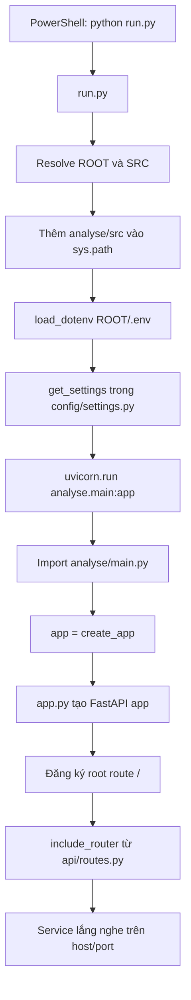

# Hướng dẫn chạy service `analyse`

Ngày lập báo cáo: 2026-06-22  
Thư mục phân tích: `D:\SWD\BE_AI_Stock_Trend_Prediction\analyse`  
Lưu ý bảo mật: không đọc nội dung `analyse/.env` vì file này có thể chứa API key/token. Báo cáo dựa trên source code, `.env.example`, `pyproject.toml`, `requirements.txt`, `uv.lock` và test hiện có.

## 1. Mục tiêu báo cáo

Báo cáo này giải thích chi tiết cách chạy service `analyse` ở môi trường local, dựa trực tiếp trên source code hiện có. Nội dung tập trung vào:

- Service khởi động từ đâu.
- Cấu hình được load như thế nào.
- Cần Python/dependency/env gì.
- Cách chạy bằng `python run.py`, `uv run` và Uvicorn trực tiếp.
- Cách kiểm tra service còn chạy hay đã tắt.
- Cách gọi health endpoint và endpoint report chính.
- Cách hiểu log “Uvicorn running on http://0.0.0.0:5100” rồi shutdown.
- Các lỗi thường gặp và cách xử lý trên Windows PowerShell.

## 2. Source code đã kiểm tra

| File/Folder | Vai trò | Ghi chú |
|---|---|---|
| `analyse/run.py` | Entry script khi chạy `python run.py`. | Thêm `src` vào `sys.path`, load `.env`, đọc settings và gọi `uvicorn.run()`. |
| `analyse/README.md` | Tài liệu người dùng hiện có. | Có hướng dẫn `python run.py`, `uv sync`, `uv run python run.py`, endpoint chính và Swagger docs. |
| `analyse/.env.example` | Mẫu cấu hình local. | Có đầy đủ biến app, Backend API, LLM, research, risk; có `PYTHONPATH=src`. |
| `analyse/.env` | File cấu hình local thật. | Tồn tại nhưng không đọc nội dung để tránh lộ secret. |
| `analyse/.env copy.example` | File đang mở trong IDE theo mô tả. | **Chưa thấy trong source code** khi kiểm tra bằng `Test-Path`. |
| `analyse/.gitignore` | Danh sách file không commit. | Ignore `.env`, `.venv/`, cache, `reports/`, `.research_cache/`. |
| `analyse/requirements.txt` | Dependency cho pip. | Có `fastapi`, `uvicorn[standard]`, `pydantic`, `pydantic-settings`, `python-dotenv`, `httpx`, `openai`, `google-genai`, `pytest`, `tzdata`. |
| `analyse/pyproject.toml` | Metadata package và dependency chuẩn project. | `requires-python = ">=3.11"`, package source tại `src`, pytest `pythonpath = ["src"]`. |
| `analyse/uv.lock` | Lockfile cho `uv`. | Có `requires-python = ">=3.11"` và package `analyse` editable từ `.`. |
| `analyse/src/analyse/main.py` | Module ASGI app target. | `app = create_app()`. |
| `analyse/src/analyse/app.py` | Tạo FastAPI app. | Cấu hình title/version/docs, root route `/`, include router. |
| `analyse/src/analyse/config/settings.py` | Cấu hình runtime. | Dùng `pydantic-settings`, alias env var, default values, `env_file=".env"`. |
| `analyse/src/analyse/api/routes.py` | Định nghĩa endpoint. | Có root router cho health, placeholder routes, và `/api/ai-reports/analyse-one`. |
| `analyse/src/analyse/api/dependencies.py` | Dependency injection. | Tạo `BackendClient`, `ExternalResearchService`, `ReportService`. |
| `analyse/src/analyse/clients/backend_client.py` | Client gọi Backend API. | Dùng base URL/endpoints/token từ settings. |
| `analyse/src/analyse/clients/http_client.py` | HTTP helper dùng `httpx`. | `get_json()` và `get_text()` gọi `raise_for_status()`. |
| `analyse/src/analyse/providers/base.py` | Interface LLM provider. | `BaseLLMProvider`, `normalize_llm_report_output()`. |
| `analyse/src/analyse/providers/provider_factory.py` | Chọn provider. | Hỗ trợ `openai`, `gemini`; provider khác raise `ValueError`. |
| `analyse/src/analyse/providers/openai_provider.py` | OpenAI provider. | Kiểm tra enabled/key khi gọi provider, không phải lúc app start. |
| `analyse/src/analyse/providers/gemini_provider.py` | Gemini provider. | Kiểm tra enabled/key khi gọi provider, không phải lúc app start. |
| `analyse/src/analyse/schemas/*` | Pydantic schemas. | Request/response DTO, provider metadata, LLM result, research, stock/watchlist. |
| `analyse/src/analyse/services/report_service.py` | Orchestrator chính. | Luồng Backend -> summary -> LLM -> Markdown/HTML metadata -> response. |
| `analyse/src/analyse/services/watchlist_service.py` | Rule watchlist. | Normalize symbol, limit tối đa `MAX_WATCHLIST_SYMBOLS`. |
| `analyse/src/analyse/services/stock_data_service.py` | Chuẩn hóa dữ liệu stock/chart. | Unwrap `data`, merge `price_history`, extract company. |
| `analyse/src/analyse/services/summary_service.py` | Tạo summary deterministic. | Có disclaimer, data coverage, momentum đơn giản, score placeholder. |
| `analyse/src/analyse/services/scoring_service.py` | Tính score. | Hiện là placeholder, score `None`. |
| `analyse/src/analyse/services/markdown_service.py` | Tạo Markdown. | Dùng LLM markdown nếu có, fallback placeholder và disclaimer. |
| `analyse/src/analyse/services/html_service.py` | Tạo HTML metadata. | Chưa render file HTML thật, chỉ trả path/template metadata. |
| `analyse/src/analyse/research/*` | External research adapters. | Vietstock/CafeF/Google News hiện TODO, trả `[]`. |
| `analyse/src/analyse/prompts/*` | Prompt LLM. | Prompt bắt LLM không sửa dữ liệu định lượng. |
| `analyse/src/analyse/utils/*` | Tiện ích thời gian, JSON, symbol, logging. | Logging helper có nhưng chưa thấy được cấu hình/sử dụng rộng. |
| `analyse/src/analyse/examples/*` | Request/response mẫu. | Có mẫu `sample_analyse_one_request.json`. |
| `analyse/tests/*` | Test suite. | Kiểm tra settings, provider factory, schema, endpoint, report flow, Backend client. |

## 3. Kết luận nhanh về log hiện tại

Nếu terminal có các dòng tương tự:

```text
Application startup complete.
Uvicorn running on http://0.0.0.0:5100
```

thì app đã start thành công. Địa chỉ `0.0.0.0:5100` là địa chỉ bind của server; khi mở trình duyệt trên máy local, nên dùng:

```text
http://localhost:5100
```

hoặc:

```text
http://127.0.0.1:5100
```

Nếu ngay sau đó có log shutdown như:

```text
Shutting down
Application shutdown complete
Finished server process
```

thì nghĩa là process Uvicorn đã dừng sau khi start. Dựa trên source code hiện tại, **chưa thấy trong source code** đoạn nào chủ động tự tắt app ngay sau startup. Vì vậy shutdown này không đủ bằng chứng để kết luận là lỗi application.

Các nguyên nhân có thể xảy ra, cần kiểm tra thêm từ terminal/log thao tác:

| Khả năng | Giải thích | Có được chứng minh bởi source không? |
|---|---|---|
| Người dùng nhấn `Ctrl+C` | Uvicorn nhận interrupt và shutdown bình thường. | Không chứng minh được từ source; cần kiểm tra thao tác/log terminal. |
| VS Code terminal/process bị stop | Terminal restart, kill task, đóng pane hoặc extension dừng process. | Không chứng minh được từ source; cần kiểm tra VS Code. |
| Reloader process restart/stop | `ANALYSE_ENV=development` làm `reload=True`; Uvicorn có process reloader riêng. | Có liên quan trực tiếp vì `run.py` bật reload theo env. |
| Port/process bị kill từ bên ngoài | Một process khác hoặc command khác dừng Python/Uvicorn. | Cần kiểm tra thêm. |
| Startup crash trong app | Nếu có traceback/import error thì mới nghiêng về lỗi app. | Với log chỉ có startup rồi shutdown, **chưa thấy bằng chứng crash**. |

Điểm quan trọng từ `analyse/run.py`:

```python
uvicorn.run(
    "analyse.main:app",
    host=settings.analyse_host,
    port=settings.analyse_port,
    reload=settings.analyse_env == "development",
)
```

Với `.env.example`, `ANALYSE_ENV=development`, nên `reload=True`. Port mặc định là `5100`, lấy từ `ANALYSE_PORT`.

## 4. Cách hoạt động của lệnh `python run.py`

Khi chạy:

```powershell
cd D:\SWD\BE_AI_Stock_Trend_Prediction\analyse
python run.py
```

luồng thực tế theo source code là:

1. `run.py` xác định `ROOT = Path(__file__).resolve().parent`.
2. `run.py` xác định `SRC = ROOT / "src"`.
3. Nếu `src` chưa có trong `sys.path`, script thêm `analyse/src` vào đầu `sys.path`.
4. Import `get_settings` từ `analyse.config.settings`.
5. Trong `main()`, gọi `load_dotenv(ROOT / ".env")`.
6. Gọi `settings = get_settings()`.
7. `Settings` đọc env từ biến môi trường và `.env`, có default nếu biến chưa được khai báo.
8. Gọi `uvicorn.run("analyse.main:app", host=..., port=..., reload=...)`.
9. Uvicorn import `analyse.main`.
10. `main.py` gọi `create_app()` từ `app.py`.
11. `create_app()` tạo `FastAPI(...)`, đăng ký route `/`, include router trong `api/routes.py`.
12. Server bắt đầu lắng nghe tại host/port cấu hình.

Mermaid diagram:



### Ghi chú về `load_dotenv()` và `Settings`

`run.py` gọi `load_dotenv(ROOT / ".env")` trước khi gọi `get_settings()`. Ngoài ra, `Settings` cũng có:

```python
model_config = SettingsConfigDict(
    env_file=".env",
    env_file_encoding="utf-8",
    extra="ignore",
    populate_by_name=True,
)
```

Nghĩa là app có thể đọc `.env` theo hai lớp: `python-dotenv` trong `run.py` và `pydantic-settings` trong `Settings`. Nếu `.env` không tồn tại, source code vẫn có default cho nhiều biến và không tự crash chỉ vì thiếu file `.env`.

## 5. Yêu cầu môi trường

| Hạng mục | Yêu cầu theo source | Ghi chú |
|---|---|---|
| Python | `>=3.11` | Khai báo trong `pyproject.toml` và `uv.lock`. Máy hiện kiểm tra được `Python 3.13.7`. |
| Hệ điều hành | Không khóa OS | Báo cáo này dùng lệnh Windows PowerShell theo môi trường hiện tại. |
| `uv` | Có hỗ trợ | Có `uv.lock`; máy hiện có `uv 0.11.21`. |
| `.venv` | Nên dùng nếu chạy bằng pip | Không bắt buộc nếu dùng `uv run`, nhưng nên dùng để cô lập dependency. |
| `.env` | Không bắt buộc để app start | Nên tạo từ `.env.example` để cấu hình port, Backend, provider key. |
| Backend service | Không bắt buộc để app start | Cần chạy nếu muốn tạo report đầy đủ từ Backend API. |
| OpenAI/Gemini API key | Không bắt buộc để app start | Cần nếu muốn provider LLM thật trả `success`. |
| Port | Mặc định `5100` | Lấy từ `ANALYSE_PORT`. |
| Reload mode | Bật nếu `ANALYSE_ENV=development` | `run.py` đặt `reload=settings.analyse_env == "development"`. |

Dependency cần thiết theo `requirements.txt` và `pyproject.toml`:

| Dependency | Mục đích |
|---|---|
| `fastapi` | Web framework. |
| `uvicorn[standard]` | ASGI server chạy FastAPI. |
| `pydantic` | Schema validation. |
| `pydantic-settings` | Load cấu hình từ env. |
| `python-dotenv` | Load file `.env`. |
| `httpx` | Gọi Backend API và external HTTP. |
| `openai` | OpenAI provider. |
| `google-genai` | Gemini provider. |
| `pytest` | Chạy test. |
| `tzdata` | Timezone data, hữu ích trên Windows. |

## 6. Cách cài dependencies

### Cách 1: Dùng `uv`

Project có `pyproject.toml` và `uv.lock`, nên có thể dùng `uv sync`:

```powershell
cd D:\SWD\BE_AI_Stock_Trend_Prediction\analyse
uv sync
```

Sau đó chạy app bằng:

```powershell
uv run python run.py
```

Hoặc chạy test:

```powershell
uv run pytest
```

Ghi chú: `uv.lock` cho thấy package `analyse` được dùng ở dạng editable từ `.`. Vì vậy sau `uv sync`, import package qua `analyse.main:app` thường hoạt động đúng trong môi trường `uv`.

### Cách 2: Dùng Python venv + pip

```powershell
cd D:\SWD\BE_AI_Stock_Trend_Prediction\analyse
python -m venv .venv
.\.venv\Scripts\Activate.ps1
python -m pip install --upgrade pip
pip install -r requirements.txt
```

Với cách này, `python run.py` vẫn chạy được vì `run.py` tự thêm `analyse/src` vào `sys.path`.

Nếu muốn package được install editable để import trực tiếp hơn, có thể dùng thêm:

```powershell
pip install -e .
```

Lệnh này hợp lệ vì `pyproject.toml` có cấu hình build bằng `setuptools` và package nằm trong `src`.

## 7. Cách tạo file `.env`

Từ thư mục `analyse`, chạy:

```powershell
cd D:\SWD\BE_AI_Stock_Trend_Prediction\analyse
copy .env.example .env
```

File `.env` bị ignore bởi `.gitignore`, không nên commit.

Các biến quan trọng:

| Biến | Ý nghĩa | Có bắt buộc để app start không? | Ghi chú |
|---|---|---|---|
| `ANALYSE_ENV` | Môi trường chạy app. | Không | Mặc định `development`; nếu là `development` thì `run.py` bật reload. |
| `ANALYSE_HOST` | Host bind cho Uvicorn. | Không | Mặc định `0.0.0.0`. Browser local dùng `localhost`. |
| `ANALYSE_PORT` | Port chạy service. | Không | Mặc định `5100`. |
| `ANALYSE_LOG_LEVEL` | Log level mong muốn. | Không | Có trong settings nhưng **chưa thấy trong source code** được áp dụng để cấu hình logging. |
| `ANALYSE_TIMEZONE` | Timezone report/timestamp. | Không | Mặc định `Asia/Ho_Chi_Minh`. |
| `PYTHONPATH` | Đường dẫn import package. | Không với `python run.py` | Có trong `.env.example`; không phải field của `Settings`, `extra="ignore"` nên Pydantic bỏ qua. Hữu ích khi chạy Uvicorn trực tiếp. |
| `BACKEND_API_BASE_URL` | Base URL Backend API. | Không để start | Cần đúng nếu gọi `/api/ai-reports/analyse-one` thật. |
| `BACKEND_API_TIMEOUT_MS` | Timeout gọi Backend. | Không | Mặc định `30000`. |
| `BACKEND_API_TOKEN` | Bearer token gọi Backend. | Không để start | Cần nếu Backend yêu cầu auth. |
| `BACKEND_WATCHLIST_ENDPOINT` | Endpoint watchlist. | Không | Mặc định `/api/watchlists`. |
| `BACKEND_STOCK_DETAIL_ENDPOINT` | Endpoint chi tiết stock. | Không | Mặc định `/api/stocks/{symbol}`. |
| `BACKEND_STOCK_CHART_ENDPOINT` | Endpoint chart. | Không | Mặc định `/api/stocks/{symbol}/chart?range={range}`. |
| `REPORT_OUTPUT_DIR` | Path output report metadata. | Không | Mặc định `reports`; hiện code chưa ghi file Markdown/HTML thật. |
| `REPORT_LANGUAGE` | Ngôn ngữ mặc định. | Không | Mặc định `vi`; request option cũng có `language`. |
| `SUMMARY_SCHEMA_VERSION` | Version summary schema. | Không | Mặc định `1.0`. |
| `MAX_WATCHLIST_SYMBOLS` | Số symbol hợp lệ tối đa từ watchlist. | Không | Mặc định `5`. |
| `ANALYSE_ONE_SYMBOL_ONLY` | Bật rule chỉ phân tích symbol nằm trong watchlist. | Không | Mặc định `true`. |
| `DEFAULT_LLM_PROVIDER` | Provider mặc định nếu request không truyền `provider`. | Không | Chỉ nhận `openai` hoặc `gemini`. |
| `ALLOW_REQUEST_MODEL_OVERRIDE` | Cho phép request truyền model riêng. | Không | Mặc định `true`. |
| `OPENAI_ENABLED` | Bật/tắt OpenAI provider. | Không | Nếu `false`, provider trả status `disabled`. |
| `OPENAI_API_KEY` | API key OpenAI. | Không để start | Thiếu key thì OpenAI request trả provider status `failed` và warning. |
| `OPENAI_MODEL` | Model OpenAI mặc định. | Không | Mặc định `gpt-4.1-mini`. |
| `GEMINI_ENABLED` | Bật/tắt Gemini provider. | Không | Nếu `false`, provider trả status `disabled`. |
| `GEMINI_API_KEY` | API key Gemini. | Không để start | Thiếu key thì Gemini request trả provider status `failed` và warning. |
| `GEMINI_MODEL` | Model Gemini mặc định. | Không | Mặc định `gemini-1.5-flash`. |
| `ENABLE_EXTERNAL_RESEARCH` | Bật external research tổng. | Không | Mặc định `false`; adapter hiện vẫn placeholder. |
| `ENABLE_VIETSTOCK` | Bật adapter Vietstock. | Không | Adapter hiện TODO, trả `[]`. |
| `ENABLE_CAFEF` | Bật adapter CafeF. | Không | Adapter hiện TODO, trả `[]`. |
| `ENABLE_GOOGLE_NEWS_RSS` | Bật adapter Google News RSS. | Không | Adapter hiện TODO, trả `[]`. |
| `DEFAULT_CAPITAL_VND` | Vốn mặc định cho position sizing. | Không | Dùng nếu request không truyền `capitalVnd`. |
| `DEFAULT_RISK_PER_TRADE_PCT` | Rủi ro/trade mặc định. | Không | Dùng nếu request không truyền `riskPerTradePct`. |
| `DEFAULT_MAX_POSITION_PCT` | Tỷ trọng vị thế tối đa mặc định. | Không | Dùng nếu request không truyền `maxPositionPct`. |

Kết luận cấu hình:

- App thường có thể start mà không cần `.env`, nhờ default trong `Settings`.
- App có thể start mà không có OpenAI/Gemini key.
- Gọi provider thật sẽ thất bại nếu thiếu API key tương ứng.
- Backend API cần chạy nếu muốn report có dữ liệu thật từ watchlist/stock/chart.

## 8. Cách chạy service

### Chạy bằng Python

```powershell
cd D:\SWD\BE_AI_Stock_Trend_Prediction\analyse
.\.venv\Scripts\Activate.ps1
python run.py
```

Nếu chưa tạo `.venv`, xem lại mục cài dependencies ở trên.

Khi chạy đúng, terminal nên có log tương tự:

```text
Application startup complete.
Uvicorn running on http://0.0.0.0:5100
```

Giữ terminal đó mở. Nếu PowerShell quay về prompt thì process đã dừng.

### Chạy bằng `uv`

```powershell
cd D:\SWD\BE_AI_Stock_Trend_Prediction\analyse
uv run python run.py
```

Nếu chưa sync dependency:

```powershell
cd D:\SWD\BE_AI_Stock_Trend_Prediction\analyse
uv sync
uv run python run.py
```

### Chạy bằng Uvicorn trực tiếp

Lệnh Uvicorn trực tiếp hợp lệ, nhưng cần đảm bảo Python import được package `analyse`.

Nếu đã `uv sync` hoặc đã `pip install -e .`, có thể chạy:

```powershell
cd D:\SWD\BE_AI_Stock_Trend_Prediction\analyse
uvicorn analyse.main:app --host 0.0.0.0 --port 5100 --reload
```

Nếu chỉ cài bằng `pip install -r requirements.txt`, package chưa chắc đã được install editable. Khi đó nên set `PYTHONPATH=src` trong PowerShell:

```powershell
cd D:\SWD\BE_AI_Stock_Trend_Prediction\analyse
$env:PYTHONPATH = "src"
uvicorn analyse.main:app --host 0.0.0.0 --port 5100 --reload
```

Hoặc dùng Python module:

```powershell
cd D:\SWD\BE_AI_Stock_Trend_Prediction\analyse
$env:PYTHONPATH = "src"
python -m uvicorn analyse.main:app --host 0.0.0.0 --port 5100 --reload
```

### Chạy không reload

Nếu muốn tránh reloader khi debug log shutdown/startup, đặt:

```powershell
$env:ANALYSE_ENV = "production"
python run.py
```

Hoặc sửa `.env`:

```env
ANALYSE_ENV=production
```

Khi đó `run.py` sẽ truyền `reload=False`.

## 9. Cách kiểm tra service đã chạy chưa

### Kiểm tra bằng trình duyệt

Mở các URL:

```text
http://localhost:5100
http://localhost:5100/api/analyse/health
http://localhost:5100/api/analyse/docs
```

Theo `app.py`, root `/` trả metadata gồm service, port, docs và endpoint chính.

Theo `routes.py`, health endpoint:

```text
GET /api/analyse/health
```

trả:

```json
{
  "code": 200,
  "message": "Analyse service đã sẵn sàng.",
  "data": null
}
```

### Kiểm tra bằng PowerShell

```powershell
Invoke-RestMethod http://localhost:5100/api/analyse/health
```

Kiểm tra root:

```powershell
Invoke-RestMethod http://localhost:5100
```

Kiểm tra port:

```powershell
netstat -ano | findstr :5100
```

Hoặc:

```powershell
Get-NetTCPConnection -LocalPort 5100
```

Nếu không có process/listener trên port `5100`, service đã dừng hoặc chưa chạy.

## 10. Cách test API chính

Endpoint chính:

```http
POST /api/ai-reports/analyse-one
```

Request tối thiểu nên có `provider`, `symbol`, `scopeExchange`, `options`. Ví dụ PowerShell:

```powershell
$body = @{
  provider = "openai"
  symbol = "FPT"
  scopeExchange = "HOSE"
  options = @{
    language = "vi"
    riskProfile = "medium"
    timeHorizon = "medium_term"
    includeExternalResearch = $false
    renderMarkdown = $true
    renderHtml = $false
  }
} | ConvertTo-Json -Depth 10

Invoke-RestMethod `
  -Uri "http://localhost:5100/api/ai-reports/analyse-one" `
  -Method POST `
  -ContentType "application/json" `
  -Body $body
```

Ví dụ request JSON:

```json
{
  "provider": "openai",
  "symbol": "FPT",
  "scopeExchange": "HOSE",
  "options": {
    "language": "vi",
    "riskProfile": "medium",
    "timeHorizon": "medium_term",
    "includeExternalResearch": false,
    "renderMarkdown": true,
    "renderHtml": false
  }
}
```

Response thành công có shape chung:

```json
{
  "code": 200,
  "message": "Tạo dữ liệu report thành công",
  "data": {
    "report_id": "FPT_HOSE_20260622_153000",
    "generated_at": "2026-06-22T15:30:00+07:00",
    "symbol": "FPT",
    "company": "Cong ty Co phan FPT",
    "scope_exchange": "HOSE",
    "language": "vi",
    "summary_schema_version": "1.0",
    "provider": {
      "name": "openai",
      "model": "gpt-4.1-mini",
      "status": "success",
      "latency_ms": 1200
    },
    "data_sources": [],
    "summary": {},
    "markdown_report": {
      "available": true,
      "output_path": "reports/FPT_HOSE_20260622_153000.md",
      "content": "# Báo cáo phân tích cổ phiếu FPT..."
    },
    "html_report": {
      "available": false,
      "output_path": null,
      "content": null,
      "template_name": null
    },
    "warnings": []
  }
}
```

### Nếu thiếu OpenAI/Gemini API key

Theo `openai_provider.py` và `gemini_provider.py`, app không crash lúc start. Khi gọi endpoint report:

- OpenAI thiếu key: provider trả `status="failed"` và warning `Thiếu cấu hình OPENAI_API_KEY.`
- Gemini thiếu key: provider trả `status="failed"` và warning `Thiếu cấu hình GEMINI_API_KEY.`

Khi LLM fail, `ReportService` vẫn giữ summary deterministic và dùng Markdown fallback nếu `renderMarkdown=true`.

### Nếu Backend API chưa chạy

Theo `ReportService.analyse_one_report()`:

- Nếu không gọi được `/api/watchlists`, service thêm warning `Chưa gọi được /api/watchlists: ...`, data source status `failed`, rồi tiếp tục với `allowed_symbols=[symbol]`.
- Nếu không gọi được `/api/stocks/{symbol}`, service tạo stock detail tối thiểu `{"stock": {"symbol": symbol}, "latest_price": {}, "financials": {}}`, thêm warning rồi tiếp tục.
- Nếu không gọi được chart endpoint, service thêm warning và data source status `partial`.

Vì vậy Backend không bắt buộc để app start, nhưng cần để report có dữ liệu thật. Nếu Backend chưa chạy, response có thể vẫn là `code=200` nhưng chứa nhiều warning và summary scaffold.

### Nếu symbol không nằm trong watchlist

Nếu Backend `/api/watchlists` gọi được và `ANALYSE_ONE_SYMBOL_ONLY=true`, symbol phải nằm trong tối đa 5 mã watchlist hợp lệ đầu tiên. Nếu không:

```json
{
  "code": 403,
  "message": "Symbol không nằm trong 5 mã watchlist hợp lệ",
  "error": {
    "type": "SYMBOL_NOT_IN_WATCHLIST",
    "details": [
      {
        "field": "symbol",
        "message": "SSI không nằm trong danh sách ['FPT', 'CMG', 'MWG', 'HPG', 'VCB']"
      }
    ]
  },
  "data": null
}
```

Ghi chú kỹ thuật: route hiện trả dict trực tiếp, **chưa thấy trong source code** dùng `HTTPException` hoặc `JSONResponse(status_code=403)`, nên HTTP status thực tế có thể vẫn là `200` trong khi body có `code=403`. Cần kiểm tra thêm nếu frontend phụ thuộc HTTP status.

## 11. Cách chạy test

Chạy bằng Python:

```powershell
cd D:\SWD\BE_AI_Stock_Trend_Prediction\analyse
python -m pytest
```

Chạy bằng `uv`:

```powershell
cd D:\SWD\BE_AI_Stock_Trend_Prediction\analyse
uv run pytest
```

Kết quả kiểm tra tại thời điểm lập báo cáo:

```text
18 passed
```

## 12. Các lỗi thường gặp và cách sửa

| Lỗi/Dấu hiệu | Nguyên nhân có thể | Cách kiểm tra | Cách sửa |
|---|---|---|---|
| App bật lên rồi tắt | Người dùng nhấn `Ctrl+C`, VS Code dừng terminal, process bị kill, hoặc reloader restart/stop. Source chưa thấy tự shutdown. | Kiểm tra terminal có traceback không; chạy `Get-NetTCPConnection -LocalPort 5100`; xem có quay về prompt không. | Chạy lại `python run.py`; giữ terminal mở; thử `ANALYSE_ENV=production` để tắt reload khi debug. |
| Port `5100` bị chiếm | Process khác đang listen port này. | `netstat -ano | findstr :5100` hoặc `Get-NetTCPConnection -LocalPort 5100`. | Kill process chiếm port hoặc đổi `ANALYSE_PORT` trong `.env`. |
| `ModuleNotFoundError: analyse` | Chạy Uvicorn trực tiếp nhưng Python không thấy `src`. | Kiểm tra đang ở folder `analyse`; kiểm tra `$env:PYTHONPATH`. | Dùng `python run.py`, hoặc set `$env:PYTHONPATH="src"`, hoặc `pip install -e .`, hoặc `uv sync`. |
| `ModuleNotFoundError` cho FastAPI/Uvicorn/Pydantic/OpenAI/Gemini | Chưa cài dependencies hoặc chưa activate đúng venv. | `pip show fastapi`, `python -m pip list`, kiểm tra prompt có `(.venv)`. | `pip install -r requirements.txt` hoặc `uv sync`. |
| Thiếu `.env` | Chưa copy `.env.example`. | `Test-Path .env`. | `copy .env.example .env`. App vẫn có thể start nhờ default, nhưng nên tạo `.env`. |
| Backend API chưa chạy | `BACKEND_API_BASE_URL` không có service hoặc sai port. | Mở `http://localhost:5000/api/watchlists` hoặc gọi bằng `Invoke-RestMethod`. | Start Backend API, sửa `BACKEND_API_BASE_URL`, điền `BACKEND_API_TOKEN` nếu cần. |
| Thiếu OpenAI/Gemini API key | Provider được gọi nhưng env key trống. | Xem `data.provider.status` và `warnings` trong response. | Điền `OPENAI_API_KEY` hoặc `GEMINI_API_KEY`; hoặc đổi provider; hoặc tắt provider nếu không dùng. |
| PowerShell không activate được `.venv` | Execution policy chặn script. | Lỗi thường có chữ `running scripts is disabled`. | Chạy `Set-ExecutionPolicy -Scope Process -ExecutionPolicy Bypass`, rồi activate lại. |
| Không mở được Swagger docs | Service chưa chạy, port sai, hoặc app chạy host/port khác. | Mở `http://localhost:5100/api/analyse/health`; kiểm tra port. | Chạy lại app, kiểm tra `ANALYSE_PORT`, dùng đúng URL `/api/analyse/docs`. |
| Gọi `/api/ai-reports/analyse-one` bị lỗi 422 | Request body sai schema, thiếu `symbol`, provider không phải `openai/gemini`, field enum sai. | Xem response validation detail từ FastAPI. | Dùng request mẫu; đảm bảo `riskProfile` là `low/medium/high`, `timeHorizon` hợp lệ. |
| API trả warning provider failed | Thiếu key, dependency provider thiếu, model call lỗi, provider disabled. | Xem `data.provider.status`, `data.provider.model`, `warnings`. | Điền key, cài dependency, kiểm tra model, bật `OPENAI_ENABLED/GEMINI_ENABLED`. |
| API trả lỗi symbol không nằm trong watchlist | `ANALYSE_ONE_SYMBOL_ONLY=true` và symbol không thuộc 5 mã hợp lệ đầu từ Backend watchlist. | Xem body `SYMBOL_NOT_IN_WATCHLIST`; kiểm tra Backend `/api/watchlists`. | Gọi symbol nằm trong watchlist, cập nhật watchlist, tăng `MAX_WATCHLIST_SYMBOLS`, hoặc tắt rule nếu phù hợp. |
| Health endpoint không phản hồi | Server không chạy hoặc bị firewall/proxy/port sai. | `Get-NetTCPConnection -LocalPort 5100`; kiểm tra terminal Uvicorn. | Chạy lại app, đổi port, kiểm tra firewall local nếu cần. |
| Response có Markdown nhưng file không xuất hiện trong `reports/` | Source hiện chỉ trả `output_path`, chưa ghi file thật. | Kiểm tra `MarkdownService` và `ReportService`; không thấy code write file. | Cần implement ghi file nếu muốn tạo artifact thật. |

## 13. Checklist chạy đúng

- [ ] Đang ở đúng folder `D:\SWD\BE_AI_Stock_Trend_Prediction\analyse`
- [ ] Đã tạo `.env` từ `.env.example`
- [ ] Đã cài dependencies bằng `uv sync` hoặc `pip install -r requirements.txt`
- [ ] Đã activate `.venv` hoặc dùng `uv run`
- [ ] Port `5100` chưa bị chiếm
- [ ] Backend API đang chạy nếu muốn tạo report thật
- [ ] `BACKEND_API_BASE_URL` trỏ đúng Backend
- [ ] `BACKEND_API_TOKEN` đã cấu hình nếu Backend yêu cầu auth
- [ ] OpenAI/Gemini key đã cấu hình nếu muốn gọi LLM thật
- [ ] Terminal Uvicorn vẫn đang chạy, chưa quay về prompt
- [ ] Health endpoint trả success
- [ ] Swagger docs mở được tại `/api/analyse/docs`

## 14. Đề xuất lệnh chạy nhanh cho Windows

### Lần đầu chạy bằng `uv`

```powershell
cd D:\SWD\BE_AI_Stock_Trend_Prediction\analyse
copy .env.example .env
uv sync
uv run python run.py
```

Health check ở terminal PowerShell khác:

```powershell
Invoke-RestMethod http://localhost:5100/api/analyse/health
```

### Lần đầu chạy bằng venv + pip

```powershell
cd D:\SWD\BE_AI_Stock_Trend_Prediction\analyse
python -m venv .venv
.\.venv\Scripts\Activate.ps1
python -m pip install --upgrade pip
pip install -r requirements.txt
copy .env.example .env
python run.py
```

Nếu PowerShell chặn activate:

```powershell
Set-ExecutionPolicy -Scope Process -ExecutionPolicy Bypass
.\.venv\Scripts\Activate.ps1
python run.py
```

### Lệnh kiểm tra nhanh sau khi app chạy

```powershell
Invoke-RestMethod http://localhost:5100
Invoke-RestMethod http://localhost:5100/api/analyse/health
```

Mở Swagger:

```text
http://localhost:5100/api/analyse/docs
```

## 15. Kết luận

Cách chạy chính xác và đơn giản nhất theo source hiện tại là:

```powershell
cd D:\SWD\BE_AI_Stock_Trend_Prediction\analyse
uv sync
uv run python run.py
```

Hoặc nếu dùng venv:

```powershell
cd D:\SWD\BE_AI_Stock_Trend_Prediction\analyse
.\.venv\Scripts\Activate.ps1
python run.py
```

Nếu log có `Application startup complete` và `Uvicorn running on http://0.0.0.0:5100`, app đã start thành công. Nếu sau đó terminal shutdown và trả prompt, process đã bị dừng; source code hiện tại không cho thấy app tự tắt sau startup, nên cần kiểm tra thao tác `Ctrl+C`, VS Code terminal, reloader, hoặc process bên ngoài.

Để xác nhận service đang hoạt động, dùng:

```powershell
Invoke-RestMethod http://localhost:5100/api/analyse/health
```

Backend API và OpenAI/Gemini API key không bắt buộc để start server, nhưng cần để endpoint `/api/ai-reports/analyse-one` tạo report có dữ liệu thật và provider status `success`.

File báo cáo này được tạo tại:

```text
ANALYSE_RUN_GUIDE_REPORT.md
```
