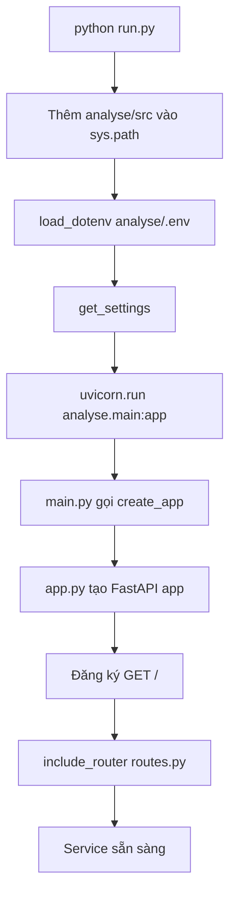
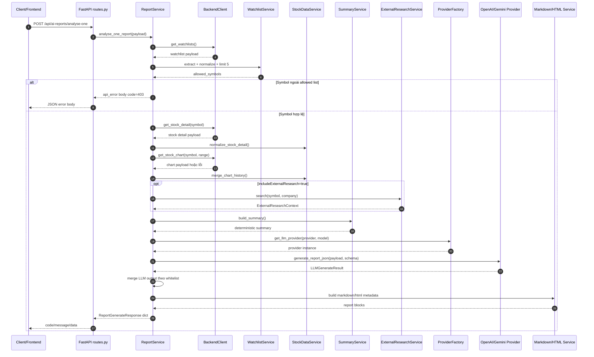
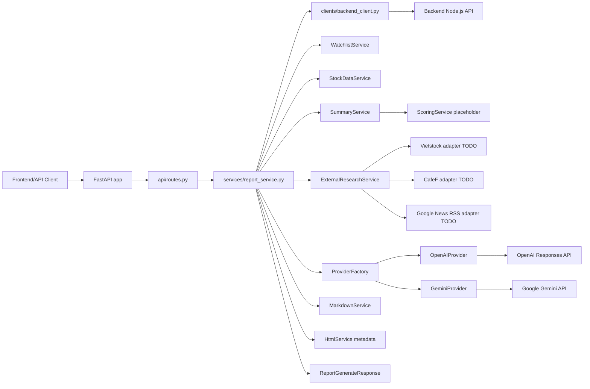
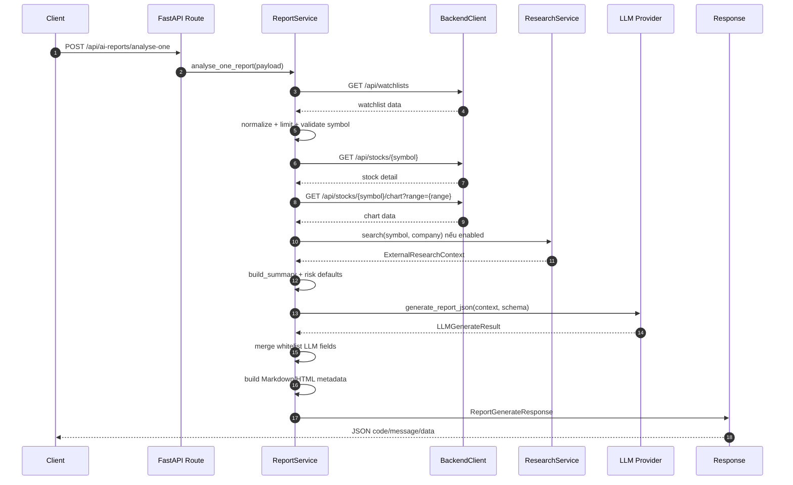
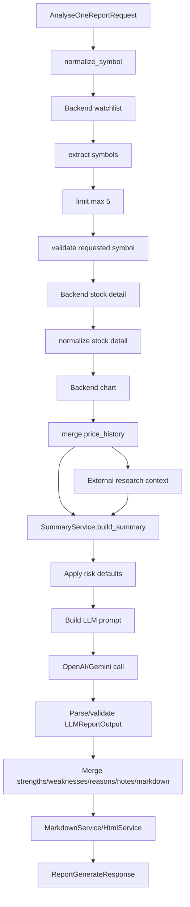

# Báo cáo phân tích source code thư mục `analyse`

Ngày phân tích: 2026-06-22  
Phạm vi: toàn bộ source thực thi trong `analyse`, ưu tiên `analyse/src`; có đọc `analyse/tests`, `analyse/examples`, `run.py`, `pyproject.toml`, `requirements.txt`, `.env.example`, `.gitignore`.  
Không đọc nội dung `analyse/.env` để tránh lộ API key/token hoặc cấu hình nhạy cảm.  
File `analyse/.env copy.example`: **Chưa thấy trong source code** tại thời điểm quét thư mục.  
Kết quả kiểm thử nhanh: chạy `python -m pytest` trong thư mục `analyse` thành công, `18 passed`.

## 1. Tổng quan hệ thống

`analyse` là service Python/FastAPI độc lập trong dự án `BE_AI_Stock_Trend_Prediction`. Service này nhận yêu cầu phân tích một mã cổ phiếu Việt Nam, lấy dữ liệu từ Backend API, chuẩn hóa dữ liệu, tạo summary định lượng ở mức scaffold, gọi LLM provider OpenAI hoặc Gemini để sinh phần diễn giải, rồi trả về JSON report thống nhất cho frontend.

Mục tiêu thiết kế hiện tại:

- Chỉ có một endpoint report chính: `POST /api/ai-reports/analyse-one`.
- OpenAI và Gemini dùng chung request schema, response schema, flow Backend và cấu trúc provider metadata.
- Provider chỉ làm nhiệm vụ gọi model, parse output và trả `LLMGenerateResult`.
- Business logic nằm trong `services`, route nằm trong `api`, schema nằm trong `schemas`, config nằm trong `config/settings.py`.
- LLM chỉ được sinh các phần diễn giải như `strengths`, `weaknesses`, `system_decision.reasons`, `markdown_report.content`, `data_quality_notes`.
- Dữ liệu định lượng như giá, volume, EPS, P/E, P/B, ROE, score, vùng giá, position sizing không được lấy từ LLM.

Trạng thái thực tế trong source code:

| Hạng mục | Trạng thái |
|---|---|
| FastAPI app | Đã có `create_app()` trong `analyse/src/analyse/app.py`. |
| Endpoint chính | Đã có `POST /api/ai-reports/analyse-one`. |
| Backend client | Đã gọi được watchlist, stock detail, stock chart theo env endpoint. |
| Watchlist max 5 | Đã có trong `WatchlistService.limit_symbols()`. |
| One-symbol rule | Đã có trong `ReportService.analyse_one_report()`. |
| OpenAI provider | Đã có implementation dùng `AsyncOpenAI.responses.parse()`. |
| Gemini provider | Đã có implementation dùng `google.genai.Client.models.generate_content()`. |
| LLM output merge | Đã merge theo whitelist trong `ReportService._merge_llm_output()`. |
| Numeric protection | Có bằng cách chỉ merge field text từ LLM. |
| External research | Adapter Vietstock/CafeF/Google News vẫn là placeholder, trả `[]`. |
| Scoring | Vẫn là placeholder an toàn, score là `None`. |
| Markdown | Có fallback rule-based và có thể dùng Markdown từ LLM. Chưa ghi file thật. |
| HTML | Chỉ tạo metadata/path, chưa render HTML content/file thật. |
| Logging | Có helper `get_logger()`, nhưng chưa thấy cấu hình logging hoặc sử dụng thực tế. |

## 2. Cấu trúc thư mục và vai trò từng file

```text
analyse/
├── .env
├── .env.example
├── .gitignore
├── README.md
├── pyproject.toml
├── requirements.txt
├── run.py
├── uv.lock
├── src/
│   └── analyse/
│       ├── __init__.py
│       ├── app.py
│       ├── main.py
│       ├── api/
│       ├── clients/
│       ├── config/
│       ├── examples/
│       ├── prompts/
│       ├── providers/
│       ├── research/
│       ├── schemas/
│       ├── services/
│       └── utils/
└── tests/
```

| Đường dẫn file | Vai trò | Ghi chú |
| -------------- | ------- | ------- |
| `analyse/run.py` | Entry point chạy local bằng Uvicorn. | Load `.env`, thêm `src` vào `sys.path`, chạy `analyse.main:app`. |
| `analyse/pyproject.toml` | Metadata package, dependency và pytest config. | Dùng layout `src`, package name `analyse`, version `0.2.0`. |
| `analyse/requirements.txt` | Dependency runtime/test dạng pip. | Có `fastapi`, `uvicorn`, `pydantic`, `httpx`, `openai`, `google-genai`, `pytest`, `tzdata`. |
| `analyse/.env.example` | Env sample sạch. | Không có secret thật; dùng để tạo `.env`. |
| `analyse/.env` | Env local. | Không đọc nội dung trong báo cáo để tránh lộ secret. |
| `analyse/.gitignore` | Ignore `.env`, `.venv`, cache, reports, research cache. | Đúng hướng bảo mật local. |
| `analyse/README.md` | Tài liệu sử dụng service. | Đã mô tả unified OpenAI/Gemini service. |
| `analyse/uv.lock` | Lockfile của `uv`. | Không phải source logic; dùng để khóa dependency. |
| `analyse/src/analyse/__init__.py` | Marker package. | Không có logic runtime. |
| `analyse/src/analyse/app.py` | Tạo FastAPI app. | Hàm chính `create_app()`. |
| `analyse/src/analyse/main.py` | Expose `app = create_app()`. | Uvicorn import file này. |
| `analyse/src/analyse/api/__init__.py` | Marker module API. | Không có logic. |
| `analyse/src/analyse/api/routes.py` | Khai báo route FastAPI. | Route mỏng, gọi `ReportService`. |
| `analyse/src/analyse/api/dependencies.py` | Dependency factories. | Tạo `BackendClient`, `ExternalResearchService`, `ReportService`. |
| `analyse/src/analyse/clients/__init__.py` | Marker module clients. | Không có logic. |
| `analyse/src/analyse/clients/http_client.py` | HTTP helper async. | Dùng `httpx.AsyncClient`, có `get_json()` và `get_text()`. |
| `analyse/src/analyse/clients/backend_client.py` | Client gọi Backend API. | Dùng env endpoint và bearer token nếu có. |
| `analyse/src/analyse/config/__init__.py` | Re-export `Settings`, `get_settings`. | Không có logic riêng. |
| `analyse/src/analyse/config/settings.py` | Cấu hình runtime. | Pydantic Settings đọc `.env` và biến môi trường. |
| `analyse/src/analyse/examples/sample_analyse_one_request.json` | Request mẫu cho endpoint chính. | Dùng provider/model/options aliases. |
| `analyse/src/analyse/examples/sample_analysis_result.json` | Response mẫu. | Mô tả response report thành công. |
| `analyse/src/analyse/examples/sample_stock_request.json` | Payload mẫu cho route `/api/analyse/stock`. | Dùng `latestPrice`, `priceHistory`, `marketOverview`. |
| `analyse/src/analyse/examples/sample_watchlist_request.json` | Payload mẫu cho route `/api/analyse/watchlist`. | Dùng watchlist direct payload. |
| `analyse/src/analyse/prompts/__init__.py` | Export prompt helper. | Re-export `get_system_prompt`. |
| `analyse/src/analyse/prompts/system_prompts.py` | System prompt chống hallucination. | Quy định LLM không sửa số liệu định lượng. |
| `analyse/src/analyse/prompts/report_prompts.py` | Build prompt report. | Ghép system prompt, schema instruction, JSON context. |
| `analyse/src/analyse/prompts/json_schema_prompts.py` | Sinh instruction về JSON schema. | Được dùng trong `build_report_prompt()`. |
| `analyse/src/analyse/providers/__init__.py` | Export provider factory. | Re-export `get_llm_provider`. |
| `analyse/src/analyse/providers/base.py` | Interface provider và normalize output. | Có `BaseLLMProvider`, `normalize_llm_report_output()`. |
| `analyse/src/analyse/providers/provider_factory.py` | Chọn provider theo tên. | Hàm `get_llm_provider(provider, settings, model=None)`. |
| `analyse/src/analyse/providers/openai_provider.py` | OpenAI provider. | Dùng `AsyncOpenAI.responses.parse()`. |
| `analyse/src/analyse/providers/gemini_provider.py` | Gemini provider. | Dùng `google.genai`. |
| `analyse/src/analyse/research/__init__.py` | Marker module research. | Không có logic. |
| `analyse/src/analyse/research/base.py` | Abstract research adapter. | `BaseResearchAdapter.search()` abstract. |
| `analyse/src/analyse/research/vietstock.py` | Adapter Vietstock. | TODO, hiện trả `[]`. |
| `analyse/src/analyse/research/cafef.py` | Adapter CafeF. | TODO, hiện trả `[]`. |
| `analyse/src/analyse/research/google_news.py` | Adapter Google News RSS. | TODO, hiện trả `[]`. |
| `analyse/src/analyse/research/research_service.py` | Orchestrator external research. | Chọn adapter theo settings, gom item. |
| `analyse/src/analyse/schemas/__init__.py` | Marker schemas. | Không có logic. |
| `analyse/src/analyse/schemas/common.py` | Type chung và response helper. | Có `ProviderName`, `SourceStatus`, disclaimer, `api_success()`, `api_error()`. |
| `analyse/src/analyse/schemas/stock.py` | Schema stock/options. | Có alias camelCase. |
| `analyse/src/analyse/schemas/watchlist.py` | Schema watchlist direct route. | Có `WatchlistAnalysisRequest`. |
| `analyse/src/analyse/schemas/research.py` | Schema research item/context. | Có `ResearchItem`, `ExternalResearchContext`. |
| `analyse/src/analyse/schemas/llm.py` | Schema LLM input/result/output. | Có `LLMGenerateResult`, `LLMReportOutput`. |
| `analyse/src/analyse/schemas/report.py` | Schema endpoint report. | Có `AnalyseOneReportRequest`, `ReportGenerateResponse`. |
| `analyse/src/analyse/services/__init__.py` | Marker service module. | Không có logic. |
| `analyse/src/analyse/services/report_service.py` | Orchestrator chính. | File nghiệp vụ quan trọng nhất. |
| `analyse/src/analyse/services/watchlist_service.py` | Xử lý watchlist symbol. | Normalize, limit, validate. |
| `analyse/src/analyse/services/stock_data_service.py` | Chuẩn hóa payload stock/chart. | Unwrap Backend response, merge chart history, extract company. |
| `analyse/src/analyse/services/summary_service.py` | Tạo summary deterministic. | Có momentum đơn giản; scoring vẫn placeholder. |
| `analyse/src/analyse/services/scoring_service.py` | Tính score. | Hiện là placeholder an toàn, trả `None`. |
| `analyse/src/analyse/services/markdown_service.py` | Tạo Markdown report. | Dùng LLM Markdown nếu có, fallback rule-based. |
| `analyse/src/analyse/services/html_service.py` | Tạo HTML metadata. | Chưa render HTML content thật. |
| `analyse/src/analyse/utils/__init__.py` | Marker utilities. | Không có logic. |
| `analyse/src/analyse/utils/datetime_utils.py` | Helper thời gian. | `now_iso()`, `timestamp_for_filename()`, fallback UTC. |
| `analyse/src/analyse/utils/symbol_utils.py` | Normalize symbol. | Uppercase, trim, bỏ duplicate. |
| `analyse/src/analyse/utils/safe_json.py` | Dump/load JSON an toàn. | Không có JSON repair. |
| `analyse/src/analyse/utils/logging.py` | Helper logger. | Chưa thấy được dùng. |
| `analyse/tests/test_backend_client.py` | Test BackendClient. | Header token và URL. |
| `analyse/tests/test_provider_factory.py` | Test provider factory. | OpenAI/Gemini/unknown/model override. |
| `analyse/tests/test_report_schema.py` | Test schema request/response. | Alias và provider optional. |
| `analyse/tests/test_analyse_one_flow.py` | Test flow service. | Watchlist, model, merge LLM, chống overwrite số. |
| `analyse/tests/test_endpoint_contract.py` | Test endpoint shape. | Dùng FastAPI TestClient và fake service. |
| `analyse/tests/test_settings.py` | Test settings LLM selection. | Provider/model env. |

## 3. Luồng khởi động ứng dụng

### 3.1. Chạy bằng `python run.py`

File xử lý: `analyse/run.py`

Luồng:

1. Tính `ROOT = Path(__file__).resolve().parent`, tức thư mục `analyse`.
2. Tính `SRC = ROOT / "src"`.
3. Nếu `SRC` chưa nằm trong `sys.path`, thêm vào để import được package `analyse`.
4. Load `.env` bằng `load_dotenv(ROOT / ".env")`.
5. Gọi `get_settings()` từ `analyse.config.settings`.
6. Chạy Uvicorn:

```python
uvicorn.run(
    "analyse.main:app",
    host=settings.analyse_host,
    port=settings.analyse_port,
    reload=settings.analyse_env == "development",
)
```

### 3.2. Uvicorn import app

File xử lý: `analyse/src/analyse/main.py`

```python
from analyse.app import create_app

app = create_app()
```

`create_app()` trong `analyse/src/analyse/app.py`:

1. Đọc settings bằng `get_settings()`.
2. Tạo `FastAPI` với:
   - `title="Analyse Service"`
   - `version="0.2.0"`
   - `docs_url="/api/analyse/docs"`
   - `redoc_url="/api/analyse/redoc"`
3. Khai báo route `GET /`.
4. Include router từ `analyse.api.routes`.

### 3.3. Mermaid startup flow



## 4. Cấu hình môi trường

File chính: `analyse/src/analyse/config/settings.py`  
Class chính: `Settings`  
Cơ chế: `pydantic_settings.BaseSettings`, `env_file=".env"`, `extra="ignore"`, `populate_by_name=True`.  
Cache: `get_settings()` dùng `@lru_cache`.

| Biến môi trường | Mục đích | Bắt buộc | Giá trị mặc định | File sử dụng |
| --------------- | -------- | -------- | ---------------- | ------------ |
| `ANALYSE_ENV` | Môi trường chạy app; bật reload khi `development`. | Không | `development` | `settings.py`, `run.py` |
| `ANALYSE_HOST` | Host bind Uvicorn. | Không | `0.0.0.0` | `settings.py`, `run.py` |
| `ANALYSE_PORT` | Port Uvicorn. | Không | `5100` | `settings.py`, `run.py`, `app.py` |
| `ANALYSE_LOG_LEVEL` | Mức log mong muốn. | Không | `INFO` | Có trong `settings.py`, chưa thấy cấu hình logging thực tế. |
| `ANALYSE_TIMEZONE` | Timezone cho `generated_at` và `report_id`. | Không | `Asia/Ho_Chi_Minh` | `datetime_utils.py`, `report_service.py` |
| `BACKEND_API_BASE_URL` | Base URL Backend Node.js API. | Có khi gọi Backend thật | `http://localhost:5000` | `backend_client.py` |
| `BACKEND_API_TIMEOUT_MS` | Timeout HTTP Backend. | Không | `30000` | `BackendClient`, `HttpClient` |
| `BACKEND_API_TOKEN` | Bearer token gọi Backend. | Có nếu Backend yêu cầu auth | `None` | `BackendClient._headers()` |
| `BACKEND_WATCHLIST_ENDPOINT` | Endpoint watchlist. | Không | `/api/watchlists` | `BackendClient.get_watchlists()` |
| `BACKEND_STOCK_DETAIL_ENDPOINT` | Endpoint stock detail. | Không | `/api/stocks/{symbol}` | `BackendClient.get_stock_detail()` |
| `BACKEND_STOCK_CHART_ENDPOINT` | Endpoint chart. | Không | `/api/stocks/{symbol}/chart?range={range}` | `BackendClient.get_stock_chart()` |
| `REPORT_OUTPUT_DIR` | Thư mục output path report. | Không | `reports` | `ReportService`, `HtmlService` |
| `REPORT_LANGUAGE` | Ngôn ngữ mặc định report. | Không | `vi` | Có trong settings; response dùng `payload.options.language`. |
| `SUMMARY_SCHEMA_VERSION` | Version schema summary. | Không | `1.0` | `ReportService` |
| `MAX_WATCHLIST_SYMBOLS` | Số symbol watchlist tối đa xét. | Không | `5` | `WatchlistService.limit_symbols()` |
| `ANALYSE_ONE_SYMBOL_ONLY` | Bật rule symbol phải nằm trong watchlist. | Không | `True` | `ReportService.analyse_one_report()` |
| `DEFAULT_LLM_PROVIDER` | Provider mặc định nếu request không gửi provider. | Không | `openai` | `ReportService.analyse_one_report()` |
| `ALLOW_REQUEST_MODEL_OVERRIDE` | Cho phép request override model. | Không | `True` | `ReportService._select_model_override()` |
| `ENABLE_EXTERNAL_RESEARCH` | Bật/tắt research ngoài toàn cục. | Không | `False` | `ExternalResearchService.search()` |
| `ENABLE_VIETSTOCK` | Bật adapter Vietstock. | Không | `False` | `ExternalResearchService.search()` |
| `ENABLE_CAFEF` | Bật adapter CafeF. | Không | `False` | `ExternalResearchService.search()` |
| `ENABLE_GOOGLE_NEWS_RSS` | Bật adapter Google News RSS. | Không | `False` | `ExternalResearchService.search()` |
| `RESEARCH_CACHE_DIR` | Thư mục cache research. | Không | `.research_cache` | Có trong settings, **chưa thấy trong source code** được dùng. |
| `RESEARCH_CACHE_TTL_SECONDS` | TTL cache research. | Không | `21600` | Có trong settings, **chưa thấy trong source code** được dùng. |
| `RESEARCH_TIMEOUT_MS` | Timeout research. | Không | `20000` | Có trong settings, adapter chưa dùng. |
| `MAX_RESEARCH_ITEMS` | Số item research tối đa. | Không | `10` | `ExternalResearchService.search()` |
| `DEFAULT_CAPITAL_VND` | Vốn mặc định cho sizing. | Không | `100000000` | `ReportService._apply_request_risk_defaults()` |
| `DEFAULT_RISK_PER_TRADE_PCT` | Rủi ro/lệnh mặc định. | Không | `1.0` | `ReportService._apply_request_risk_defaults()` |
| `DEFAULT_MAX_POSITION_PCT` | Tỷ trọng tối đa mặc định. | Không | `12.0` | `ReportService._apply_request_risk_defaults()` |
| `GEMINI_ENABLED` | Bật/tắt Gemini provider. | Không | `True` | `GeminiProvider.generate_report_json()` |
| `GEMINI_API_KEY` | API key Gemini. | Có khi gọi Gemini thật | `None` | `GeminiProvider._get_client()` |
| `GEMINI_MODEL` | Model Gemini mặc định. | Không | `gemini-1.5-flash` | `GeminiProvider.__init__()` |
| `GEMINI_TEMPERATURE` | Temperature Gemini. | Không | `0.2` | `GeminiProvider._build_config()` |
| `GEMINI_TOP_P` | Top-p Gemini. | Không | `0.9` | `GeminiProvider._build_config()` |
| `GEMINI_MAX_OUTPUT_TOKENS` | Max output token Gemini. | Không | `8192` | `GeminiProvider._build_config()` |
| `GEMINI_TIMEOUT_MS` | Timeout Gemini. | Không | `60000` | `GeminiProvider.generate_report_json()` |
| `GEMINI_JSON_MODE` | Ép Gemini JSON mode. | Không | `True` | `GeminiProvider._build_config()` |
| `OPENAI_ENABLED` | Bật/tắt OpenAI provider. | Không | `True` | `OpenAIProvider.generate_report_json()` |
| `OPENAI_API_KEY` | API key OpenAI. | Có khi gọi OpenAI thật | `None` | `OpenAIProvider._get_client()` |
| `OPENAI_MODEL` | Model OpenAI mặc định. | Không | `gpt-4.1-mini` | `OpenAIProvider.__init__()` |
| `OPENAI_TEMPERATURE` | Temperature OpenAI. | Không | `0.2` | `OpenAIProvider.generate_report_json()` |
| `OPENAI_MAX_OUTPUT_TOKENS` | Max output token OpenAI. | Không | `8192` | `OpenAIProvider.generate_report_json()` |
| `OPENAI_TIMEOUT_MS` | Timeout OpenAI. | Không | `60000` | `OpenAIProvider._get_client()` |
| `OPENAI_JSON_MODE` | Cấu hình JSON mode OpenAI. | Không | `True` | Có trong settings, nhưng hiện OpenAI dùng `responses.parse()` với Pydantic `text_format`, không đọc flag này trực tiếp. |

Ghi chú:

- `run.py` chủ động load `analyse/.env`. `Settings` cũng có `env_file=".env"`, nhưng đường dẫn tương đối phụ thuộc current working directory nếu không chạy qua `run.py`.
- Nội dung `.env` thật không được đưa vào báo cáo để tránh lộ secret.
- `.env copy.example`: **Chưa thấy trong source code**.

## 5. Danh sách API endpoint

Router chính: `analyse/src/analyse/api/routes.py`  
Router không có prefix riêng; mỗi path khai báo đầy đủ.

| Method | Endpoint | Chức năng | Request | Response | File xử lý |
| ------ | -------- | --------- | ------- | -------- | ---------- |
| `GET` | `/` | Root health/metadata. | Không có body/query. | `api_success()` với service info. | `app.py::create_app.root` |
| `GET` | `/api/analyse/health` | Health check đơn giản. | Không có. | `api_success("Analyse service đã sẵn sàng.")`. | `routes.py::health` |
| `POST` | `/api/analyse/stock` | Route placeholder phân tích trực tiếp một stock payload. | `StockAnalysisRequest`. | Summary placeholder. | `routes.py::analyse_stock`, `ReportService.build_direct_stock_placeholder()` |
| `POST` | `/api/analyse/watchlist` | Route placeholder phân tích watchlist gửi trực tiếp. | `WatchlistAnalysisRequest`. | Allowed symbols và total received. | `routes.py::analyse_watchlist`, `ReportService.build_watchlist_placeholder()` |
| `POST` | `/api/analyse/fetch-and-analyse/stock` | Route placeholder fetch-and-analyse. | `StockFetchAnalysisRequest`. | Status `NOT_IMPLEMENTED`. | `routes.py::fetch_and_analyse_stock`, `ReportService.fetch_and_analyse_stock_placeholder()` |
| `POST` | `/api/ai-reports/analyse-one` | Endpoint report chính cho một mã cổ phiếu. | `AnalyseOneReportRequest`. | `ReportGenerateResponse` hoặc `api_error()` body. | `routes.py::analyse_one_report`, `ReportService.analyse_one_report()` |

Route docs tự động:

| Method | Endpoint | Ghi chú |
|---|---|---|
| `GET` | `/api/analyse/docs` | Swagger UI. |
| `GET` | `/api/analyse/redoc` | ReDoc. |
| `GET` | `/openapi.json` | OpenAPI schema mặc định của FastAPI. |

## 6. Chi tiết từng API

### `GET /`

- Mục đích: kiểm tra service sẵn sàng và trả metadata cơ bản.
- File xử lý: `analyse/src/analyse/app.py`
- Function/Class chính: route inline `root()` trong `create_app()`
- Request gửi lên:

```json
{}
```

- Response trả về:

```json
{
  "code": 200,
  "message": "Analyse service đã sẵn sàng.",
  "data": {
    "service": "analyse",
    "port": 5100,
    "docs": "/api/analyse/docs",
    "target_endpoint": "/api/ai-reports/analyse-one"
  }
}
```

- Luồng xử lý:
  1. FastAPI nhận `GET /`.
  2. Route đọc `settings.analyse_port` đã lấy trong `create_app()`.
  3. Gọi `api_success()`.
  4. Trả dict JSON.

- Lỗi có thể xảy ra:
  - Chưa thấy xử lý lỗi riêng trong source code.
  - Nếu app không import được settings/router thì service không khởi động.

- Ghi chú kỹ thuật:
  - Response không có response model cụ thể.

### `GET /api/analyse/health`

- Mục đích: health check đơn giản.
- File xử lý: `analyse/src/analyse/api/routes.py`
- Function/Class chính: `health()`
- Request gửi lên:

```json
{}
```

- Response trả về:

```json
{
  "code": 200,
  "message": "Analyse service đã sẵn sàng.",
  "data": null
}
```

- Luồng xử lý:
  1. FastAPI route nhận request.
  2. Gọi `api_success("Analyse service đã sẵn sàng.")`.
  3. Trả JSON.

- Lỗi có thể xảy ra:
  - Chưa thấy trong source code lỗi business riêng.

- Ghi chú kỹ thuật:
  - Endpoint không kiểm tra kết nối Backend/LLM.

### `POST /api/analyse/stock`

- Mục đích: route placeholder nhận dữ liệu stock trực tiếp và tạo summary scaffold.
- File xử lý:
  - `analyse/src/analyse/api/routes.py`
  - `analyse/src/analyse/services/report_service.py`
- Function/Class chính:
  - `analyse_stock()`
  - `ReportService.build_direct_stock_placeholder()`
- Request gửi lên:

```json
{
  "symbol": "VCB",
  "data": {
    "stock": {
      "symbol": "VCB",
      "company_name": "Ngân hàng TMCP Ngoại thương Việt Nam",
      "market_code": "HOSE"
    },
    "latestPrice": {
      "close_price": 88400,
      "volume": 1850000,
      "pe": 15.2,
      "pb": 2.6,
      "roe": 19.5
    },
    "priceHistory": [
      {"time": "2026-06-13", "close": 87600},
      {"time": "2026-06-15", "close": 88400}
    ],
    "financials": {}
  },
  "options": {
    "language": "vi",
    "riskProfile": "medium",
    "timeHorizon": "short_term"
  }
}
```

- Response trả về:

```json
{
  "code": 200,
  "message": "Phân tích stock placeholder thành công.",
  "data": {
    "symbol": "VCB",
    "summary": {
      "symbol": "VCB",
      "company": "Ngân hàng TMCP Ngoại thương Việt Nam",
      "scope_exchange": "HOSE",
      "disclaimer": "Báo cáo chỉ phục vụ tham khảo/học tập, không phải khuyến nghị đầu tư cá nhân hóa.",
      "latest_market": {},
      "scores": {
        "overall_score": null,
        "overall_label": "Chưa đủ dữ liệu"
      }
    }
  }
}
```

- Luồng xử lý:
  1. FastAPI validate body bằng `StockAnalysisRequest`.
  2. Route inject `ReportService`.
  3. `build_direct_stock_placeholder()` normalize symbol.
  4. Convert `payload.data` sang dict bằng `model_dump(by_alias=True)`.
  5. Gọi `SummaryService.build_summary()`.
  6. Trả `api_success()`.

- Lỗi có thể xảy ra:
  - Request sai schema sẽ bị FastAPI/Pydantic trả HTTP 422.
  - Không có try/except riêng trong function này.

- Ghi chú kỹ thuật:
  - Đây là route placeholder, không gọi Backend, không gọi LLM.
  - `scope_exchange` bị hard-code `"HOSE"` trong route này.

### `POST /api/analyse/watchlist`

- Mục đích: route placeholder nhận watchlist trực tiếp và trả danh sách symbol đã normalize/limit.
- File xử lý:
  - `analyse/src/analyse/api/routes.py`
  - `analyse/src/analyse/services/report_service.py`
  - `analyse/src/analyse/services/watchlist_service.py`
- Function/Class chính:
  - `analyse_watchlist()`
  - `ReportService.build_watchlist_placeholder()`
  - `WatchlistService.build_placeholder_result()`
- Request gửi lên:

```json
{
  "userId": "optional-user-id",
  "stocks": [
    {"symbol": "VCB", "data": {"latest_price": {"close_price": 88400}}},
    {"symbol": "FPT", "data": {"latest_price": {"close_price": 132500}}}
  ],
  "options": {
    "language": "vi",
    "riskProfile": "medium",
    "timeHorizon": "medium_term"
  }
}
```

- Response trả về:

```json
{
  "code": 200,
  "message": "Phân tích watchlist placeholder thành công.",
  "data": {
    "summary": "Watchlist placeholder: service đã nhận danh sách mã, phân tích AI sẽ triển khai sau.",
    "allowed_symbols": ["VCB", "FPT"],
    "total_symbols_received": 2
  }
}
```

- Luồng xử lý:
  1. FastAPI validate body bằng `WatchlistAnalysisRequest`.
  2. `ReportService.build_watchlist_placeholder()` gọi `WatchlistService.build_placeholder_result()`.
  3. Symbol được normalize uppercase, trim, bỏ trùng.
  4. Chỉ lấy tối đa `settings.max_watchlist_symbols`.
  5. Trả response placeholder.

- Lỗi có thể xảy ra:
  - Request sai schema bị HTTP 422.

- Ghi chú kỹ thuật:
  - Không gọi Backend, không gọi LLM.

### `POST /api/analyse/fetch-and-analyse/stock`

- Mục đích: route tương thích skeleton, báo endpoint report chính là `/api/ai-reports/analyse-one`.
- File xử lý:
  - `analyse/src/analyse/api/routes.py`
  - `analyse/src/analyse/services/report_service.py`
- Function/Class chính:
  - `fetch_and_analyse_stock()`
  - `ReportService.fetch_and_analyse_stock_placeholder()`
- Request gửi lên:

```json
{
  "symbol": "FPT",
  "fetchFromBackend": true,
  "options": {
    "language": "vi",
    "riskProfile": "medium",
    "timeHorizon": "medium_term"
  }
}
```

- Response trả về:

```json
{
  "code": 200,
  "message": "Fetch-and-analyse đã khai báo skeleton; endpoint report chính là /api/ai-reports/analyse-one.",
  "data": {
    "symbol": "FPT",
    "backend_mode": true,
    "status": "NOT_IMPLEMENTED"
  }
}
```

- Luồng xử lý:
  1. FastAPI validate body bằng `StockFetchAnalysisRequest`.
  2. Normalize symbol.
  3. Trả status placeholder.

- Lỗi có thể xảy ra:
  - Request sai schema bị HTTP 422.

- Ghi chú kỹ thuật:
  - `status="NOT_IMPLEMENTED"` dùng uppercase, trong khi schema `SourceStatus` dùng lowercase `not_implemented`. Vì đây là dict placeholder không validate bằng `SourceStatus`, code vẫn chạy nhưng naming chưa nhất quán.

### `POST /api/ai-reports/analyse-one`

- Mục đích: endpoint chính tạo report phân tích một mã cổ phiếu.
- File xử lý:
  - `analyse/src/analyse/api/routes.py`
  - `analyse/src/analyse/services/report_service.py`
  - `analyse/src/analyse/clients/backend_client.py`
  - `analyse/src/analyse/providers/*`
- Function/Class chính:
  - `analyse_one_report()`
  - `ReportService.analyse_one_report()`
  - `BackendClient`
  - `WatchlistService`
  - `StockDataService`
  - `SummaryService`
  - `OpenAIProvider` hoặc `GeminiProvider`

- Request gửi lên:

```json
{
  "provider": "openai",
  "model": "gpt-4.1-mini",
  "symbol": "FPT",
  "scopeExchange": "HOSE",
  "options": {
    "language": "vi",
    "riskProfile": "medium",
    "timeHorizon": "medium_term",
    "includeExternalResearch": true,
    "renderMarkdown": true,
    "renderHtml": true,
    "capitalVnd": 100000000,
    "riskPerTradePct": 1.0,
    "maxPositionPct": 12.0
  }
}
```

- Response thành công mẫu:

```json
{
  "code": 200,
  "message": "Tạo dữ liệu report thành công",
  "data": {
    "report_id": "FPT_HOSE_20260622_153000",
    "generated_at": "2026-06-22T15:30:00+07:00",
    "symbol": "FPT",
    "company": "Công ty Cổ phần FPT",
    "scope_exchange": "HOSE",
    "language": "vi",
    "summary_schema_version": "1.0",
    "provider": {
      "name": "openai",
      "model": "gpt-4.1-mini",
      "status": "success",
      "latency_ms": 1200
    },
    "data_sources": [
      {
        "name": "Backend /api/watchlists",
        "type": "backend_api",
        "status": "success",
        "detail": null
      }
    ],
    "summary": {
      "symbol": "FPT",
      "latest_market": {},
      "scores": {
        "overall_score": null,
        "overall_label": "Chưa đủ dữ liệu"
      }
    },
    "markdown_report": {
      "available": true,
      "output_path": "reports/FPT_HOSE_20260622_153000.md",
      "content": "# Báo cáo phân tích cổ phiếu FPT..."
    },
    "html_report": {
      "available": true,
      "output_path": "reports/FPT_HOSE_20260622_153000.html",
      "content": null,
      "template_name": "src/analyse/services/html_service.py::build_metadata"
    },
    "warnings": []
  }
}
```

- Error response body mẫu khi symbol không nằm trong 5 mã watchlist:

```json
{
  "code": 403,
  "message": "Symbol không nằm trong 5 mã watchlist hợp lệ",
  "error": {
    "type": "SYMBOL_NOT_IN_WATCHLIST",
    "details": [
      {
        "field": "symbol",
        "message": "SSI không nằm trong danh sách ['FPT', 'CMG', 'MWG', 'HPG', 'VCB']"
      }
    ]
  },
  "data": null
}
```

- Luồng xử lý:
  1. Normalize `payload.symbol`.
  2. Nếu symbol rỗng, trả `api_error(..., "VALIDATION_ERROR")`.
  3. Chọn `provider_name = payload.provider or settings.default_llm_provider`.
  4. Gọi `BackendClient.get_watchlists()`.
  5. `WatchlistService.extract_symbols_from_backend_payload()` lấy symbol từ `items`, `watchlist`, `stocks`, hoặc nested `stock`/`stock_id`.
  6. `WatchlistService.limit_symbols()` giới hạn tối đa `MAX_WATCHLIST_SYMBOLS`.
  7. Nếu `ANALYSE_ONE_SYMBOL_ONLY=true` và symbol không nằm trong danh sách, trả `SYMBOL_NOT_IN_WATCHLIST`.
  8. Gọi `BackendClient.get_stock_detail(symbol)`.
  9. Normalize stock detail bằng `StockDataService.normalize_stock_detail()`.
  10. Chọn chart range theo `time_horizon` bằng `_chart_range_for_time_horizon()`.
  11. Gọi `BackendClient.get_stock_chart(symbol, range_value=chart_range)`.
  12. Merge chart history vào stock detail bằng `StockDataService.merge_chart_history()`.
  13. Nếu `includeExternalResearch=true`, gọi `ExternalResearchService.search()`, ngược lại tạo context disabled.
  14. Build summary bằng `SummaryService.build_summary()`.
  15. Áp dụng default risk/portfolio bằng `_apply_request_risk_defaults()`.
  16. Chọn model override bằng `_select_model_override()`.
  17. Tạo provider bằng `get_llm_provider(provider_name, settings, model=selected_model)`.
  18. Gọi `provider.generate_report_json()` với context và `LLMReportOutput.model_json_schema()`.
  19. Nếu LLM success, merge output bằng `_merge_llm_output()`.
  20. Tạo `report_id`, `generated_at`.
  21. Build Markdown: ưu tiên Markdown từ LLM, fallback `MarkdownService.build()`.
  22. Build HTML metadata nếu `renderHtml=true`.
  23. Validate response bằng `ReportGenerateResponse`.
  24. Trả `report.model_dump()`.

- Lỗi có thể xảy ra:
  - Request sai schema: FastAPI/Pydantic trả HTTP 422.
  - Watchlist API lỗi: service fallback `allowed_symbols=[symbol]`, thêm warning.
  - Stock detail API lỗi: service dùng stock detail tối thiểu và thêm warning.
  - Chart API lỗi: thêm warning, source status `partial`.
  - Research adapter lỗi: gom warning trong `flag_summary`, không fail report.
  - Provider disabled: provider status `disabled`, report vẫn trả code 200.
  - Provider thiếu API key: provider status `failed`, report vẫn trả code 200 với warning.
  - LLM timeout/API lỗi/parse lỗi: provider status `failed`, dùng summary deterministic và Markdown fallback.

- Ghi chú kỹ thuật:
  - `api_error()` chỉ trả dict body, không set HTTP status code thực tế. Vì route không dùng `JSONResponse(status_code=...)` hoặc `HTTPException`, HTTP status có thể vẫn là 200 dù body `code=403`.
  - Nếu `/api/watchlists` lỗi, code cho phép tiếp tục bằng `allowed_symbols=[symbol]`. Đây là fallback mềm nhưng có thể làm yếu rule watchlist.

## 7. Luồng xử lý request từ đầu đến cuối



## 8. Luồng phân tích AI/LLM

### 8.1. Chọn provider/model

File liên quan:

- `analyse/src/analyse/schemas/report.py::AnalyseOneReportRequest`
- `analyse/src/analyse/config/settings.py::Settings`
- `analyse/src/analyse/services/report_service.py::ReportService.analyse_one_report`
- `analyse/src/analyse/providers/provider_factory.py::get_llm_provider`

Cơ chế:

1. Nếu request có `provider`, dùng provider đó.
2. Nếu request không có `provider`, dùng `DEFAULT_LLM_PROVIDER`.
3. Nếu request có `model` và `ALLOW_REQUEST_MODEL_OVERRIDE=true`, dùng model request.
4. Nếu request không có `model`, provider dùng model env:
   - OpenAI: `OPENAI_MODEL`
   - Gemini: `GEMINI_MODEL`
5. Nếu request có `model` nhưng `ALLOW_REQUEST_MODEL_OVERRIDE=false`, bỏ qua model request và thêm warning.

### 8.2. Build prompt

File:

- `analyse/src/analyse/prompts/system_prompts.py`
- `analyse/src/analyse/prompts/json_schema_prompts.py`
- `analyse/src/analyse/prompts/report_prompts.py`

`build_report_prompt(context, schema)` tạo prompt gồm:

1. System prompt từ `get_system_prompt()`.
2. `OUTPUT REQUIREMENTS`.
3. Hướng dẫn JSON schema từ `build_json_schema_instruction(schema)`.
4. `JSON CONTEXT` là `safe_json_dumps(context)`.

Payload đưa vào LLM từ `ReportService`:

```json
{
  "symbol": "FPT",
  "scope_exchange": "HOSE",
  "options": {
    "language": "vi",
    "riskProfile": "medium",
    "timeHorizon": "medium_term",
    "includeExternalResearch": true,
    "renderMarkdown": true,
    "renderHtml": true
  },
  "summary": {
    "symbol": "FPT",
    "latest_market": {},
    "scores": {},
    "system_decision": {}
  }
}
```

Schema truyền vào provider:

```python
LLMReportOutput.model_json_schema()
```

### 8.3. Output LLM được phép

Schema `LLMReportOutput` chỉ cho các field:

```json
{
  "strengths": [],
  "weaknesses": [],
  "system_decision": {
    "reasons": []
  },
  "markdown_report": {
    "content": null
  },
  "data_quality_notes": []
}
```

`model_config = ConfigDict(extra="forbid")` nên output parse bằng Pydantic sẽ từ chối field ngoài schema trong OpenAI structured output và normalize chung.

### 8.4. OpenAI flow

File: `analyse/src/analyse/providers/openai_provider.py`

1. Nếu `OPENAI_ENABLED=false`, trả `LLMGenerateResult(status="disabled")`.
2. Nếu thiếu `OPENAI_API_KEY` và không có test client inject, trả `status="failed"`.
3. Tạo prompt bằng `build_report_prompt()`.
4. Tạo `AsyncOpenAI(api_key=..., timeout=..., max_retries=2)`.
5. Gọi:

```python
await client.responses.parse(
    model=self.model,
    input=prompt,
    text_format=LLMReportOutput,
    max_output_tokens=settings.openai_max_output_tokens,
    temperature=settings.openai_temperature,
)
```

6. Lấy `response.output_parsed`.
7. Normalize bằng `normalize_llm_report_output()`.
8. Trả `LLMGenerateResult(status="success")`.

### 8.5. Gemini flow

File: `analyse/src/analyse/providers/gemini_provider.py`

1. Nếu `GEMINI_ENABLED=false`, trả `status="disabled"`.
2. Nếu thiếu `GEMINI_API_KEY` và không có test client inject, trả `status="failed"`.
3. Tạo prompt bằng `build_report_prompt()`.
4. Tạo `google.genai.Client(api_key=...)`.
5. Build config bằng `GenerateContentConfig`, gồm:
   - `temperature`
   - `top_p`
   - `max_output_tokens`
   - `response_mime_type="application/json"` nếu `GEMINI_JSON_MODE=true`
   - `response_schema=schema` nếu có schema
6. Gọi:

```python
client.models.generate_content(
    model=self.model,
    contents=prompt,
    config=config,
)
```

7. Extract text từ `response.text` hoặc `response.candidates[].content.parts[].text`.
8. Parse bằng `safe_json_loads()`.
9. Normalize bằng `normalize_llm_report_output()`.
10. Trả `LLMGenerateResult(status="success")`.

### 8.6. Merge LLM output

File: `analyse/src/analyse/services/report_service.py`  
Function: `ReportService._merge_llm_output()`

Chỉ merge:

- `strengths`
- `weaknesses`
- `system_decision.reasons`
- `data_quality_notes`
- `markdown_report.content`

Không merge:

- `latest_market`
- `scores`
- `financial_balance`
- `investment_plan.reference_levels`
- `investment_plan.position_sizing`
- raw Backend data

Test bảo vệ:

- `analyse/tests/test_analyse_one_flow.py::test_llm_output_is_merged_without_overwriting_numeric_fields`

## 9. Data schema và model

| Schema/Class | File | Vai trò | Field chính |
| ------------ | ---- | ------- | ----------- |
| `ProviderName` | `schemas/common.py` | Literal provider hợp lệ. | `"openai"`, `"gemini"` |
| `SourceStatus` | `schemas/common.py` | Trạng thái nguồn/provider. | `success`, `partial`, `failed`, `disabled`, `not_implemented` |
| `ErrorDetail` | `schemas/common.py` | Chi tiết lỗi. | `field`, `message` |
| `ErrorBody` | `schemas/common.py` | Body lỗi. | `type`, `details` |
| `APIErrorResponse` | `schemas/common.py` | Schema error response. | `code`, `message`, `error`, `data` |
| `AnalysisOptions` | `schemas/stock.py` | Options chung cho analysis. | `language`, `risk_profile`, `time_horizon`, `include_external_research`, `render_markdown`, `render_html`, `capital_vnd`, `risk_per_trade_pct`, `max_position_pct` |
| `StockDataBundle` | `schemas/stock.py` | Data bundle direct stock route. | `stock`, `latest_price`, `price_history`, `market_overview`, `financials`, `crawl_quality` |
| `StockAnalysisRequest` | `schemas/stock.py` | Request `/api/analyse/stock`. | `symbol`, `data`, `options` |
| `StockFetchAnalysisRequest` | `schemas/stock.py` | Request fetch placeholder. | `symbol`, `options`, `fetch_from_backend` |
| `WatchlistStockItem` | `schemas/watchlist.py` | Item watchlist direct route. | `symbol`, `company`, `exchange`, `data` |
| `WatchlistAnalysisRequest` | `schemas/watchlist.py` | Request `/api/analyse/watchlist`. | `user_id`, `stocks`, `options` |
| `ResearchItem` | `schemas/research.py` | Một item research. | `source`, `type`, `title`, `url`, `published_at`, `snippet`, `tone`, `relevance_score`, `status` |
| `ExternalResearchContext` | `schemas/research.py` | Context research cho summary. | `enabled`, `status`, `items`, `flag_summary`, `note` |
| `LLMReportPayload` | `schemas/llm.py` | Payload LLM schema cũ/chung. | `provider`, `symbol`, `context`, `response_schema` |
| `LLMGenerateResult` | `schemas/llm.py` | Kết quả provider trả về. | `provider`, `model`, `status`, `latency_ms`, `data`, `warnings` |
| `LLMSystemDecisionOutput` | `schemas/llm.py` | Sub-schema LLM decision. | `reasons` |
| `LLMMarkdownOutput` | `schemas/llm.py` | Sub-schema Markdown LLM. | `content` |
| `LLMReportOutput` | `schemas/llm.py` | Output LLM narrative-only. | `strengths`, `weaknesses`, `system_decision`, `markdown_report`, `data_quality_notes` |
| `AnalyseOneReportRequest` | `schemas/report.py` | Request endpoint chính. | `provider`, `model`, `symbol`, `scope_exchange`, `options` |
| `ProviderMetadata` | `schemas/report.py` | Metadata provider trong response. | `name`, `model`, `status`, `latency_ms` |
| `DataSourceStatus` | `schemas/report.py` | Trạng thái nguồn dữ liệu. | `name`, `type`, `status`, `detail` |
| `MarkdownReport` | `schemas/report.py` | Markdown block. | `available`, `output_path`, `content` |
| `HtmlReport` | `schemas/report.py` | HTML block. | `available`, `output_path`, `content`, `template_name` |
| `ReportData` | `schemas/report.py` | Payload `data` của report. | `report_id`, `generated_at`, `symbol`, `company`, `provider`, `summary`, `markdown_report`, `html_report`, `warnings` |
| `ReportGenerateResponse` | `schemas/report.py` | Response endpoint chính. | `code`, `message`, `data` |
| `Settings` | `config/settings.py` | Runtime config. | Env fields cho app/backend/report/LLM/research/risk |
| `BaseLLMProvider` | `providers/base.py` | Interface provider. | `provider_name`, `model`, `generate_report_json()` |
| `BackendClient` | `clients/backend_client.py` | Client Backend API. | `get_watchlists()`, `get_stock_detail()`, `get_stock_chart()` |
| `HttpClient` | `clients/http_client.py` | HTTP helper. | `get_json()`, `get_text()` |
| `ReportService` | `services/report_service.py` | Orchestrator chính. | `analyse_one_report()` |
| `SummaryService` | `services/summary_service.py` | Build summary. | `build_summary()`, `_build_momentum()` |
| `ScoringService` | `services/scoring_service.py` | Build scores. | `build_placeholder_scores()` |

Alias quan trọng:

| Python field | JSON alias |
|---|---|
| `scope_exchange` | `scopeExchange` |
| `risk_profile` | `riskProfile` |
| `time_horizon` | `timeHorizon` |
| `include_external_research` | `includeExternalResearch` |
| `render_markdown` | `renderMarkdown` |
| `render_html` | `renderHtml` |
| `capital_vnd` | `capitalVnd` |
| `risk_per_trade_pct` | `riskPerTradePct` |
| `max_position_pct` | `maxPositionPct` |
| `latest_price` | `latestPrice` |
| `price_history` | `priceHistory` |
| `market_overview` | `marketOverview` |
| `crawl_quality` | `crawlQuality` |
| `fetch_from_backend` | `fetchFromBackend` |
| `user_id` | `userId` |

## 10. Tích hợp Backend API / External API

### 10.1. Backend API

File: `analyse/src/analyse/clients/backend_client.py`

| Client method | Endpoint mặc định | Dùng ở đâu | Ghi chú |
|---|---|---|---|
| `get_watchlists()` | `GET /api/watchlists` | `ReportService.analyse_one_report()` | Có `Authorization: Bearer <token>` nếu `BACKEND_API_TOKEN` có giá trị. |
| `get_stock_detail(symbol)` | `GET /api/stocks/{symbol}` | `ReportService.analyse_one_report()` | Symbol uppercase. |
| `get_stock_chart(symbol, range_value)` | `GET /api/stocks/{symbol}/chart?range={range}` | `ReportService.analyse_one_report()` | Range lấy theo `time_horizon`. |

`HttpClient` dùng `httpx.AsyncClient` và gọi `response.raise_for_status()`.

Rủi ro:

- Không retry Backend.
- Không phân loại lỗi HTTP chi tiết.
- `str(exc)` được đưa vào `warnings` và `data_sources.detail`; cần kiểm tra thêm để tránh lộ thông tin nhạy cảm trong production.

### 10.2. LLM provider API

| Provider | File | API/SDK dùng | Điều kiện chạy thật |
|---|---|---|---|
| OpenAI | `providers/openai_provider.py` | `openai.AsyncOpenAI.responses.parse()` | `OPENAI_ENABLED=true`, có `OPENAI_API_KEY`. |
| Gemini | `providers/gemini_provider.py` | `google.genai.Client.models.generate_content()` | `GEMINI_ENABLED=true`, có `GEMINI_API_KEY`. |

### 10.3. Third-party research services

| Nguồn | File | Trạng thái |
|---|---|---|
| Vietstock | `research/vietstock.py` | TODO, hiện `return []`. |
| CafeF | `research/cafef.py` | TODO, hiện `return []`. |
| Google News RSS | `research/google_news.py` | TODO, hiện `return []`. |

Chưa thấy trong source code:

- HTTP call thật tới Vietstock/CafeF/Google News.
- Cache research.
- Parse HTML/XML/RSS.
- Rate limit external sources.

## 11. Prompt engineering và quy tắc tạo báo cáo AI

System prompt hiện yêu cầu:

- AI phân tích bằng tiếng Việt.
- Chỉ dùng dữ liệu trong JSON context.
- Chỉ phân tích mã có trong context.
- Không bịa dữ liệu tài chính.
- Không thay đổi/tự tính lại giá, volume, EPS, P/E, P/B, ROE, score, vùng giá, position sizing hoặc dữ liệu Backend thô.
- Nếu thiếu số liệu, ghi vào `data_quality_notes`.
- Không đảm bảo lợi nhuận.
- Không đưa lời khuyên đầu tư cá nhân hóa.
- Không đưa lệnh mua/bán tuyệt đối.
- Chỉ sinh `strengths`, `weaknesses`, `system_decision.reasons`, `markdown_report.content`, `data_quality_notes`.
- Output chỉ là JSON hợp lệ.

Code prompt:

```python
def build_report_prompt(context, schema=None):
    schema_instruction = build_json_schema_instruction(schema)
    return f"""{get_system_prompt()}

OUTPUT REQUIREMENTS:
{schema_instruction}

JSON CONTEXT:
{safe_json_dumps(context)}
""".strip()
```

Output validation:

- OpenAI dùng `responses.parse(..., text_format=LLMReportOutput)`.
- Gemini parse text bằng `safe_json_loads()` rồi normalize qua `LLMReportOutput`.
- `LLMReportOutput` forbid extra fields.

Điểm còn cần kiểm tra thêm:

- Gemini `response_schema` nhận Pydantic JSON schema có tương thích hoàn toàn với SDK version đang dùng hay không cần test integration thật.
- Markdown content từ LLM có thể chứa số liệu trong prose; code hiện chỉ bảo vệ JSON field định lượng, chưa kiểm chứng từng câu Markdown.

## 12. Error handling, validation và logging

### 12.1. Validation

| Lớp | Cơ chế |
|---|---|
| FastAPI request body | Pydantic schema. |
| Provider | `ProviderName = Literal["openai", "gemini"]`. |
| Options | `RiskProfile`, `TimeHorizon` literal. |
| Symbol empty | Check thủ công trong `ReportService.analyse_one_report()`. |
| Watchlist rule | `WatchlistService.validate_symbol_allowed()`. |
| LLM output | `LLMReportOutput` và `normalize_llm_report_output()`. |
| Report response | `ReportGenerateResponse(...)` validate trước `model_dump()`. |

### 12.2. Error handling

| Tình huống | Hành vi hiện tại |
|---|---|
| Request sai schema | FastAPI trả HTTP 422. |
| Symbol rỗng | Trả body `api_error(..., code=400)`. |
| Symbol ngoài 5 mã watchlist | Trả body `api_error(..., code=403)`. |
| Watchlist API lỗi | Fallback `allowed_symbols=[symbol]`, thêm warning. |
| Stock detail API lỗi | Tạo stock detail tối thiểu, thêm warning. |
| Chart API lỗi | Thêm warning, source status `partial`. |
| Research disabled | Context `ExternalResearchContext(enabled=False, status="disabled")`. |
| Research adapter lỗi | Ghi warning trong `flag_summary`, không fail report. |
| Provider disabled | `LLMGenerateResult.status="disabled"`, report vẫn tạo. |
| Missing API key | `LLMGenerateResult.status="failed"`, warning an toàn. |
| LLM timeout/API/parse error | `status="failed"`, dùng deterministic summary và Markdown fallback. |

Ghi chú quan trọng:

- `api_error()` chỉ trả dict, không set HTTP status code thực tế. Cần dùng `JSONResponse(status_code=...)` hoặc `HTTPException` nếu client cần HTTP status đúng.

### 12.3. Logging/debugging

File `analyse/src/analyse/utils/logging.py` có:

```python
def get_logger(name: str) -> logging.Logger:
    return logging.getLogger(name)
```

Nhưng hiện tại:

- Chưa thấy cấu hình `logging.basicConfig()`.
- Chưa thấy `get_logger()` được dùng trong service/provider/client.
- Chưa có request id/correlation id.
- Chưa có structured log cho Backend/LLM latency.
- Chưa có middleware log request/response.

## 13. Đánh giá chất lượng source code

| Hạng mục | Nhận xét | Mức độ |
| -------- | -------- | ------ |
| Cấu trúc module | Tách rõ `api`, `clients`, `config`, `providers`, `schemas`, `services`, `utils`. | Tốt |
| Route layer | Mỏng, gọi service qua FastAPI Depends. | Tốt |
| Schema Pydantic | Có alias camelCase và response schema thống nhất. | Tốt |
| Provider abstraction | Có interface chung và factory hỗ trợ model override. | Tốt |
| OpenAI/Gemini parity | Cùng trả `LLMGenerateResult`, cùng output schema. | Tốt |
| Numeric protection | Merge whitelist trong service, có test chống overwrite. | Tốt |
| Backend integration | Gọi watchlist/detail/chart qua env endpoint. | Khá |
| Error handling | Có fallback mềm, nhưng HTTP status thực tế chưa chuẩn. | Trung bình |
| Summary/scoring | Summary còn scaffold, scoring placeholder. | Trung bình thấp |
| External research | Adapter mới là TODO, chưa fetch thật. | Yếu |
| Markdown/HTML | Markdown có fallback; HTML mới metadata, chưa render file. | Trung bình thấp |
| Logging | Helper có nhưng chưa dùng. | Yếu |
| Tests | 18 test pass, cover provider/settings/schema/service/endpoint shape. | Khá |
| Security config | Không hard-code key, `.env` ignored, `.env.example` sạch. | Khá |

## 14. Rủi ro hiện tại

1. **HTTP status code lỗi business chưa đúng**  
   `api_error()` trả body có `code=403/400`, nhưng FastAPI route vẫn có thể trả HTTP 200.

2. **Watchlist fallback có thể làm yếu rule**  
   Nếu Backend `/api/watchlists` lỗi, service đặt `allowed_symbols=[symbol]`, làm request symbol tự động hợp lệ.

3. **External research chưa có dữ liệu thật**  
   Vietstock/CafeF/Google News adapters vẫn trả `[]`.

4. **Scoring chưa có logic tài chính thật**  
   Tất cả score quan trọng đang là `None`; report chưa thể xem là phân tích định lượng đầy đủ.

5. **HTML report chưa render thật**  
   `HtmlService` chỉ trả `output_path`, `template_name`, `content=None`.

6. **Markdown/HTML chưa được ghi file**  
   Response có `output_path`, nhưng chưa thấy code tạo thư mục hoặc ghi file ra disk.

7. **Markdown từ LLM có thể chứa số liệu không được kiểm chứng**  
   Code bảo vệ JSON field định lượng, nhưng chưa kiểm chứng prose trong `markdown_report.content`.

8. **Exception detail trả về client**  
   Warning có thể chứa `str(exc)`. Cần kiểm tra thêm để tránh lộ URL/token/nội dung nhạy cảm.

9. **Logging production chưa đủ**  
   Chưa có log structured, request id, provider latency log hoặc backend error log.

10. **Timezone fallback im lặng**  
    Nếu `ZoneInfo` không tìm thấy timezone, code fallback UTC nhưng không warning.

11. **`OPENAI_JSON_MODE` chưa được dùng trực tiếp**  
    OpenAI dùng structured parse nên thực tế vẫn JSON/schema-oriented, nhưng flag env không được branch trong code.

12. **Research cache settings chưa được dùng**  
    `RESEARCH_CACHE_DIR`, `RESEARCH_CACHE_TTL_SECONDS`, `RESEARCH_TIMEOUT_MS` chưa được adapter dùng vì adapter còn placeholder.

## 15. Đề xuất cải thiện

| Ưu tiên | Đề xuất | Lợi ích |
|---|---|---|
| Cao | Dùng `JSONResponse(status_code=...)` hoặc raise `HTTPException` cho `api_error`. | Client nhận HTTP status đúng. |
| Cao | Quyết định strict mode cho watchlist: nếu `/api/watchlists` lỗi thì fail thay vì auto allow, hoặc thêm setting rõ. | Giữ rule nghiệp vụ an toàn hơn. |
| Cao | Implement scoring thật trong `ScoringService`. | Report có giá trị định lượng hơn. |
| Cao | Render và ghi Markdown/HTML file thật nếu trả `output_path`. | Tránh path ảo. |
| Cao | Kiểm thử integration với OpenAI/Gemini API key thật ở môi trường an toàn. | Xác nhận SDK/schema hoạt động thật. |
| Trung bình | Implement external research adapters với cache/timeout/rate limit. | Bổ sung ngữ cảnh tin tức đáng tin hơn. |
| Trung bình | Sanitize exception trước khi đưa vào response warning. | Giảm rủi ro lộ thông tin. |
| Trung bình | Thêm structured logging theo `ANALYSE_LOG_LEVEL`. | Dễ debug vận hành. |
| Trung bình | Validate Markdown LLM hoặc tạo Markdown từ summary đã merge thay vì nhận prose tự do. | Giảm nguy cơ LLM viết sai số liệu trong prose. |
| Trung bình | Dùng `OPENAI_JSON_MODE` hoặc bỏ env này nếu không cần. | Tránh cấu hình không có tác dụng rõ. |
| Thấp | Chuẩn hóa status placeholder `NOT_IMPLEMENTED` vs `not_implemented`. | Nhất quán naming. |
| Thấp | Thêm response model cho route FastAPI. | OpenAPI docs chặt hơn. |

## 16. TODO, unused code, duplicate và naming chưa nhất quán

### 16.1. TODO/placeholder

| File | Nội dung |
|---|---|
| `research/vietstock.py` | TODO lấy dữ liệu public hợp lệ, có cache và timeout. |
| `research/cafef.py` | TODO lấy tin public/RSS từ CafeF. |
| `research/google_news.py` | TODO lấy Google News RSS, cache XML và chuẩn hóa item. |
| `services/scoring_service.py` | Score vẫn placeholder, toàn bộ score định lượng `None`. |
| `services/markdown_service.py` | Markdown fallback vẫn ghi “placeholder”. |
| `services/html_service.py` | Chưa render HTML đầy đủ. |
| `services/report_service.py` | Các route `/api/analyse/stock`, `/watchlist`, `/fetch-and-analyse/stock` vẫn là skeleton/placeholder. |

### 16.2. Code/config chưa thấy được dùng hoặc dùng chưa đầy đủ

| Thành phần | Ghi chú |
|---|---|
| `LLMReportPayload` | Chưa thấy được dùng trong flow chính. |
| `utils.logging.get_logger()` | Chưa thấy được import/sử dụng. |
| `Settings.report_language` | Response dùng `payload.options.language`; env default chưa được áp vào request thiếu options vì options schema tự default `vi`. |
| `Settings.research_cache_dir` | Chưa thấy adapter dùng. |
| `Settings.research_cache_ttl_seconds` | Chưa thấy adapter dùng. |
| `Settings.research_timeout_ms` | Chưa thấy adapter dùng. |
| `Settings.openai_json_mode` | Chưa thấy branch dùng trực tiếp. |
| `HtmlService.build_metadata(report_id, summary)` | Nhận `summary` nhưng chưa dùng. |

### 16.3. Duplicate/confusing

| Vấn đề | Chi tiết |
|---|---|
| `.env copy.example` | IDE có tab nhưng file **chưa thấy trong source code**. |
| `.env` local | Tồn tại trong folder nhưng được ignore; không đọc nội dung để tránh secret. |
| `NOT_IMPLEMENTED` vs `not_implemented` | Fetch placeholder trả uppercase string, schema status dùng lowercase. |
| `MarkdownReport.output_path`/`HtmlReport.output_path` | Có path nhưng chưa thấy code ghi file. |

## 17. Mermaid diagrams

### 17.1. High-level architecture



### 17.2. Request/response sequence flow



### 17.3. Main data flow



## 18. Test hiện tại

Đã chạy:

```powershell
cd analyse
python -m pytest
```

Kết quả:

```text
18 passed
```

Nhóm test hiện có:

| File | Nội dung test |
|---|---|
| `test_backend_client.py` | Header token và URL config. |
| `test_provider_factory.py` | Chọn OpenAI/Gemini, invalid provider, model override. |
| `test_settings.py` | Settings provider/model env. |
| `test_report_schema.py` | Request aliases, provider optional, response minimal. |
| `test_analyse_one_flow.py` | Watchlist rule, provider/model chọn đúng, merge LLM, chống overwrite số. |
| `test_endpoint_contract.py` | Endpoint trả unified shape cho OpenAI/Gemini bằng fake service. |

## 19. Kết luận

`analyse` hiện đã là service FastAPI tương đối rõ kiến trúc, có endpoint report chính, provider abstraction cho OpenAI/Gemini, Backend client theo env, schema Pydantic đầy đủ và test cơ bản khá tốt. Flow quan trọng nhất hiện nay là `POST /api/ai-reports/analyse-one` trong `ReportService.analyse_one_report()`: lấy watchlist, xác thực symbol, lấy stock detail/chart, tạo summary deterministic, gọi LLM provider, merge output narrative-only, rồi trả response thống nhất.

Tuy nhiên, hệ thống vẫn còn một số phần scaffold: external research chưa fetch thật, scoring chưa có công thức định lượng, HTML chưa render file, Markdown chưa ghi file, logging chưa được cấu hình, và error HTTP status chưa phản ánh đúng body error. Đây là các điểm nên ưu tiên nếu service chuẩn bị chạy production hoặc tích hợp frontend nghiêm túc.

Điểm thiết kế tốt nhất trong source hiện tại là LLM không được phép ghi đè field định lượng. Dữ liệu số vẫn được lấy từ Backend/code, còn AI chỉ đóng vai trò diễn giải bằng tiếng Việt. Đây là hướng đúng cho một service phân tích tài chính có kiểm soát.
