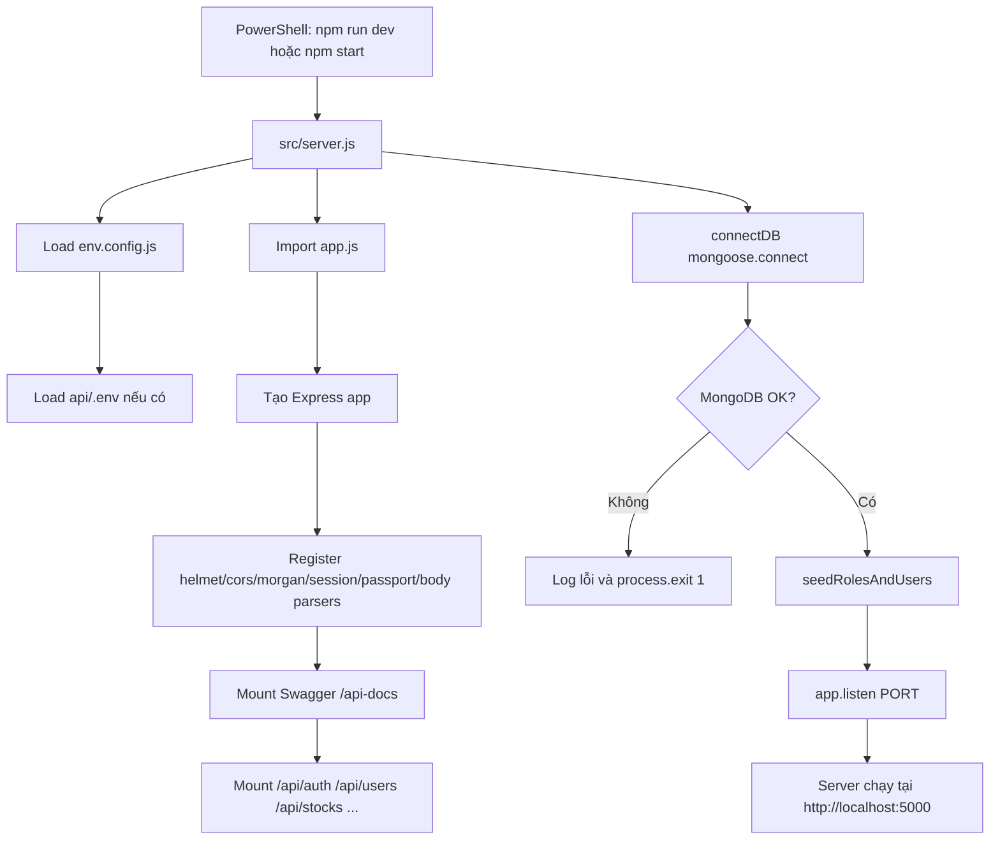

# Hướng dẫn chạy service `api`

Ngày lập báo cáo: 2026-06-22  
Thư mục phân tích: `D:\SWD\BE_AI_Stock_Trend_Prediction\api`  
Phạm vi: đọc source code trong `api` bằng file thực tế. Không đọc file `.env` thật vì trong thư mục `api` hiện **chưa thấy `.env` trong source code**.

## 1. Mục tiêu báo cáo

Báo cáo này hướng dẫn cách chạy local service `api`, bao gồm:

- Công nghệ/framework service đang dùng.
- Entry point và luồng khởi động.
- Cách cài dependency.
- Cách cấu hình `.env`.
- Cách chuẩn bị MongoDB.
- Cách chạy service ở development/production.
- Cách kiểm tra root/Swagger/API bằng PowerShell và Postman.
- Các endpoint chính đã được mount thật trong `src/app.js`.
- Các lỗi thường gặp và cách sửa.

Tất cả nội dung bên dưới dựa trên source code hiện có, không tự bịa endpoint, env hay command.

## 2. Công nghệ và framework được sử dụng

| Hạng mục | Kết quả phát hiện | File chứng minh | Ghi chú |
|---|---|---|---|
| Language | JavaScript CommonJS | `api/src/server.js`, `api/src/app.js` | Dùng `require()`/`module.exports`, không phải TypeScript. |
| Runtime | Node.js | `api/package.json` | `"main": "src/server.js"`. Máy hiện kiểm tra được `node v22.20.0`. |
| Framework | Express.js | `api/src/app.js`, `api/package.json` | Dùng `express()`, `express.Router()`. |
| API docs | Swagger UI/OpenAPI | `api/src/config/swagger.config.js`, `api/src/app.js` | Swagger mount tại `/api-docs`. |
| Package manager | npm | `api/package-lock.json`, `api/package.json` | Không thấy `pnpm-lock.yaml` hoặc `yarn.lock`. |
| Dev runner | nodemon | `api/package.json` | Script `npm run dev` chạy `nodemon src/server.js`. |
| Database | MongoDB | `api/src/config/database.config.js` | Dùng `mongoose.connect(env.MONGODB_URI)`. |
| ORM/ODM | Mongoose | `api/package.json`, `api/src/database/models/*.js` | Không phải Prisma/TypeORM. |
| Auth | JWT + bcrypt + Passport Google OAuth | `api/src/common/utils/jwt.util.js`, `api/src/modules/auth/*`, `api/src/config/passport.config.js` | Bearer access token cho route cần auth. |
| Session | express-session | `api/src/app.js` | Dùng cho Google OAuth state. |
| Security middleware | helmet, cors, morgan | `api/src/app.js` | Helmet tắt CSP để Swagger inline assets chạy được. |
| Payment | PayOS | `api/src/modules/subscriptions/*`, `@payos/node` trong `package.json` | Dùng cho subscription checkout/webhook. |
| Docker support | Chưa thấy | Không có `api/Dockerfile`, `api/docker-compose.yml` | **Chưa thấy trong source code**. |
| NestJS/Spring/FastAPI | Không dùng | Không có `nest-cli.json`, `tsconfig.json`, `pom.xml`, `build.gradle`, `run.py` trong `api` | Đây là Express app. |

Dependency chính trong `package.json`:

| Dependency | Vai trò |
|---|---|
| `express` | HTTP framework. |
| `mongoose` | Kết nối và model MongoDB. |
| `dotenv` | Load biến môi trường. |
| `cors` | CORS middleware. |
| `helmet` | HTTP security headers. |
| `morgan` | Request logging. |
| `express-session` | Session cho OAuth. |
| `passport`, `passport-google-oauth20` | Google OAuth. |
| `jsonwebtoken` | Access/refresh token JWT. |
| `bcryptjs` | Hash password và refresh token. |
| `express-validator` | Validate request body/query/path. |
| `swagger-jsdoc`, `swagger-ui-express` | Swagger docs tại `/api-docs`. |
| `@payos/node` | PayOS payment/webhook. |
| `nodemon` | Dev auto-restart. |

## 3. Source code đã kiểm tra

| File/Folder | Vai trò | Ghi chú |
|---|---|---|
| `api/package.json` | Metadata, dependencies, scripts. | Có `start`, `dev`, `test`, `test:*`. |
| `api/package-lock.json` | Lockfile npm. | Xác nhận dùng npm. |
| `api/README.md` | README chính. | File tồn tại nhưng rỗng. |
| `api/README-GOOGLE-OAUTH.md` | Hướng dẫn Google OAuth. | Có nhắc `.env.example` nhưng file này không tồn tại trong `api`. |
| `api/.env.example` | Env mẫu. | **Chưa thấy trong source code**. |
| `api/.env.template` | Env mẫu. | **Chưa thấy trong source code**. |
| `api/.gitignore` | Ignore file local. | **Chưa thấy trong source code** ở thư mục `api`. |
| `api/Dockerfile` | Docker image. | **Chưa thấy trong source code**. |
| `api/docker-compose.yml` | Docker compose. | **Chưa thấy trong source code**. |
| `api/tsconfig.json`, `api/nest-cli.json` | TypeScript/Nest config. | **Chưa thấy trong source code**. |
| `api/src/server.js` | Entry point chạy server. | Connect MongoDB, seed role/user, listen port, graceful shutdown. |
| `api/src/app.js` | Express app setup. | Middleware, Swagger, route mounting, root endpoint, 404, error handler. |
| `api/src/config/env.config.js` | Load env. | Load `../../../.env` rồi `.env`; định nghĩa default env. |
| `api/src/config/app.config.js` | App config. | Port, env, CORS, session secret. |
| `api/src/config/database.config.js` | MongoDB connection. | `mongoose.connect(env.MONGODB_URI)`; startup fail sẽ `process.exit(1)`. |
| `api/src/config/jwt.config.js` | JWT config. | Access/refresh secrets, expires, bcrypt rounds. |
| `api/src/config/passport.config.js` | Passport setup. | Serialize/deserialize user, register Google strategy. |
| `api/src/config/swagger.config.js` | Swagger setup. | OpenAPI server `http://localhost:5000`, scan route/module files. |
| `api/src/config/plan.config.js` | Subscription plan limits. | FREE 5 watchlist items, PRO 50. |
| `api/src/common/middlewares/*.js` | Auth/role/subscription/error middleware. | Bearer token, role guard, subscription expiry, global error handler. |
| `api/src/common/utils/*.js` | JWT và response helpers. | Response chuẩn `{ success, message, data/errors }`. |
| `api/src/common/stores/oauth-exchange.store.js` | In-memory OAuth code store. | Code TTL 5 phút, single process only. |
| `api/src/database/models/*.js` | Mongoose models. | Users, roles, stocks, prices, watchlists, subscriptions, crawl logs, market overview. |
| `api/src/database/seeds/seed-roles.js` | Seed roles/users mặc định. | Được chạy tự động khi server start. |
| `api/src/database/seeds/seed-industries.js` | Seed industries helper. | Export function, chưa thấy CLI/script gọi trực tiếp. |
| `api/src/database/seeds/seed-markets.js` | Seed markets helper. | Export function, chưa thấy CLI/script gọi trực tiếp. |
| `api/src/database/seeds/seed-expired-user-watchlist.js` | Seed watchlist cho expired user. | Có thể chạy trực tiếp, phụ thuộc dữ liệu stock tồn tại. |
| `api/src/modules/auth/*` | Login/register/logout/refresh/Google OAuth. | Mount tại `/api/auth`. |
| `api/src/modules/users/*` | Profile và admin user management. | Mount tại `/api/users`, `/api/admin/users`. |
| `api/src/modules/stocks/*` | Stock catalog, detail, chart. | Mount tại `/api/stocks`, `/api/admin/stocks`. |
| `api/src/modules/watchlists/*` | User watchlist. | Mount tại `/api/watchlists`. |
| `api/src/modules/dashboard/*` | Role dashboard. | Mount tại `/api/dashboard`. |
| `api/src/modules/subscriptions/*` | PayOS subscription. | Mount tại `/api/subscriptions`. |
| `api/src/modules/admin-subscriptions/*` | Admin subscription management. | Mount tại `/api/admin/subscriptions`. |
| `api/src/modules/staff-subscriptions/*` | Staff read-only subscription management. | Mount tại `/api/staff/subscriptions`. |
| `api/src/modules/markets`, `industries`, `roles`, `financials`, `data-sources`, `crawl-jobs`, `crawl-logs`, `market-overview` | Skeleton module folders. | Nhiều `controller/routes/service/repository` file dài `0` byte; chưa thấy mount trong `app.js`. |
| `api/test-dashboard.js` | Service-layer dashboard test script. | Có thể chạy thủ công nếu DB có dữ liệu role/user. |
| `api/test/*` | Test script theo `package.json`. | **Chưa thấy trong source code**; `npm test` hiện lỗi `MODULE_NOT_FOUND`. |

## 4. Entry point và luồng khởi động

Entry point chính là:

```text
api/src/server.js
```

Script chạy từ `package.json`:

```json
{
  "start": "node src/server.js",
  "dev": "nodemon src/server.js"
}
```

Luồng khởi động thực tế:

1. Chạy `npm start` hoặc `npm run dev`.
2. Node chạy `src/server.js`.
3. `server.js` import `app`, `app.config`, `env.config`, `database.config`, `seed-roles`.
4. `env.config.js` load env theo thứ tự:
   - `path.resolve(__dirname, '../../../.env')`, tức từ `api/src/config` đi lên 3 cấp: `api/.env`.
   - fallback `dotenv.config()` theo working directory hiện tại, thường cũng là `api/.env` nếu chạy từ `api`.
5. `server.js` gọi `connectDB()`.
6. `database.config.js` gọi `mongoose.connect(env.MONGODB_URI)`.
7. Nếu MongoDB connect lỗi, code log lỗi và `process.exit(1)`.
8. Nếu DB connect thành công, `server.js` chạy `seedRolesAndUsers()`.
9. `seed-roles.js` tạo roles `USER`, `STAFF`, `ADMIN` nếu chưa có.
10. `seed-roles.js` tạo user mẫu nếu chưa có:
    - `user@example.com` / `user123456`
    - `staff@example.com` / `staff123456`
    - `admin@example.com` / `admin123456`
    - `locked@example.com` / `locked123456`
    - `pro@example.com` / `pro123456`
    - `expired@example.com` / `expired123456`
11. `server.js` gọi `app.listen(appConfig.port)`.
12. `app.js` đã tạo Express app, register middleware và route trước đó.
13. Server lắng nghe port mặc định `5000`.
14. `server.js` đăng ký graceful shutdown cho `SIGTERM` và `SIGINT`.

Middleware và route registration trong `app.js`:

| Thứ tự | Middleware/Route | Ghi chú |
|---|---|---|
| 1 | `helmet({ contentSecurityPolicy: false })` | Tắt CSP để Swagger UI inline assets hoạt động. |
| 2 | `cors(appConfig.corsOptions)` | Nếu `CORS_ORIGINS` trống thì reflect origin. |
| 3 | `morgan(...)` | Log `dev` nếu `NODE_ENV=development`, ngược lại `combined`. |
| 4 | `express-session` | Dùng `SESSION_SECRET`, cookie 15 phút. |
| 5 | `passport.initialize()`, `passport.session()` | Google OAuth. |
| 6 | `express.raw()` cho `/api/subscriptions/webhook` | Đặt trước `express.json()` để giữ raw body PayOS. |
| 7 | `express.json()`, `express.urlencoded()` | Parse JSON/form. |
| 8 | No-cache middleware | Set `Cache-Control`. |
| 9 | Swagger `/api-docs` | API docs. |
| 10 | API routes | Auth, users, stocks, watchlists, dashboard, subscriptions. |
| 11 | `GET /` | Root/health đơn giản. |
| 12 | 404 handler | Trả `{ success:false, message:"Route ... not found" }`. |
| 13 | Global error handler | Trả error JSON, stack trong development. |

Mermaid diagram:



## 5. Cấu hình môi trường `.env`

Trong thư mục `api`, hiện:

```text
Chưa thấy `.env.example` trong source code
Chưa thấy `.env.template` trong source code
Chưa thấy `.env` trong source code
```

Vì vậy không thể dùng lệnh copy mẫu như:

```powershell
copy .env.example .env
```

Thay vào đó, cần tạo thủ công file:

```text
D:\SWD\BE_AI_Stock_Trend_Prediction\api\.env
```

Ví dụ PowerShell:

```powershell
cd D:\SWD\BE_AI_Stock_Trend_Prediction\api
New-Item -ItemType File -Name .env
```

Sau đó điền các biến cần thiết. Các biến dưới đây được tìm thấy trong `api/src/config/env.config.js` và các file sử dụng config:

| Biến môi trường | Mục đích | Bắt buộc không? | Giá trị mặc định | File sử dụng |
|---|---|---|---|---|
| `NODE_ENV` | Môi trường chạy app. | Không | `development` | `env.config.js`, `app.config.js`, `error.middleware.js`, `auth.routes.js` |
| `PORT` | Port Express listen. | Không | `5000` | `env.config.js`, `app.config.js`, `server.js` |
| `MONGODB_URI` | MongoDB connection string. | Có cho startup thật | `mongodb://localhost:27017/aistock` | `env.config.js`, `database.config.js` |
| `JWT_ACCESS_SECRET` | Secret ký access token. | Nên bắt buộc | `default_access_secret_key_1234567890` | `env.config.js`, `jwt.config.js` |
| `JWT_REFRESH_SECRET` | Secret ký refresh token. | Nên bắt buộc | `default_refresh_secret_key_1234567890` | `env.config.js`, `jwt.config.js` |
| `JWT_ACCESS_EXPIRES_IN` | Thời hạn access token. | Không | `15m` | `env.config.js`, `jwt.config.js` |
| `JWT_REFRESH_EXPIRES_IN` | Thời hạn refresh token. | Không | `7d` | `env.config.js`, `jwt.config.js` |
| `BCRYPT_SALT_ROUNDS` | Số rounds hash bcrypt. | Không | `10` | `env.config.js`, `jwt.config.js`, `seed-roles.js` |
| `CORS_ORIGINS` | Danh sách origin cách nhau bằng dấu phẩy. | Không | `null`, app dùng `true` | `env.config.js`, `app.config.js` |
| `SESSION_SECRET` | Secret cho express-session. | Nên bắt buộc nếu dùng OAuth | `dev_session_secret_change_me` | `env.config.js`, `app.config.js`, `app.js` |
| `GOOGLE_CLIENT_ID` | Google OAuth client ID. | Không để start | Chuỗi rỗng | `env.config.js`, `auth.routes.js`, `google.strategy.js`, `server.js` |
| `GOOGLE_CLIENT_SECRET` | Google OAuth client secret. | Không để start | Chuỗi rỗng | `env.config.js`, `auth.routes.js`, `google.strategy.js`, `server.js` |
| `GOOGLE_CALLBACK_URL` | Callback URL Google OAuth. | Không để start | `http://localhost:5000/api/auth/google/callback` | `env.config.js`, `google.strategy.js`, `auth.routes.js`, `server.js` |
| `GOOGLE_OAUTH_SUCCESS_REDIRECT` | Frontend URL nhận `?code=` sau OAuth. | Không | `http://localhost:3000` | `env.config.js`, `auth.controller.js`, `auth.routes.js` |
| `GOOGLE_OAUTH_FAILURE_REDIRECT` | Frontend URL khi OAuth lỗi. | Không | Chuỗi rỗng, fallback từ success redirect | `env.config.js`, `auth.controller.js`, `auth.routes.js` |
| `PAYOS_CLIENT_ID` | PayOS client ID. | Chỉ bắt buộc khi tạo payment thật | Chuỗi rỗng | `env.config.js`, `payos.service.js` |
| `PAYOS_API_KEY` | PayOS API key. | Chỉ bắt buộc khi tạo payment thật | Chuỗi rỗng | `env.config.js`, `payos.service.js` |
| `PAYOS_CHECKSUM_KEY` | PayOS checksum key. | Chỉ bắt buộc cho payment/webhook thật | Chuỗi rỗng | `env.config.js`, `payos.service.js` |
| `PAYOS_RETURN_URL` | URL redirect payment success. | Không | fallback `http://localhost:3000/payment/success` trong service | `env.config.js`, `subscriptions.service.js` |
| `PAYOS_CANCEL_URL` | URL redirect payment cancel. | Không | fallback `http://localhost:3000/payment/cancel` trong service | `env.config.js`, `subscriptions.service.js` |
| `PAYOS_PRO_PRICE` | Giá PRO trong env. | Không | `50000` | `env.config.js`; **cần kiểm tra thêm** vì service đang dùng `SUBSCRIPTION_PRICE` từ `plan.config.js`. |

Ví dụ `.env` tối thiểu để chạy local:

```env
NODE_ENV=development
PORT=5000
MONGODB_URI=mongodb://localhost:27017/aistock
JWT_ACCESS_SECRET=local_access_secret_change_me
JWT_REFRESH_SECRET=local_refresh_secret_change_me
JWT_ACCESS_EXPIRES_IN=15m
JWT_REFRESH_EXPIRES_IN=7d
BCRYPT_SALT_ROUNDS=10
CORS_ORIGINS=http://localhost:3000
SESSION_SECRET=local_session_secret_change_me

GOOGLE_CLIENT_ID=
GOOGLE_CLIENT_SECRET=
GOOGLE_CALLBACK_URL=http://localhost:5000/api/auth/google/callback
GOOGLE_OAUTH_SUCCESS_REDIRECT=http://localhost:3000
GOOGLE_OAUTH_FAILURE_REDIRECT=

PAYOS_CLIENT_ID=
PAYOS_API_KEY=
PAYOS_CHECKSUM_KEY=
PAYOS_RETURN_URL=http://localhost:3000/payment/success
PAYOS_CANCEL_URL=http://localhost:3000/payment/cancel
PAYOS_PRO_PRICE=50000
```

Ghi chú bảo mật:

- Không dùng default JWT secret ở production.
- Không commit `.env`.
- Trong `api` hiện **chưa thấy `.gitignore`**, cần kiểm tra root `.gitignore` có ignore `api/.env` chưa.

## 6. Cài đặt dependencies

Project dùng npm vì có `package.json` và `package-lock.json`. Không thấy pnpm/yarn lockfile.

Cài dependency:

```powershell
cd D:\SWD\BE_AI_Stock_Trend_Prediction\api
npm install
```

Hoặc nếu muốn cài đúng theo lockfile trong CI/local sạch:

```powershell
cd D:\SWD\BE_AI_Stock_Trend_Prediction\api
npm ci
```

Không dùng các lệnh dưới đây vì **chưa thấy trong source code** cấu hình tương ứng:

```powershell
pnpm install
yarn install
mvn clean install
pip install -r requirements.txt
```

## 7. Database setup nếu có

Source sử dụng MongoDB qua Mongoose.

| Hạng mục | Chi tiết |
|---|---|
| Database | MongoDB |
| Connection env | `MONGODB_URI` |
| Default URI | `mongodb://localhost:27017/aistock` |
| ODM | Mongoose |
| Migration framework | **Chưa thấy trong source code** |
| Prisma/TypeORM | **Chưa thấy trong source code** |
| Auto seed | Có, `seedRolesAndUsers()` chạy mỗi lần startup |
| Docker MongoDB | **Chưa thấy Dockerfile/docker-compose trong `api`** |

### 7.1. Cách chạy MongoDB local

Nếu máy đã cài MongoDB Community Server, đảm bảo service MongoDB đang chạy. Kiểm tra nhanh:

```powershell
mongosh "mongodb://localhost:27017/aistock"
```

Nếu chưa có `mongosh`, có thể kiểm tra port mặc định:

```powershell
netstat -ano | findstr :27017
```

Nếu muốn dùng Docker cho MongoDB, trong source `api` **chưa thấy docker-compose**, nhưng có thể chạy container MongoDB thủ công. Đây là lệnh gợi ý ngoài source, cần kiểm tra thêm theo môi trường máy:

```powershell
docker run --name aistock-mongo -p 27017:27017 -d mongo:7
```

Sau đó cấu hình:

```env
MONGODB_URI=mongodb://localhost:27017/aistock
```

### 7.2. Migration

Chưa thấy cấu hình migration trong source code. Không có Prisma schema, TypeORM migration, hoặc script migration trong `package.json`.

Mongoose sẽ tạo collection/index khi model được sử dụng và MongoDB cho phép tạo index. Các index được khai báo trong model như:

- `DimStockSchema.index({ market_id: 1, symbol: 1 }, { unique: true })`
- `FactMarketPriceSchema.index({ stock_id: 1, time_id: 1, data_source_id: 1 }, { unique: true })`
- `WatchlistSchema.index({ user_id: 1, stock_id: 1 }, { unique: true })`

### 7.3. Seed data

Seed tự động khi start:

```text
src/server.js -> seedRolesAndUsers()
```

Seed này tạo roles và user mẫu. Có thể chạy riêng:

```powershell
cd D:\SWD\BE_AI_Stock_Trend_Prediction\api
node src/database/seeds/seed-roles.js
```

User mẫu trong source:

| Email | Password | Role/Trạng thái |
|---|---|---|
| `user@example.com` | `user123456` | USER, ACTIVE |
| `staff@example.com` | `staff123456` | STAFF, ACTIVE |
| `admin@example.com` | `admin123456` | ADMIN, ACTIVE |
| `locked@example.com` | `locked123456` | USER, LOCKED |
| `pro@example.com` | `pro123456` | USER, PRO ACTIVE |
| `expired@example.com` | `expired123456` | USER, PRO EXPIRED |

Lưu ý: đây là dữ liệu seed trong source, cần đổi/xóa ở môi trường thật.

Các file `seed-industries.js` và `seed-markets.js` chỉ export function, **chưa thấy script CLI hoặc `package.json` script** để chạy trực tiếp. File `seed-expired-user-watchlist.js` có thể chạy trực tiếp nhưng phụ thuộc dữ liệu stock đã tồn tại:

```powershell
node src/database/seeds/seed-expired-user-watchlist.js
```

## 8. Cách chạy service

### 8.1. Chạy development

Script hợp lệ trong `package.json`:

```powershell
cd D:\SWD\BE_AI_Stock_Trend_Prediction\api
npm run dev
```

Lệnh này chạy:

```text
nodemon src/server.js
```

Nếu MongoDB chưa chạy hoặc `MONGODB_URI` sai, app sẽ fail trong bước startup vì `connectDB()` gọi `process.exit(1)`.

### 8.2. Chạy production/simple start

```powershell
cd D:\SWD\BE_AI_Stock_Trend_Prediction\api
npm start
```

Lệnh này chạy:

```text
node src/server.js
```

### 8.3. Chạy trực tiếp bằng node

Lệnh này tương đương `npm start`:

```powershell
cd D:\SWD\BE_AI_Stock_Trend_Prediction\api
node src/server.js
```

### 8.4. Chạy bằng Docker

Trong `api` hiện:

```text
Chưa thấy Dockerfile trong source code
Chưa thấy docker-compose.yml trong source code
```

Vì vậy không có lệnh Docker chính thức cho service `api`. Lệnh `docker compose up --build` **không được xem là hợp lệ cho project này** nếu chỉ dựa trên source `api`.

## 9. Cách kiểm tra service đã chạy

Base URL mặc định:

```text
http://localhost:5000
```

### 9.1. Root endpoint

`app.js` định nghĩa:

```http
GET /
```

Kiểm tra bằng PowerShell:

```powershell
Invoke-RestMethod http://localhost:5000/
```

Expected response:

```json
{
  "message": "AI Stock Trend Prediction API is running"
}
```

### 9.2. Health endpoint

Chưa thấy health endpoint riêng như `/health` hoặc `/api/health` trong source code. Root `/` đang đóng vai trò kiểm tra service sống.

Nếu gọi:

```powershell
Invoke-RestMethod http://localhost:5000/health
```

khả năng cao sẽ nhận 404:

```json
{
  "success": false,
  "message": "Route /health not found"
}
```

### 9.3. Swagger/OpenAPI docs

Swagger UI được mount tại:

```text
http://localhost:5000/api-docs
```

Mở trình duyệt hoặc chạy:

```powershell
Start-Process http://localhost:5000/api-docs
```

### 9.4. Kiểm tra port

```powershell
netstat -ano | findstr :5000
```

Hoặc:

```powershell
Get-NetTCPConnection -LocalPort 5000
```

Nếu không thấy process listen port `5000`, service chưa chạy hoặc đã crash/shutdown.

## 10. Hướng dẫn test bằng Postman

### 10.1. Base URL

```text
http://localhost:5000
```

### 10.2. Headers mặc định

| Key | Value |
|---|---|
| `Content-Type` | `application/json` |
| `Accept` | `application/json` |

Với endpoint cần auth, thêm:

```text
Authorization: Bearer <access_token>
```

Access token lấy từ:

```http
POST /api/auth/login
```

### 10.3. Test health/root endpoint

| Field | Giá trị |
|---|---|
| Method | `GET` |
| URL | `http://localhost:5000/` |
| Auth | Không |
| Body | Không |

Expected response:

```json
{
  "message": "AI Stock Trend Prediction API is running"
}
```

### 10.4. Test các API chính

Các endpoint dưới đây là endpoint đã được mount trong `api/src/app.js`.

| Method | Endpoint | Mục đích | Cần auth? | Body mẫu |
|---|---|---|---|---|
| `GET` | `/` | Root check. | Không | Không |
| `POST` | `/api/auth/register` | Đăng ký user. | Không | `{"full_name":"New User","email":"newuser@example.com","password":"newuser123456"}` |
| `POST` | `/api/auth/login` | Đăng nhập, lấy access/refresh token. | Không | `{"email":"user@example.com","password":"user123456"}` |
| `POST` | `/api/auth/refresh-token` | Refresh access token. | Không | `{"refresh_token":"..."}` |
| `POST` | `/api/auth/logout` | Logout user hiện tại. | Có | Không |
| `GET` | `/api/auth/google` | Bắt đầu Google sign-in. | Không | Không |
| `GET` | `/api/auth/google/register` | Bắt đầu Google sign-up. | Không | Không |
| `GET` | `/api/auth/google/callback` | Callback Google OAuth. | Google gọi | Không |
| `POST` | `/api/auth/oauth/exchange` | Đổi OAuth code lấy token. | Không | `{"code":"..."}` |
| `GET` | `/api/auth/google/oauth-config` | Xem callback URL trong development. | Không | Không |
| `GET` | `/api/users/me` | Xem profile. | Có | Không |
| `PUT` | `/api/users/me` | Update profile. | Có | `{"full_name":"Nguyen Van B"}` |
| `PUT` | `/api/users/me/password` | Đổi password. | Có | `{"current_password":"user123456","new_password":"newuser123456"}` |
| `GET` | `/api/admin/users` | Admin list/search users. | Có, ADMIN | Query `page`, `limit`, `keyword`, `status`, `role` |
| `GET` | `/api/admin/users/:id` | Admin xem user detail. | Có, ADMIN | Không |
| `PATCH` | `/api/admin/users/:id/lock` | Admin khóa user. | Có, ADMIN | Không |
| `PATCH` | `/api/admin/users/:id/unlock` | Admin mở khóa user. | Có, ADMIN | Không |
| `PATCH` | `/api/admin/users/:id/role` | Admin đổi role USER/STAFF. | Có, ADMIN | `{"role":"STAFF"}` |
| `GET` | `/api/stocks` | Danh sách stock. | Không | Query `page`, `limit`, `keyword`, `market` |
| `GET` | `/api/stocks/:symbol` | Chi tiết stock. | Không | Không |
| `GET` | `/api/stocks/:symbol/chart` | Chart OHLCV. | Không | Query `range=7d/1m/3m/6m/1y/all` |
| `POST` | `/api/admin/stocks` | Admin tạo stock master. | Có, ADMIN | `{"symbol":"FPT","company_name":"Công ty Cổ phần FPT","market_id":"..."}` |
| `PUT` | `/api/admin/stocks/:id` | Admin update stock master. | Có, ADMIN | `{"company_name":"...","status":"ACTIVE"}` |
| `GET` | `/api/watchlists` | Lấy watchlist user. | Có | Không |
| `POST` | `/api/watchlists` | Thêm symbol vào watchlist. | Có | `{"symbol":"FPT"}` |
| `DELETE` | `/api/watchlists/:symbol` | Xóa symbol khỏi watchlist. | Có | Không |
| `POST` | `/api/watchlists/trim` | Trim watchlist khi quá limit. | Có | `{"keepStockIds":["..."]}` |
| `GET` | `/api/dashboard/user` | Dashboard USER. | Có, USER | Không |
| `GET` | `/api/dashboard/staff` | Dashboard STAFF. | Có, STAFF | Không |
| `GET` | `/api/dashboard/admin` | Dashboard ADMIN. | Có, ADMIN | Không |
| `POST` | `/api/subscriptions/create-payment` | Tạo PayOS payment. | Có | `{}` hoặc `{"amount":50000}` |
| `POST` | `/api/subscriptions/webhook` | PayOS webhook. | Không | `{"orderCode":123,"status":"PAID"}` cho test đơn giản |
| `GET` | `/api/subscriptions/status` | Trạng thái subscription của user. | Có | Không |
| `GET` | `/api/subscriptions/transactions` | Transaction của user. | Có | Query `page`, `limit` |
| `GET` | `/api/admin/subscriptions` | Admin list subscriptions. | Có, ADMIN | Query filter |
| `GET` | `/api/admin/subscriptions/stats` | Admin subscription stats. | Có, ADMIN | Không |
| `GET` | `/api/admin/subscriptions/transactions` | Admin transaction history. | Có, ADMIN | Query filter |
| `GET` | `/api/admin/subscriptions/:userId` | Admin subscription detail. | Có, ADMIN | Không |
| `POST` | `/api/admin/subscriptions/:userId/grant` | Admin grant PRO. | Có, ADMIN | `{"duration_days":30,"notes":"manual grant"}` |
| `POST` | `/api/admin/subscriptions/:userId/renew` | Admin renew PRO. | Có, ADMIN | `{"duration_days":30,"notes":"renew"}` |
| `POST` | `/api/admin/subscriptions/:userId/cancel` | Admin cancel PRO. | Có, ADMIN | `{"notes":"cancel"}` |
| `PATCH` | `/api/admin/subscriptions/:userId/expiry` | Admin sửa hạn PRO. | Có, ADMIN | `{"expires_at":"2026-09-15T10:00:00.000Z","notes":"extend"}` |
| `GET` | `/api/staff/subscriptions` | Staff list subscriptions. | Có, STAFF hoặc ADMIN | Query filter |
| `GET` | `/api/staff/subscriptions/search` | Staff search subscriptions. | Có, STAFF hoặc ADMIN | Query `keyword` |
| `GET` | `/api/staff/subscriptions/:userId` | Staff subscription detail. | Có, STAFF hoặc ADMIN | Không |

### 10.5. Postman flow gợi ý

#### Bước 1: kiểm tra root

```http
GET http://localhost:5000/
```

#### Bước 2: login user seed

```http
POST http://localhost:5000/api/auth/login
Content-Type: application/json
```

Body:

```json
{
  "email": "user@example.com",
  "password": "user123456"
}
```

Expected response shape:

```json
{
  "success": true,
  "message": "Login successfully",
  "data": {
    "access_token": "...",
    "refresh_token": "...",
    "user": {
      "id": "...",
      "full_name": "Regular User",
      "email": "user@example.com",
      "role": "USER",
      "status": "ACTIVE"
    }
  }
}
```

Lưu `data.access_token` vào Postman variable, ví dụ `access_token`.

#### Bước 3: gọi API cần auth

```http
GET http://localhost:5000/api/users/me
Authorization: Bearer {{access_token}}
```

Expected response shape:

```json
{
  "success": true,
  "message": "Get profile successfully",
  "data": {
    "id": "...",
    "full_name": "Regular User",
    "email": "user@example.com",
    "role": "USER",
    "status": "ACTIVE",
    "plan": "FREE",
    "subscription_status": "NONE",
    "subscription_expires_at": null
  }
}
```

#### Bước 4: test stock public API

```http
GET http://localhost:5000/api/stocks?page=1&limit=10&market=HOSE
```

Expected response shape:

```json
{
  "success": true,
  "message": "Get stocks successfully",
  "data": {
    "items": [],
    "pagination": {
      "page": 1,
      "limit": 10,
      "total_items": 0,
      "total_pages": 1
    }
  }
}
```

Nếu DB chưa có stock data, `items` có thể rỗng. Cần crawler/seed dữ liệu stock để có kết quả thật. **Chưa thấy trong source code `api` script seed stock master đầy đủ**.

#### Bước 5: test watchlist

```http
POST http://localhost:5000/api/watchlists
Authorization: Bearer {{access_token}}
Content-Type: application/json
```

Body:

```json
{
  "symbol": "FPT"
}
```

Lỗi thường gặp:

```json
{
  "success": false,
  "message": "Stock symbol not found"
}
```

Lỗi này xảy ra nếu collection `dimstocks` chưa có mã `FPT`.

#### Bước 6: test admin API

Login admin:

```json
{
  "email": "admin@example.com",
  "password": "admin123456"
}
```

Sau đó gọi:

```http
GET http://localhost:5000/api/admin/users?page=1&limit=10
Authorization: Bearer {{admin_access_token}}
```

#### Bước 7: test Swagger

Mở:

```text
http://localhost:5000/api-docs
```

Trong Swagger, bấm Authorize và nhập:

```text
Bearer <access_token>
```

## 11. Cách chạy test

`package.json` khai báo:

```json
{
  "test": "node test/test-auth-flow.js && node test/test-users-flow.js && node test/test-stocks-watchlist-flow.js",
  "test:auth": "node test/test-auth-flow.js",
  "test:users": "node test/test-users-flow.js",
  "test:stocks": "node test/test-stocks-watchlist-flow.js"
}
```

Nhưng hiện tại:

```text
Chưa thấy test trong source code tại api/test/*
```

Đã chạy thử:

```powershell
cd D:\SWD\BE_AI_Stock_Trend_Prediction\api
npm test
```

Kết quả:

```text
Error: Cannot find module 'D:\SWD\BE_AI_Stock_Trend_Prediction\api\test\test-auth-flow.js'
```

Vì vậy `npm test` hiện chưa chạy được cho đến khi bổ sung các file `api/test/test-auth-flow.js`, `api/test/test-users-flow.js`, `api/test/test-stocks-watchlist-flow.js` hoặc sửa script test.

File `api/test-dashboard.js` tồn tại và có thể chạy thủ công nếu MongoDB có dữ liệu phù hợp:

```powershell
cd D:\SWD\BE_AI_Stock_Trend_Prediction\api
node test-dashboard.js
```

Script này kết nối DB, kiểm tra roles/users và gọi dashboard service. Đây không phải script được khai báo trong `package.json`.

## 12. Các lỗi thường gặp và cách sửa

| Lỗi/Dấu hiệu | Nguyên nhân có thể | Cách kiểm tra | Cách sửa |
|---|---|---|---|
| Service start rồi thoát ngay | MongoDB connection fail; `connectDB()` gọi `process.exit(1)`. | Xem log `[Database] MongoDB connection error`. | Start MongoDB, sửa `MONGODB_URI`. |
| Port `5000` bị chiếm | Process khác đang listen port 5000. | `netstat -ano \| findstr :5000` hoặc `Get-NetTCPConnection -LocalPort 5000`. | Kill process hoặc đổi `PORT` trong `.env`. |
| Thiếu `.env` | `api/.env` chưa có. | `Test-Path .env`. | Tạo `.env` thủ công vì chưa có `.env.example`. |
| App vẫn chạy dù thiếu `.env` | `env.config.js` có default. | Xem `env.config.js`. | Vẫn nên tạo `.env`, đặc biệt JWT/session/Mongo. |
| `MODULE_NOT_FOUND` khi start | Chưa cài npm dependency. | `npm install`; kiểm tra `node_modules`. | Chạy `npm install` hoặc `npm ci`. |
| `nodemon` không nhận | Chưa cài dependency dev hoặc install lỗi. | `npm run dev`. | Chạy `npm install`; hoặc dùng `npm start`. |
| Database connection failed | MongoDB chưa chạy hoặc URI sai. | `mongosh`, `netstat :27017`. | Start MongoDB local/container, sửa `MONGODB_URI`. |
| Migration failed | Không có migration framework. | Kiểm tra `package.json`, `prisma`, TypeORM. | **Chưa thấy migration trong source code**; dùng seed/model hiện có. |
| `npm test` lỗi `Cannot find module api/test/...` | `package.json` trỏ test files không tồn tại. | `Test-Path api/test`. | Bổ sung test files hoặc sửa script test. |
| 401 Unauthorized | Thiếu hoặc sai Bearer token. | Kiểm tra header `Authorization`. | Login lại, dùng `Authorization: Bearer <access_token>`. |
| 403 Forbidden | Role không đủ quyền hoặc account locked. | Xem response message; check role user seed. | Dùng admin/staff token đúng endpoint; unlock user nếu cần. |
| 400 Validation failed | Body/query/path sai rule `express-validator`. | Xem response `errors`. | Sửa body: email hợp lệ, password >= 8, MongoId đúng, enum đúng. |
| 404 Route not found | Sai path hoặc gọi module chưa mount. | So sánh với `src/app.js`. | Dùng đúng prefix `/api/...`; xem Swagger `/api-docs`. |
| `/health` 404 | Không có health endpoint riêng. | Xem `app.js`. | Dùng root `/` để health check. |
| Swagger không mở | Service chưa chạy hoặc sai port. | Mở root `/`, kiểm tra port 5000. | Start API, mở `/api-docs`. |
| Google OAuth trả 503 | Thiếu `GOOGLE_CLIENT_ID` hoặc `GOOGLE_CLIENT_SECRET`. | Gọi `/api/auth/google/oauth-config` trong development; xem env. | Điền Google OAuth env và cấu hình Authorized redirect URI. |
| Google `redirect_uri_mismatch` | `GOOGLE_CALLBACK_URL` không khớp Google Cloud. | Xem `README-GOOGLE-OAUTH.md`; gọi `/api/auth/google/oauth-config`. | Copy đúng callback URL vào Google Cloud. |
| PayOS create payment lỗi | Thiếu `PAYOS_CLIENT_ID`, `PAYOS_API_KEY`, `PAYOS_CHECKSUM_KEY`. | Xem response/log khi gọi `/api/subscriptions/create-payment`. | Điền PayOS env thật. |
| Watchlist add stock lỗi `Stock symbol not found` | DB chưa có stock master. | Gọi `GET /api/stocks?keyword=FPT`. | Seed/crawl/create stock master bằng admin API. |
| CORS lỗi từ frontend | `CORS_ORIGINS` chưa đúng hoặc credential mode mismatch. | Xem browser console và `app.config.js`. | Set `CORS_ORIGINS=http://localhost:3000` hoặc danh sách origin đúng. |
| Docker không chạy được | Không có Docker config trong `api`. | `Test-Path Dockerfile`, `Test-Path docker-compose.yml`. | Tạo Dockerfile/compose riêng hoặc chạy bằng npm. |
| Service starts then shuts down khi nhấn Ctrl+C | Graceful shutdown bắt `SIGINT`. | Log `[Server] SIGINT signal received`. | Đây là shutdown bình thường; chạy lại service. |

## 13. Checklist chạy đúng

- [ ] Đang ở đúng folder `D:\SWD\BE_AI_Stock_Trend_Prediction\api`
- [ ] Đã cài dependency bằng `npm install` hoặc `npm ci`
- [ ] Đã tạo `api/.env` thủ công vì chưa có `.env.example`
- [ ] Đã cấu hình `MONGODB_URI`
- [ ] MongoDB đang chạy
- [ ] Đã đổi `JWT_ACCESS_SECRET`, `JWT_REFRESH_SECRET`, `SESSION_SECRET` khỏi default nếu dùng lâu dài
- [ ] Port `5000` chưa bị chiếm
- [ ] Service đang chạy bằng `npm run dev` hoặc `npm start`
- [ ] Root endpoint `GET /` trả message OK
- [ ] Swagger mở được tại `http://localhost:5000/api-docs`
- [ ] Login bằng user seed lấy được `access_token`
- [ ] Postman gửi được `Authorization: Bearer <token>` cho API cần auth
- [ ] Nếu test subscription/payment, đã cấu hình PayOS env
- [ ] Nếu test Google OAuth, đã cấu hình Google OAuth env và redirect URI

## 14. Lệnh chạy nhanh đề xuất

Vì source `api` không có `.env.example`, sequence dưới đây tạo `.env` thủ công bằng `New-Item`, sau đó bạn cần mở file để điền biến:

```powershell
cd D:\SWD\BE_AI_Stock_Trend_Prediction\api
npm install
New-Item -ItemType File -Name .env -Force
```

Điền tối thiểu:

```env
NODE_ENV=development
PORT=5000
MONGODB_URI=mongodb://localhost:27017/aistock
JWT_ACCESS_SECRET=local_access_secret_change_me
JWT_REFRESH_SECRET=local_refresh_secret_change_me
SESSION_SECRET=local_session_secret_change_me
CORS_ORIGINS=http://localhost:3000
```

Đảm bảo MongoDB chạy, rồi start:

```powershell
npm run dev
```

Kiểm tra:

```powershell
Invoke-RestMethod http://localhost:5000/
Start-Process http://localhost:5000/api-docs
```

Nếu muốn chạy không qua nodemon:

```powershell
npm start
```

## 15. Kết luận

Service `api` là backend Node.js Express dùng MongoDB/Mongoose, JWT auth, Google OAuth, Swagger UI và PayOS subscription. Cách chạy đúng theo source hiện tại:

```powershell
cd D:\SWD\BE_AI_Stock_Trend_Prediction\api
npm install
npm run dev
```

Base URL mặc định:

```text
http://localhost:5000
```

Endpoint kiểm tra service:

```text
GET http://localhost:5000/
```

Swagger docs:

```text
http://localhost:5000/api-docs
```

Điều kiện quan trọng nhất để service start thành công là MongoDB phải kết nối được qua `MONGODB_URI`; nếu không, `connectDB()` sẽ log lỗi và dừng process. `.env.example`, Docker config và test files theo `npm test` hiện **chưa thấy trong source code**, nên cần tạo/bổ sung nếu muốn chuẩn hóa onboarding hoặc CI.

File báo cáo được tạo tại:

```text
API_RUN_GUIDE_REPORT.md
```
