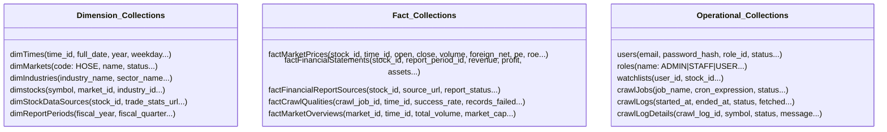

# 🏛️ Backend Knowledge Hub — AI-Based Stock Trend Prediction

Chào mừng bạn đến với tài liệu kỹ thuật trung tâm của toàn bộ hệ thống Backend. Tài liệu này đóng vai trò như **Single Source of Truth** nhằm giúp các Developer và AI Agent nhanh chóng hiểu được mục tiêu, kiến trúc, mô hình dữ liệu, luồng crawler, cũng như cách phát triển và mở rộng hệ thống mà không cần đọc toàn bộ mã nguồn.

---

## 📌 Mục lục (Table of Contents)

1. [Project Overview (Tổng quan dự án)](#1-project-overview)
2. [Current System Status (Trạng thái hệ thống)](#2-current-system-status)
3. [High-Level Architecture (Kiến trúc hệ thống)](#3-high-level-architecture)
4. [Repository Structure (Cấu trúc thư mục)](#4-repository-structure)
5. [Backend Modules (Các module nghiệp vụ)](#5-backend-modules)
6. [Database Overview (Thiết kế Data Warehouse)](#6-database-overview)
7. [Data Flow (Luồng di chuyển dữ liệu)](#7-data-flow)
8. [Crawler Overview (Hệ thống thu thập dữ liệu)](#8-crawler-overview)
9. [API Overview (Các nhóm API)](#9-api-overview)
10. [Environment Variables (Cấu hình môi trường)](#10-environment-variables)
11. [Development Workflow (Quy trình phát triển)](#11-development-workflow)
12. [Agent Quick Start (Dành riêng cho AI Agent)](#12-agent-quick-start)
13. [Roadmap (Lộ trình phát triển)](#13-roadmap)
14. [References (Tài liệu tham khảo)](#14-references)

---

## 1. Project Overview

Hệ thống **AI-Based Stock Trend Prediction** là nền tảng phân tích, trực quan hóa dữ liệu lịch sử chứng khoán sàn HOSE và dự đoán xu hướng biến động giá của các mã cổ phiếu trong tương lai.

### 🌟 Triết lý phát triển cốt lõi
Hệ thống tuân thủ nghiêm ngặt nguyên lý **Data First → AI Later**:
```text
Lấy dữ liệu đúng ➔ Lưu dữ liệu đúng ➔ Hiển thị đúng ➔ Hiển thị rõ ➔ Phát triển AI sau
```
Trọng tâm giai đoạn MVP hiện tại là xây dựng một **kho dữ liệu sạch, có giám sát chất lượng và tính lịch sử cao** trước khi ứng dụng các mô hình học máy (Machine Learning/Deep Learning) ở Phase 3.

### 🎯 Phạm vi giai đoạn MVP (Phase 1 & 2)
* **Sàn giao dịch hỗ trợ**: Tập trung xử lý dữ liệu sàn **HOSE** (Thành phố Hồ Chí Minh).
* **Thu thập dữ liệu**: Cào tự động biến động giá hàng ngày (OHLCV), chỉ số định giá cơ bản (P/E, P/B, EPS, ROE...) và Báo cáo tài chính theo quý.
* **Lưu trữ dạng Kho dữ liệu (Data Warehouse)**: Thiết kế theo mô hình Dimensional (Dimension & Fact) nhằm tối ưu hiệu năng truy vấn đa chiều và chuẩn bị tập dataset chuẩn cho AI.
* **Kiểm soát chất lượng cào (Data Quality)**: Thiết lập hệ thống log chi tiết (`crawlLogs`, `crawlLogDetails`) và báo cáo tỷ lệ thành công của mỗi phiên crawl (`factCrawlQualities`).
* **Tính năng người dùng**: Đăng ký/Đăng nhập (Local JWT + Google OAuth), tạo danh mục theo dõi cổ phiếu yêu thích (Watchlist tối đa 5 mã/user), xem các biểu đồ biến động.

---

## 2. Current System Status

Dưới đây là tiến độ triển khai thực tế của các cấu phần Backend:

| Module / Component | Status | Tech Stack | Notes |
| :--- | :---: | :---: | :--- |
| **Authentication** |  Done | JWT + Bcrypt | Hỗ trợ Local login/register & Google OAuth. Phân quyền RBAC. |
| **Users Management** |  Done | Node.js + Mongoose | Xem profile, quản lý danh sách user, khóa tài khoản (Admin). |
| **Roles Catalog** |  Done | Node.js + Seed | Định nghĩa các role: `ADMIN`, `STAFF`, `USER`. Tự động seed khi khởi động. |
| **Markets Catalog** |  Done | Node.js + Seed | Quản lý thông tin sàn (mặc định HOSE). Tự động seed khi khởi động. |
| **Industries Catalog** |  Done | Node.js + Seed | Phân loại ngành (Ngân hàng, Bất động sản...). Tự động seed khi khởi động. |
| **Stocks Catalog** |  Done | Node.js + Mongoose | Master data các mã cổ phiếu. Hỗ trợ CRUD & phân trang tìm kiếm. |
| **Watchlists** |  Done | Node.js + Mongoose | MVP watchlist cho user theo dõi tối đa 5 mã cổ phiếu. |
| **Price Data** |  Done | Node.js + Mongoose | Cung cấp dữ liệu OHLCV lịch sử phục vụ vẽ biểu đồ (Chart API). |
| **Crawler CLI** |  Done | Python + Playwright | Script CLI cào thủ công theo ngày với cơ chế Multi-source Fallback. |
| **Crawl Jobs** |  In Progress | Node-cron | Khung cấu hình job tự động lưu trong DB. Chờ kích hoạt scheduler. |
| **Crawl Logs** |  In Progress | Python + Node.js | Ghi log chi tiết phiên chạy và trạng thái từng mã. API đọc log đã sẵn sàng. |
| **Financial Statements** |  In Progress | Python Parser | Parser bóc tách Báo cáo tài chính từ Vietstock. Mongoose Schema đã xong. |
| **Market Overview** |  In Progress | Python + Node.js | Tổng quan thanh khoản sàn, khối ngoại. Schema và API cơ bản đang dựng. |
| **AI Prediction** | 💤 Not Started | Python + PyTorch | Dự kiến triển khai tại Phase 3 sau khi tích lũy đủ dữ liệu lịch sử sạch. |

---

## 3. High-Level Architecture

Hệ thống được thiết kế theo mô hình kiến trúc phân tầng độc lập giúp dễ dàng bảo trì và mở rộng quy mô.

### 🗺️ Luồng kiến trúc tổng thể (System Architecture Flow)

```text
       ┌────────────────────────────────────────────────────────┐
       │                      External Sources                  │
       │     (Vietstock Web, FiinTrade, CafeF, EODHD API)       │
       └───────────────────────────┬────────────────────────────┘
                                   │
                                   ▼ (Scrapes / API Fetch)
       ┌────────────────────────────────────────────────────────┐
       │                Python Crawler Service                  │
       │       (manual_crawl_by_date_improved.py & parsers)      │
       └───────────────────────────┬────────────────────────────┘
                                   │ (Direct Writes to DW)
                                   ▼
       ┌────────────────────────────────────────────────────────┐
       │               MongoDB Atlas Data Warehouse             │
       │      (dimTimes, dimstocks, factMarketPrices, etc.)     │
       └───────────────────────────▲────────────────────────────┘
                                   │ (Mongoose ODM - Reads/Writes)
                                   ▼
       ┌────────────────────────────────────────────────────────┐
       │                   Backend API Server                   │
       │              (Node.js + Express.js + JWT)              │
       └──────┬────────────────────┬────────────────────┬───────┘
              │                    │                    │
              ▼ (REST APIs)        ▼ (REST APIs)        ▼ (REST APIs)
       ┌──────────────┐     ┌──────────────┐     ┌──────────────┐
       │   Web App    │     │  Mobile App  │     │ Swagger Docs │
       │ (React/Vite) │     │(React Native)│     │  (/api-docs) │
       └──────────────┘     └──────────────┘     └──────────────┘
```

---

## 4. Repository Structure

Thư mục dịch vụ Backend nằm trong phân vùng `/services` của Monorepo:

```text
services/
├── api/                             # Dịch vụ Backend API (Node.js/Express)
│   ├── src/
│   │   ├── app.js                   # Khởi tạo Express, cấu hình Middlewares & Router chính
│   │   ├── server.js                # Khởi động server, kết nối MongoDB Atlas & chạy Seed data
│   │   ├── config/                  # Cấu hình CORS, DB, JWT, Passport OAuth, Swagger
│   │   ├── common/                  # Middlewares (Auth, Role, Error) & Response Helpers
│   │   ├── database/
│   │   │   ├── models/              # Lớp định nghĩa 17 Mongoose Schemas (Dim/Fact/Operational)
│   │   │   └── seeds/               # File nạp dữ liệu mặc định (roles, markets, industries)
│   │   └── modules/                 # Nghiệp vụ phân lớp (Route -> Controller -> Service -> Repo)
│   │       ├── auth/                # Đăng ký, đăng nhập, cấp JWT, Google OAuth
│   │       ├── stocks/              # Tra cứu mã cổ phiếu, lấy chart lịch sử, CRUD danh mục
│   │       ├── watchlists/          # Thêm/Xóa/Xem watchlist cá nhân của user
│   │       └── [other modules]/     # Các module quản lý crawl và dữ liệu kho (đang phát triển)
│   └── package.json
│
└── crawler/                         # Dịch vụ cào dữ liệu tự động & thủ công (Python)
    ├── src/
    │   └── vietstock_crawler/
    │       ├── app.py               # Logic cào chính từ Vietstock (tương tác trình duyệt)
    │       ├── core/                # Trình duyệt giả lập Playwright, Logging, Exceptions
    │       ├── models/              # Định nghĩa cột ánh xạ và dữ liệu đầu ra
    │       ├── parsers/             # Lớp phân tích HTML (Giá, BCTC, Chỉ số giao dịch)
    │       └── services/            # Kết nối ghi dữ liệu trực tiếp qua mongodb_service.py
    ├── manual_crawl_by_date_improved.py # Script CLI chạy cào dữ liệu theo ngày chỉ định
    └── requirements.txt             # Các thư viện Python (playwright, pymongo, pandas, bs4)
```

---

## 5. Backend Modules

Mỗi module nghiệp vụ nằm trong thư mục [services/api/src/modules/](file:///d:/MONHOCKI7/Project/ai-stock-trend-prediction/services/api/src/modules) chứa các file phân lớp: `routes.js`, `controller.js`, `service.js`, `repository.js`, `validation.js` và `constants.js`.

### 🛡️ Auth Module
* **Mục đích**: Cung cấp cơ chế xác thực dựa trên JWT (Access/Refresh Tokens) và Google OAuth 2.0.
* **APIs liên quan**:
  * `POST /api/auth/register` (Đăng ký tài khoản USER bằng email & password)
  * `POST /api/auth/login` (Đăng nhập bằng Email & Password)
  * `POST /api/auth/refresh-token` (Làm mới Access Token thông qua Refresh Token)
  * `GET /api/auth/google` (Điều hướng đăng nhập tài khoản Google)
  * `GET /api/auth/google/register` (Điều hướng đăng ký tài khoản mới qua Google)
  * `POST /api/auth/oauth/exchange` (Frontend gửi Auth Code nhận JWT Token)
* **Collection liên quan**: `users`, `roles`
* **Dependency liên quan**: `jsonwebtoken`, `passport`, `bcrypt`

### 📈 Stocks Module
* **Mục đích**: Quản lý danh mục mã cổ phiếu niêm yết trên thị trường và cung cấp biểu đồ lịch sử giá.
* **APIs liên quan**:
  * `GET /api/stocks` (Lấy danh mục cổ phiếu có phân trang, lọc theo sàn, từ khóa)
  * `GET /api/stocks/:symbol` (Xem chi tiết chỉ số định giá mới nhất của cổ phiếu)
  * `GET /api/stocks/:symbol/chart` (Lấy mảng lịch sử n-candles OHLCV để vẽ chart)
  * `POST /api/admin/stocks` (Admin: Tạo mới một mã cổ phiếu)
  * `PUT /api/admin/stocks/:id` (Admin: Cập nhật thông tin mã niêm yết)
* **Collection liên quan**: `dimstocks`, `factMarketPrices`, `dimMarkets`, `dimIndustries`

### ⭐️ Watchlist Module
* **Mục đích**: Cho phép người dùng theo dõi biến động các mã cổ phiếu ưa thích.
* **APIs liên quan**:
  * `GET /api/watchlists` (Xem danh sách watchlist hiện tại của tài khoản)
  * `POST /api/watchlists` (Thêm mã cổ phiếu vào danh sách theo dõi)
  * `DELETE /api/watchlists/:symbol` (Xóa mã cổ phiếu khỏi danh sách theo dõi)
* **Collection liên quan**: `watchlists`, `dimstocks`
* **Quy tắc nghiệp vụ**: Giới hạn tối đa **5 mã** theo dõi cho mỗi user (giai đoạn MVP).

### ⚙️ Crawl Jobs & Logs Modules (In Progress)
* **Mục đích**: Cấu hình lịch cào tự động và quản lý vết lỗi của tiến trình thu thập.
* **Collection liên quan**: `crawlJobs`, `crawlLogs`, `crawlLogDetails`
* **Cơ chế**: Lập lịch tự động thông qua thư viện `node-cron` kích hoạt định kỳ.

---

## 6. Database Overview (Data Warehouse)

Cơ sở dữ liệu MongoDB Atlas được thiết kế theo cấu trúc **Dimensional Modeling** để tối ưu hóa việc phân tích dữ liệu đa chiều, lưu trữ lâu dài và phục vụ mô hình AI trong tương lai.



### 🔹 Dimension Collections (Bảng chiều - Thông tin cấu hình và phân loại)
1. **`dimTimes`**: Lưu chiều thời gian dưới dạng khóa `YYYYMMDD` (ví dụ: `20260610`), lưu chi tiết ngày, tháng, quý, năm và đánh dấu ngày đó có phải là ngày giao dịch (`is_trading_day`) không.
2. **`dimMarkets`**: Lưu trữ danh mục sàn giao dịch (HOSE, HNX...).
3. **`dimIndustries`**: Chiều ngành nghề của doanh nghiệp (Banking, Real Estate, Steel...).
4. **`dimstocks`**: Lưu trữ thông tin định danh của cổ phiếu (Symbol, Company Name, Status...).
5. **`dimStockDataSources`**: Chứa thông tin cấu hình URL cào dữ liệu chi tiết cho từng cổ phiếu cụ thể.
6. **`dimReportPeriods`**: Định nghĩa các kỳ báo cáo tài chính (Ví dụ: `Q1/2026`).

### 🔸 Fact Collections (Bảng sự kiện - Số liệu biến động lịch sử)
1. **`factMarketPrices`**: Lưu lịch sử giá giao dịch cuối ngày (OHLCV) và các chỉ số định giá hàng ngày (EPS, P/E, P/B, ROE, ROA, Giao dịch khối ngoại...).
2. **`factFinancialStatements`**: Lưu trữ dữ liệu báo cáo tài chính đã chuẩn hóa theo từng quý của doanh nghiệp.
3. **`factFinancialReportSources`**: Lưu vết nguồn link file báo cáo tài chính gốc (PDF/HTML) và lưu trữ dữ liệu giải xuất thô ban đầu để đối soát.
4. **`factCrawlQualities`**: Chứa thông số đánh giá chất lượng của mỗi phiên cào (tổng số record lấy được, số bản ghi lỗi, tỷ lệ thành công `%`).
5. **`factMarketOverviews`**: Tổng hợp khối lượng và giá trị giao dịch của toàn thị trường theo ngày.

### ⚙️ Operational Collections (Bảng vận hành hệ thống)
1. **`users`** & **`roles`**: Quản trị tài khoản và phân quyền.
2. **`watchlists`**: Quản lý danh sách cổ phiếu yêu thích của người dùng.
3. **`crawlJobs`**, **`crawlLogs`** & **`crawlLogDetails`**: Quản lý lịch chạy và lưu nhật ký chi tiết quá trình cào dữ liệu.

---

## 7. Data Flow

Luồng di chuyển dữ liệu được tự động hóa từ khâu thu thập cho đến khi hiển thị trên ứng dụng người dùng:

```text
  [Vietstock/Sources]
         │ (Cào dữ liệu thô - Playwright/Requests)
         ▼
  [Crawler Service] ➔ (Lọc bỏ bản ghi lỗi / Tính toán Data Completeness)
         │
         ├──────────────────────┐ (Ghi nhận trạng thái)
         │                      ▼
         │               [crawlLogs / crawlLogDetails / factCrawlQualities]
         │ (Ghi trực tiếp thông qua PyMongo)
         ▼
  [MongoDB Data Warehouse] (Bao gồm dimTimes, factMarketPrices, factFinancialStatements)
         ▲
         │ (Mongoose ODM Queries)
         │
  [Backend API Server] ➔ (Xác thực JWT / Kiểm tra vai trò người dùng RBAC)
         │
         ▼ (REST JSON)
  [React/Mobile Clients] ➔ (Trực quan hóa qua ApexCharts / TradingView LightWeight)
```

---

## 8. Crawler Overview

Dịch vụ Python Crawler chịu trách nhiệm thu thập thông tin tài chính từ nguồn **Vietstock** thông qua Playwright và Requests.

### 🚀 1. Auto Crawl (Scheduled)
* **Cơ chế**: Trigger tự động từ phía Backend API hoặc Crontab hệ thống để chạy định kỳ sau giờ đóng cửa sàn giao dịch.
* **Input**: Sự kiện lập lịch hoặc cấu hình job tự động.
* **Output**: Tự động lấy giá đóng cửa và chỉ số giao dịch ngày hôm nay của toàn bộ danh mục cổ phiếu active.
* **Collection ghi dữ liệu**: `factMarketPrices`, `crawlLogs`, `crawlLogDetails`, `factCrawlQualities`.

### 🛠️ 2. Manual Crawl (CLI Tool)
* **Cơ chế**: Kích hoạt thủ công bởi Staff/Admin qua CLI trên server để cào bù dữ liệu khi có sự cố.
* **Lệnh chạy**:
  ```bash
  python manual_crawl_by_date_improved.py --date 2026-06-10 --delay 0.5
  ```
* **Input**: Ngày chỉ định cần cào (`--date YYYY-MM-DD`), danh sách nguồn fallback (`--providers vietstock,fiintrade,eodhd`).
* **Output**: Báo cáo log trực tiếp trên console và lưu dữ liệu.

### 📅 3. Crawl By Date
* **Mục đích**: Thu thập toàn bộ dữ liệu giao dịch của tất cả các mã cổ phiếu niêm yết trong một ngày cụ thể trong quá khứ.
* **Input**: `--date YYYY-MM-DD`.
* **Collection ghi dữ liệu**: Lấy và ghi vào `factMarketPrices` liên kết với khóa `time_id` trong `dimTimes`.

### 🏛️ 4. Market Overview Crawl
* **Mục đích**: Thu thập thông số tổng hợp của sàn giao dịch (Tổng vốn hóa toàn sàn, số lượng mã tăng/giảm, giá trị giao dịch thỏa thuận).
* **Collection ghi dữ liệu**: `factMarketOverviews`.

### 📁 5. Financial Crawl
* **Mục đích**: Cào dữ liệu báo cáo tài chính doanh nghiệp theo từng quý (Doanh thu thuần, lợi nhuận gộp, tổng tài sản, nợ phải trả, vốn chủ sở hữu, tiền gửi khách hàng...).
* **Cơ chế**: Kích hoạt khi bật flag `ENABLE_FINANCIAL_DATA=true`.
* **Collection ghi dữ liệu**: `factFinancialStatements`, `factFinancialReportSources`.

---

## 9. API Overview

Mục lục các nhóm endpoint API cơ bản phục vụ Frontend (tài liệu chi tiết tại `/api-docs`):

### 🔑 Nhóm Auth APIs (`/api/auth`)
* `POST /api/auth/register` — Đăng ký tài khoản mới bằng email/password.
* `POST /api/auth/login` — Đăng nhập bằng email/password, trả về bộ JWT Tokens.
* `POST /api/auth/refresh-token` — Trao đổi Refresh Token lấy Access Token mới.
* `GET /api/auth/google` — Khởi động luồng đăng nhập Google OAuth.
* `GET /api/auth/google/register` — Khởi động luồng đăng ký Google OAuth.
* `POST /api/auth/oauth/exchange` — Trao đổi Auth Code từ Google lấy JWT Tokens của hệ thống.

### 📊 Nhóm Stock APIs (`/api/stocks`)
* `GET /api/stocks` — Tra cứu danh mục mã cổ phiếu (Hỗ trợ tìm kiếm, phân trang và lọc theo sàn).
* `GET /api/stocks/:symbol` — Chi tiết chỉ số tài chính mới nhất của mã cổ phiếu.
* `GET /api/stocks/:symbol/chart` — Lấy lịch sử n-nến OHLCV vẽ biểu đồ nến (Hỗ trợ lọc theo khoảng thời gian `7d`, `1m`, `3m`, `6m`, `1y`).

### ⭐️ Nhóm Watchlist APIs (`/api/watchlists`)
* `GET /api/watchlists` — Lấy danh mục cổ phiếu đang theo dõi của User đăng nhập.
* `POST /api/watchlists` — Thêm mã cổ phiếu vào Watchlist.
* `DELETE /api/watchlists/:symbol` — Bỏ theo dõi mã cổ phiếu.

### 🛡️ Nhóm Admin APIs (`/api/admin`)
* `POST /api/admin/stocks` — (Chỉ Admin) Tạo mới thông tin mã niêm yết.
* `PUT /api/admin/stocks/:id` — (Chỉ Admin) Cập nhật cấu hình mã niêm yết.
* `GET /api/admin/users` — (Chỉ Admin) Liệt kê danh sách người dùng trong hệ thống.
* `PUT /api/admin/users/:id/status` — (Chỉ Admin) Khóa hoặc mở khóa tài khoản người dùng.
* `PUT /api/admin/users/:id/role` — (Chỉ Admin) Chuyển đổi vai trò người dùng (USER <-> STAFF).

---

## 10. Environment Variables

Dưới đây là mô tả các biến môi trường chính cần được cấu hình trong file `.env` tại thư mục gốc dịch vụ:

### 🔹 Dịch vụ Backend API (`services/api/.env`)
| Tên biến | Kiểu dữ liệu | Ý nghĩa | Ví dụ |
| :--- | :---: | :--- | :--- |
| `NODE_ENV` | String | Chế độ chạy ứng dụng | `development` / `production` |
| `PORT` | Number | Cổng chạy API Server | `5000` |
| `MONGODB_URI` | Connection URI | Địa chỉ kết nối MongoDB Atlas | `mongodb+srv://...` |
| `JWT_ACCESS_SECRET` | Secret String | Khóa ký số Access Token | *[Chuỗi ngẫu nhiên]* |
| `JWT_REFRESH_SECRET` | Secret String | Khóa ký số Refresh Token | *[Chuỗi ngẫu nhiên]* |
| `JWT_ACCESS_EXPIRES_IN`| Time duration | Thời gian sống Access Token | `15m` |
| `JWT_REFRESH_EXPIRES_IN`| Time duration| Thời gian sống Refresh Token | `7d` |
| `SESSION_SECRET` | Secret String | Khóa ký session của Google OAuth | *[Chuỗi ngẫu nhiên]* |
| `GOOGLE_CLIENT_ID` | String | Client ID lấy từ Google Cloud Console | `xxxx-xxxx.apps.googleusercontent.com` |
| `GOOGLE_CLIENT_SECRET`| String | Client Secret từ Google Console | `GOCSPX-xxxx` |
| `GOOGLE_CALLBACK_URL` | URL | URL chuyển hướng callback của Google | `http://localhost:5000/api/auth/google/callback` |

### 🔸 Dịch vụ Crawler (`services/crawler/.env`)
| Tên biến | Kiểu dữ liệu | Ý nghĩa | Ví dụ |
| :--- | :---: | :--- | :--- |
| `MONGODB_URI` | Connection URI | Kết nối ghi dữ liệu trực tiếp vào DB | `mongodb+srv://...` |
| `SAVE_TO_MONGODB` | Boolean | Có lưu kết quả cào vào DB không | `true` |
| `REQUEST_DELAY_SECONDS`| Number | Độ trễ giữa các request tránh bị chặn | `1.5` |
| `PLAYWRIGHT_WAIT_UNTIL`| String | Điều kiện đợi tải trang của browser | `domcontentloaded` |
| `ENABLE_FINANCIAL_DATA`| Boolean | Kích hoạt cào báo cáo tài chính doanh nghiệp | `true` |

---

## 11. Development Workflow

Quy trình phát triển tính năng mới cho dự án Backend bao gồm các bước sau:

1. **Đọc tài liệu trung tâm**: Luôn đọc README này để nắm bắt được cấu trúc dữ liệu và logic module liên quan trước khi code.
2. **Kiểm tra Schema**: Xem xét các bảng Dimension/Fact/Operational hiện có trong thư mục `src/database/models` để xem có cần thay đổi schema không.
3. **Thực hiện thay đổi code**:
   * Viết route tiếp nhận request tại `src/modules/<name>/<name>.routes.js`.
   * Thêm validation tại `src/modules/<name>/<name>.validation.js` để kiểm chuẩn đầu vào.
   * Viết xử lý nghiệp vụ tại Controller & Service.
   * Truy vấn cơ sở dữ liệu thông qua Repository tương ứng.
4. **Viết và cập nhật Swagger**: Bổ sung chú thích `@openapi` trên các endpoint để Swagger UI tự động cập nhật tài liệu.
5. **Kiểm tra thủ công**: Chạy kiểm thử API tại địa chỉ [http://localhost:5000/api-docs](http://localhost:5000/api-docs).
6. **Cập nhật README**: Nếu có thay đổi lớn về biến môi trường hoặc kiến trúc hệ thống, bắt buộc phải cập nhật lại tài liệu này.

---

## 12. Agent Quick Start (Rất Quan Trọng)

> [!IMPORTANT]
> **Hướng dẫn dành riêng cho AI Agent để tối ưu hóa token và định vị file nhanh chóng.**  
> Vui lòng mở và chỉnh sửa trực tiếp các file theo nhóm nhiệm vụ dưới đây thay vì quét toàn bộ thư mục repository:

### 🛠️ Nếu bạn cần Thêm hoặc Sửa API endpoints
* **Khai báo và điều hướng endpoint**: Chỉnh sửa file [app.js](file:///d:/MONHOCKI7/Project/ai-stock-trend-prediction/services/api/src/app.js) và các file routing trong thư mục [modules](file:///d:/MONHOCKI7/Project/ai-stock-trend-prediction/services/api/src/modules/) (ví dụ: [stocks.routes.js](file:///d:/MONHOCKI7/Project/ai-stock-trend-prediction/services/api/src/modules/stocks/stocks.routes.js)).
* **Xử lý nghiệp vụ chính**: Xem và viết logic tại các file `<module>.controller.js` và `<module>.service.js` bên trong thư mục module tương ứng.
* **Truy xuất MongoDB**: Xem các query được đóng gói tại `<module>.repository.js`.

### 🗄️ Nếu bạn cần thay đổi Cấu trúc Database (Mongoose Schema)
* **Định nghĩa bảng vật lý**: Xem và sửa các file schema Mongoose tương ứng trong thư mục [database/models](file:///d:/MONHOCKI7/Project/ai-stock-trend-prediction/services/api/src/database/models).
* **Đặc tả logic quan hệ**: Xem sơ đồ ERD tại [03-erd.md](file:///d:/MONHOCKI7/Project/ai-stock-trend-prediction/docs/03-erd.md).

### 🕷️ Nếu bạn cần sửa lỗi hoặc cải tiến Crawler
* **Script kích hoạt CLI**: Xem [manual_crawl_by_date_improved.py](file:///d:/MONHOCKI7/Project/ai-stock-trend-prediction/services/crawler/manual_crawl_by_date_improved.py).
* **Trình duyệt giả lập Playwright**: Xem [browser.py](file:///d:/MONHOCKI7/Project/ai-stock-trend-prediction/services/crawler/src/vietstock_crawler/core/browser.py).
* **Logic cào và lưu vào DB**: Xem [vietstock_service.py](file:///d:/MONHOCKI7/Project/ai-stock-trend-prediction/services/crawler/src/vietstock_crawler/services/vietstock_service.py) và [mongodb_service.py](file:///d:/MONHOCKI7/Project/ai-stock-trend-prediction/services/crawler/src/vietstock_crawler/services/mongodb_service.py).
* **Lớp parse dữ liệu thô**: Xem các file trong thư mục [parsers](file:///d:/MONHOCKI7/Project/ai-stock-trend-prediction/services/crawler/src/vietstock_crawler/parsers/).

### 🔐 Nếu bạn cần chỉnh sửa cơ chế Xác thực và Phân quyền (Auth/RBAC)
* **Middlewares kiểm tra quyền**: Xem [auth.middleware.js](file:///d:/MONHOCKI7/Project/ai-stock-trend-prediction/services/api/src/common/middlewares/auth.middleware.js) và [role.middleware.js](file:///d:/MONHOCKI7/Project/ai-stock-trend-prediction/services/api/src/common/middlewares/role.middleware.js).
* **Logic tạo JWT/Passport**: Xem [passport.config.js](file:///d:/MONHOCKI7/Project/ai-stock-trend-prediction/services/api/src/config/passport.config.js) và [auth.service.js](file:///d:/MONHOCKI7/Project/ai-stock-trend-prediction/services/api/src/modules/auth/auth.service.js).

### 📊 Nếu bạn cần chỉnh sửa dữ liệu Dashboard tổng hợp
* **Các Fact Collections chứa dữ liệu**: `factMarketPrices`, `factMarketOverviews` và `factFinancialStatements`.
* **Logic Aggregation**: Xem [dashboard.service.js](file:///d:/MONHOCKI7/Project/ai-stock-trend-prediction/services/api/src/modules/dashboard/dashboard.service.js).

---

## 13. Roadmap

Lộ trình phát triển hệ thống qua các giai đoạn:

### 📈 Phase 1: Data Platform (Hiện tại - Sắp hoàn thành)
* Xây dựng nền tảng dữ liệu lõi, cào dữ liệu OHLCV sàn HOSE hằng ngày.
* Lưu kho dữ liệu MongoDB Atlas (Dimension & Fact).
* Thiết lập hệ thống giám sát log và chất lượng dữ liệu cào.
* Cung cấp Dashboard biểu đồ giá và danh mục Watchlist (tối đa 5 mã) cho User.
* Xác thực JWT và đăng nhập tài khoản Google.

### 📊 Phase 2: Financial Dashboard (Đang phát triển)
* Cào và parse dữ liệu Báo cáo tài chính doanh nghiệp theo từng quý.
* Thiết lập Dashboard phân tích chỉ số tài chính (Doanh thu, Lợi nhuận, EPS, P/E...).
* Bổ sung tính năng so sánh các chỉ số tài chính giữa các doanh nghiệp trong cùng nhóm ngành.

### 🧠 Phase 3: AI Prediction (Sắp tới)
* Tạo các thuộc tính dữ liệu kỹ thuật từ lịch sử giá (RSI, MACD, MA...).
* Huấn luyện mô hình Học máy để dự báo xu hướng xu thế ngắn hạn (Uptrend / Downtrend / Sideway).
* Xây dựng hệ thống giả lập kiểm thử hiệu suất mô hình (Backtesting).

### 📰 Phase 4: News & Sentiment
* Thu thập tin tức doanh nghiệp, ngành nghề và thị trường tài chính Việt Nam.
* Phân tích sắc thái tin tức (Positive / Neutral / Negative) để hỗ trợ thêm góc nhìn nhận định xu hướng.

### 💼 Phase 5: Portfolio Analytics
* Hỗ trợ người dùng quản lý danh mục đầu tư giả lập cá nhân.
* Đánh giá hiệu suất đầu tư và gợi ý phân bổ tài sản thông minh dựa trên khẩu vị rủi ro và nhận định của AI.

---

## 14. References

Các tài liệu đặc tả nghiệp vụ chi tiết nằm trong thư mục `/docs` ở thư mục gốc của dự án:
* 📄 **Đặc tả yêu cầu hệ thống**: [SRS_V1.md](file:///d:/MONHOCKI7/Project/ai-stock-trend-prediction/docs/05-SRS_V1.md)
* 🗄️ **Thiết kế chi tiết cơ sở dữ liệu**: [erd.md](file:///d:/MONHOCKI7/Project/ai-stock-trend-prediction/docs/03-erd.md)
* 🧭 **Tổng quan bối cảnh dự án**: [01-project-overview.md](file:///d:/MONHOCKI7/Project/ai-stock-trend-prediction/docs/01-project-overview.md)
* 💻 **Công nghệ và Kiến trúc đề xuất**: [02-system-architecture-techstack.md](file:///d:/MONHOCKI7/Project/ai-stock-trend-prediction/docs/02-system-architecture-techstack.md)
* 📁 **Chi tiết cấu trúc thư mục Monorepo**: [04-project-structure.md](file:///d:/MONHOCKI7/Project/ai-stock-trend-prediction/docs/04-project-structure.md)
* 🌐 **Tài liệu API Swagger**: Chạy API Server cục bộ và truy cập [http://localhost:5000/api-docs](http://localhost:5000/api-docs)
