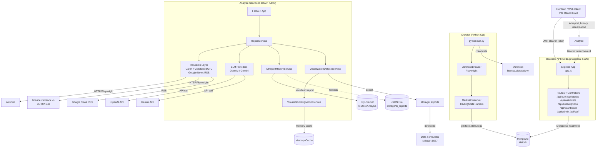
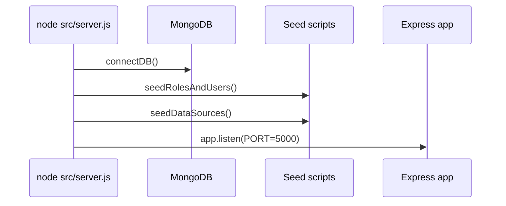
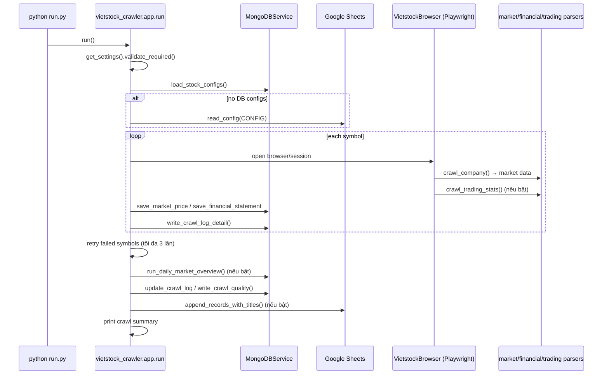
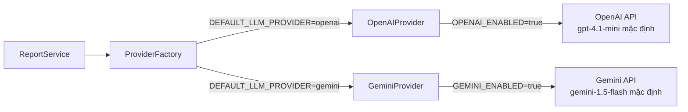
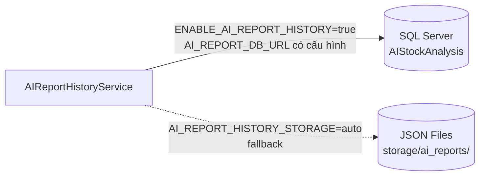
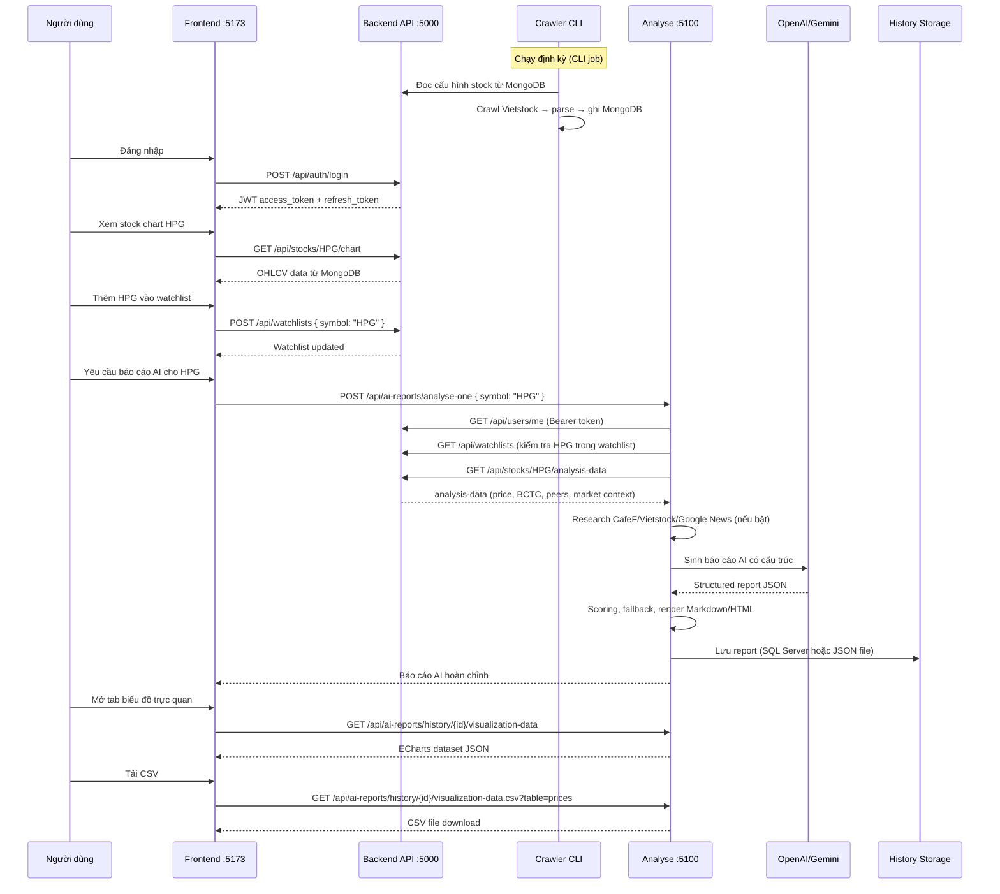
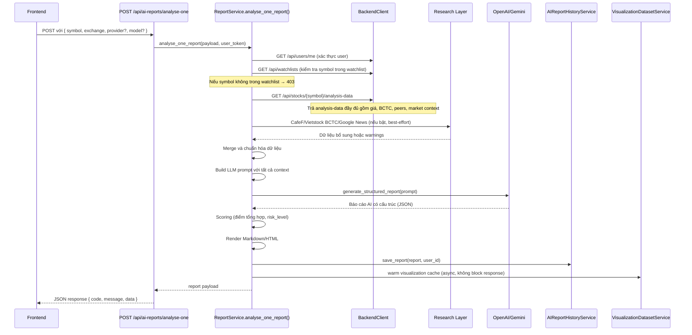

# AI Stock Trend Prediction — Hệ thống phân tích xu hướng cổ phiếu Việt Nam

> Hệ thống phân tích xu hướng cổ phiếu bằng dữ liệu tài chính, crawler nguồn bên ngoài, API nghiệp vụ và LLM provider (OpenAI / Gemini).

> ⚠️ **Khuyến nghị quan trọng**: Báo cáo AI trong dự án chỉ phục vụ mục đích tham khảo và học tập. Không phải khuyến nghị đầu tư cá nhân hóa.

---

## Mục lục

1. [Tổng quan hệ thống](#1-tổng-quan-hệ-thống)
2. [Bối cảnh nghiệp vụ](#2-bối-cảnh-nghiệp-vụ)
3. [Kiến trúc hệ thống](#3-kiến-trúc-hệ-thống)
4. [Cấu trúc repository](#4-cấu-trúc-repository)
5. [Bảng tổng hợp service](#5-bảng-tổng-hợp-service)
6. [Backend API (`api/`)](#6-backend-api-api)
7. [Crawler service (`crawler/`)](#7-crawler-service-crawler)
8. [Analyse service (`analyse/`)](#8-analyse-service-analyse)
9. [Data Formulator sidecar (`tools/data-formulator/`)](#9-data-formulator-sidecar)
10. [Luồng end-to-end](#10-luồng-end-to-end)
11. [Luồng analyse-one chi tiết](#11-luồng-analyse-one-chi-tiết)
12. [Luồng visualization](#12-luồng-visualization)
13. [Luồng CSV và Data Formulator export](#13-luồng-csv-và-data-formulator-export)
14. [Luồng lịch sử báo cáo (history)](#14-luồng-lịch-sử-báo-cáo-history)
15. [Luồng Signed URL](#15-luồng-signed-url)
16. [Tham chiếu endpoint đầy đủ](#16-tham-chiếu-endpoint-đầy-đủ)
17. [Ví dụ request/response](#17-ví-dụ-requestresponse)
18. [Biến môi trường](#18-biến-môi-trường)
19. [Cài đặt và chạy local](#19-cài-đặt-và-chạy-local)
20. [Hướng dẫn kiểm thử](#20-hướng-dẫn-kiểm-thử)
21. [Hướng dẫn xác minh thủ công](#21-hướng-dẫn-xác-minh-thủ-công)
22. [Xử lý sự cố](#22-xử-lý-sự-cố)
23. [Lưu trữ và cache](#23-lưu-trữ-và-cache)
24. [Bảo mật](#24-bảo-mật)
25. [Hiệu năng](#25-hiệu-năng)
26. [Hạn chế và rủi ro đã biết](#26-hạn-chế-và-rủi-ro-đã-biết)
27. [Quy trình phát triển](#27-quy-trình-phát-triển)
28. [Checklist merge](#28-checklist-merge)
29. [Tài liệu liên quan](#29-tài-liệu-liên-quan)

---

## 1. Tổng quan hệ thống

Đây là monorepo backend cho hệ thống phân tích và dự đoán xu hướng cổ phiếu Việt Nam. Repo không chứa một API đơn lẻ, mà gồm nhiều service phối hợp với nhau:

| Service | Thư mục | Mô tả |
|---|---|---|
| **Backend API** | `api/` | Node.js/Express – quản lý auth, user, stock catalog, watchlist, subscription, dashboard và contract dữ liệu cho `analyse`. |
| **Crawler** | `crawler/` | Python – thu thập dữ liệu giá, BCTC, thống kê giao dịch từ Vietstock; ghi MongoDB / Google Sheets. |
| **Analyse** | `analyse/` | Python/FastAPI – sinh báo cáo AI từ LLM, lưu history, xuất ECharts dataset, CSV, Data Formulator package và signed URL. |
| **Data Formulator sidecar** | `tools/data-formulator/` | Script sidecar khởi động Microsoft Data Formulator local để đọc dataset JSON/CSV do `analyse` xuất ra. |

**Triết lý phát triển**:

```
Dữ liệu đúng → Lưu dữ liệu đúng → API ổn định → Trực quan hóa rõ → AI phân tích sau
```

- **Crawler** phải lấy dữ liệu đáng tin cậy, ghi log lỗi và không làm mất vết chất lượng dữ liệu.
- **Backend API** phải trả contract ổn định cho frontend và `analyse`, kể cả khi optional data như peer/market overview/BCTC chưa đủ.
- **`analyse`** chỉ nên gọi LLM trong luồng tạo báo cáo mới. History, visualization, CSV và signed dataset phải lấy từ report đã lưu.
- **Frontend** không nên dùng AI endpoint như API dữ liệu thông thường; AI endpoint chậm vì có backend call, crawler/research và LLM.

---

## 2. Bối cảnh nghiệp vụ

### Luồng nghiệp vụ chính

```
1. Người dùng đăng ký / đăng nhập (JWT hoặc Google OAuth) qua Backend API.
2. Người dùng chọn mã cổ phiếu (VD: HPG) và thêm vào watchlist.
3. Backend API kiểm tra subscription, giới hạn watchlist theo plan.
4. Crawler chạy định kỳ (CLI/job): thu thập giá, BCTC, thống kê giao dịch từ Vietstock → ghi MongoDB.
5. Backend API đọc MongoDB → phục vụ frontend dữ liệu giá/chart/BCTC/peer.
6. Người dùng yêu cầu báo cáo AI cho một mã.
7. Analyse nhận request → kiểm tra user/watchlist qua Backend API → tải analysis-data.
8. Analyse bổ sung dữ liệu từ nguồn ngoài (CafeF, Vietstock BCTC, Google News RSS).
9. Analyse gọi LLM (OpenAI hoặc Gemini) → sinh báo cáo AI có cấu trúc.
10. Analyse lưu history vào SQL Server (hoặc JSON file fallback).
11. Người dùng xem báo cáo, mở tab biểu đồ trực quan (ECharts).
12. Người dùng tải CSV hoặc Data Formulator package về máy.
13. Người dùng xem lại lịch sử báo cáo AI.
```

### Thuật ngữ quan trọng

| Thuật ngữ | Ý nghĩa |
|---|---|
| `symbol` | Mã cổ phiếu, VD: `HPG`, `FPT`, `VNM` |
| `exchange` | Sàn giao dịch: `HOSE`, `HNX`, `UPCOM` |
| `watchlist` | Danh sách mã cổ phiếu user theo dõi; kiểm soát số lượng theo plan (FREE/PRO) |
| `provider` | Nhà cung cấp LLM: `openai` hoặc `gemini` |
| `model` | Tên model LLM, VD: `gpt-4.1-mini`, `gemini-1.5-flash` |
| `score` | Điểm tổng hợp của cổ phiếu do `analyse` tính |
| `risk_level` | Mức rủi ro: LOW / MEDIUM / HIGH |
| `data_confidence` | Mức độ tin cậy dữ liệu đầu vào cho LLM |
| `financial_statements` | Báo cáo tài chính theo quý (BCTC), bao gồm doanh thu, lợi nhuận, nợ |
| `technical indicators` | Chỉ số kỹ thuật từ price history |
| `peer_comparison` | So sánh với cổ phiếu cùng ngành |
| `market_context` | Bối cảnh thị trường VNINDEX/KQGD |
| `visualization` | Dataset ECharts để hiển thị biểu đồ trực quan trên frontend |
| `Data Formulator` | Microsoft tool để khám phá dữ liệu; `analyse` xuất package JSON/CSV tương thích |
| `history` | Lịch sử báo cáo AI đã lưu (SQL Server hoặc JSON file) |
| `signed URL` | URL tạm thời có chữ ký HMAC-SHA256 để truy cập dataset công khai mà không cần auth |

---

## 3. Kiến trúc hệ thống

### Kiến trúc tổng thể



### Giải thích các thành phần

| Thành phần | Thư mục | Vai trò | Tech | Phụ thuộc vào | Ghi chú |
|---|---|---|---|---|---|
| **Backend API** | `api/` | Auth, stock catalog, watchlist, subscription, analysis-data contract | Node.js 18+, Express | MongoDB | Port 5000. Là nguồn dữ liệu chính cho `analyse`. |
| **Crawler** | `crawler/` | Thu thập giá/BCTC/thống kê từ Vietstock | Python 3.11+, Playwright | MongoDB | CLI job, không phục vụ HTTP. Chạy định kỳ hoặc thủ công. |
| **Analyse** | `analyse/` | Sinh báo cáo AI, lưu history, xuất visualization/CSV | Python 3.11+, FastAPI | Backend API, LLM | Port 5100. Gọi Backend API để kiểm tra user/watchlist/analysis-data. |
| **MongoDB** | external | Lưu trữ dữ liệu vận hành | MongoDB | — | Được crawler ghi và Backend API đọc. |
| **SQL Server** | external | Lưu lịch sử báo cáo AI | SQL Server + ODBC | — | Optional. Nếu không có thì `analyse` fallback sang JSON file. |
| **Data Formulator** | `tools/data-formulator/` | Khám phá dữ liệu từ dataset `analyse` | Script + Microsoft app | — | Sidecar local, cổng 5567. |

---

## 4. Cấu trúc repository

```text
BE_AI_Stock_Trend_Prediction/
├── README.md                          # Tài liệu chính (file này)
├── .gitignore
│
├── api/                               # Backend API (Node.js/Express)
│   ├── src/
│   │   ├── server.js                  # Entrypoint: kết nối DB, seed, khởi server
│   │   ├── app.js                     # Tạo Express app, gắn middleware, routers
│   │   ├── config/                    # JWT, CORS, Passport Google OAuth, PayOS
│   │   ├── common/                    # Middleware auth/role, response helpers, error handler
│   │   ├── database/                  # Kết nối MongoDB (Mongoose)
│   │   └── modules/                   # 17 module nghiệp vụ:
│   │       ├── auth/                  #   Đăng nhập/đăng ký/OAuth/refresh token
│   │       ├── users/                 #   Quản lý profile, đổi mật khẩu
│   │       ├── stocks/                #   Catalog, chart, analysis-data (contract cho analyse)
│   │       ├── watchlists/            #   Watchlist cá nhân, giới hạn theo plan
│   │       ├── subscriptions/         #   PayOS payment, webhook, trạng thái gói
│   │       ├── dashboard/             #   Dashboard theo role user/staff/admin
│   │       ├── admin-subscriptions/   #   Admin quản lý subscription
│   │       ├── staff-subscriptions/   #   Staff tra cứu subscription
│   │       ├── roles/                 #   Seed và đọc roles
│   │       ├── markets/               #   Danh mục sàn
│   │       ├── industries/            #   Danh mục ngành
│   │       ├── data-sources/          #   Registry nguồn crawl
│   │       ├── crawl-jobs/            #   Cấu hình job crawl
│   │       ├── crawl-logs/            #   Log tổng và chi tiết crawl
│   │       ├── data-quality/          #   Dashboard chất lượng dữ liệu
│   │       ├── financials/            #   Tra cứu dữ liệu tài chính
│   │       └── market-overview/       #   Dữ liệu VNINDEX/KQGD
│   ├── test/                          # Contract tests cho analyse integration
│   ├── package.json
│   ├── .env.example
│   └── README.md
│
├── crawler/                           # Crawler service (Python CLI)
│   ├── run.py                         # Entrypoint: python run.py
│   ├── src/vietstock_crawler/
│   │   ├── app.py                     # Orchestrator chính
│   │   ├── config/                    # Settings (.env), constants
│   │   ├── core/                      # Browser wrapper (Playwright), logging, exceptions
│   │   ├── crawlers/                  # Crawler modules (nếu có)
│   │   ├── jobs/                      # market_overview_daily.py
│   │   ├── models/                    # Column definitions, record shapes, market_overview model
│   │   ├── parsers/                   # market_parser, financial_parser, trading_stats_parser, bctt_parser
│   │   ├── services/                  # vietstock_service, mongodb_service, google_sheets_service, llm_service
│   │   └── utils/                     # date_utils, number_utils, url_utils, text_utils
│   ├── manual_crawl_by_date_improved.py  # Script crawl thủ công theo ngày
│   ├── market_overview_crawler.py     # Script crawl VNINDEX/KQGD riêng
│   ├── crawl_financials_by_quarter.py # Script crawl BCTC theo quý
│   ├── tests/
│   ├── docs/
│   ├── requirements.txt
│   ├── pyproject.toml
│   └── README.md
│
├── analyse/                           # Analyse service (Python/FastAPI)
│   ├── run.py                         # Local runner: uvicorn :5100
│   ├── src/analyse/
│   │   ├── app.py                     # create_app(): FastAPI instance, CORS, router
│   │   ├── main.py                    # Import app cho uvicorn
│   │   ├── api/
│   │   │   ├── routes.py              # Tất cả HTTP route handlers (49KB)
│   │   │   └── dependencies.py        # Dependency injection factories
│   │   ├── config/                    # Settings (pydantic-settings), get_settings()
│   │   ├── clients/                   # BackendClient: gọi Backend API
│   │   ├── providers/                 # OpenAIProvider, GeminiProvider, ProviderFactory
│   │   ├── research/                  # CafeFResearcher, VietstockResearcher, GoogleNewsRSSResearcher
│   │   ├── repositories/              # Truy vấn SQL Server (SQLAlchemy)
│   │   ├── db/                        # DB connection, migrations helpers
│   │   ├── schemas/                   # Pydantic models: report, history, visualization, stock
│   │   ├── services/                  # ReportService, AIReportHistoryService,
│   │   │                              #   VisualizationDatasetService, VisualizationSignedUrlService,
│   │   │                              #   UserIdentityService, StockDataService, ConfigDiagnosticService
│   │   └── utils/                     # Auth helper, formatting, date utils
│   ├── tests/                         # pytest test suite (~350 tests)
│   ├── migrations/                    # SQL Server migration scripts
│   ├── storage/                       # Lưu report JSON, visualization JSON, CSV exports
│   ├── reports/                       # Lưu file Markdown/HTML báo cáo
│   ├── .data_formulator/              # Data Formulator home directory
│   ├── .research_cache/               # Cache kết quả research
│   ├── pyproject.toml
│   ├── .env.example
│   └── README.md
│
├── tools/
│   └── data-formulator/               # Data Formulator sidecar
│       ├── start-data-formulator.ps1  # Script khởi động Windows
│       ├── start-data-formulator.sh   # Script khởi động macOS/Linux
│       ├── plugins/                   # Plugin loader
│       ├── .env.data-formulator.example
│       └── README.md
│
└── docs/                              # Tài liệu kiến trúc và nghiệp vụ bổ sung
```

### Bảng mô tả thư mục

| Đường dẫn | Mục đích | File quan trọng |
|---|---|---|
| `api/src/server.js` | Entrypoint Backend API | `connectDB()`, `startServer()`, seed scripts |
| `api/src/app.js` | Express app factory | CORS, JWT middleware, Swagger, PayOS raw body parser |
| `api/src/modules/stocks/` | Stock catalog và analysis-data contract | `routes.js`, `service.js` (`getStockAnalysisData`) |
| `api/src/modules/auth/` | JWT + Google OAuth | `controller.js`, `service.js` |
| `crawler/src/vietstock_crawler/app.py` | Orchestrator crawl | `run()`, `crawl_single_stock_daily()` |
| `crawler/src/vietstock_crawler/core/browser.py` | Playwright wrapper | `VietstockBrowser` |
| `crawler/src/vietstock_crawler/services/mongodb_service.py` | Ghi MongoDB | `save_market_price()`, `save_financial_statement()` |
| `analyse/src/analyse/api/routes.py` | Tất cả FastAPI route | `analyse_one_report()`, `list_report_history()`, v.v. |
| `analyse/src/analyse/services/report_service.py` | Orchestrator báo cáo AI | `analyse_one_report()` |
| `analyse/src/analyse/services/ai_report_history_service.py` | Lưu/đọc history | SQL Server + JSON fallback |
| `analyse/src/analyse/services/visualization_dataset_service.py` | Dataset ECharts | `build_from_report_response()`, `export_csv_file()` |

---

## 5. Bảng tổng hợp service

| Service | Thư mục | Stack | Port | Entrypoint | Trách nhiệm chính | Health endpoint | Mức rủi ro |
|---|---|---|---|---|---|---|---|
| **Backend API** | `api/` | Node.js 18+, Express, Mongoose | `5000` | `npm run dev` → `src/server.js` | Auth JWT/OAuth, stock catalog, watchlist, subscription PayOS, analysis-data contract | `GET /` | 🟡 Trung bình — phụ thuộc MongoDB, PayOS |
| **Crawler** | `crawler/` | Python 3.11+, Playwright, Pymongo | CLI | `python run.py` | Thu thập giá/BCTC/thống kê Vietstock → MongoDB | Không có HTTP | 🔴 Cao — phụ thuộc layout Vietstock, Playwright |
| **Analyse** | `analyse/` | Python 3.11+, FastAPI, SQLAlchemy | `5100` | `uv run python run.py` | Báo cáo AI, history, visualization, CSV, signed URL | `GET /api/analyse/health` | 🔴 Cao — phụ thuộc Backend API + LLM |
| **Data Formulator** | `tools/data-formulator/` | Script sidecar | `5567` | `start-data-formulator.ps1` | Khởi động Microsoft Data Formulator local | — | 🟡 Trung bình |

---

## 6. Backend API (`api/`)

### Vai trò

Backend API là lớp HTTP chính cho dữ liệu ứng dụng. Nó **không gọi LLM** và **không phục vụ crawler trực tiếp**. Trách nhiệm:

- Xác thực JWT và Google OAuth (Passport.js)
- Quản lý user, role (`ADMIN`, `STAFF`, `USER`), stock catalog, watchlist
- Đọc dữ liệu giá/BCTC/market overview từ MongoDB qua Mongoose
- Trả payload `GET /api/stocks/:symbol/analysis-data` cho `analyse`
- Quản lý subscription PayOS và giới hạn watchlist theo plan (FREE/PRO)
- Cung cấp dashboard và dữ liệu vận hành crawl cho Staff/Admin

### Tech stack

| Thành phần | Chi tiết |
|---|---|
| Runtime | Node.js 18+ |
| Framework | Express.js |
| Database | MongoDB (Mongoose) |
| Auth | JWT (`jsonwebtoken`) + Google OAuth (Passport.js) |
| Payment | PayOS |
| Validation | express-validator |
| Docs | Swagger (swagger-jsdoc) |
| Port mặc định | `5000` |

### Startup flow



### Pattern code trong API

Mỗi module theo pattern:

```
routes.js → validation.js → controller.js → service.js → repository.js → model.js
```

| Lớp | Nhiệm vụ |
|---|---|
| `routes.js` | Khai báo URL, method, middleware, validation, controller |
| `validation.js` | Kiểm tra body/query/path bằng `express-validator` |
| `controller.js` | Lấy input từ `req`, gọi service, trả response helper |
| `service.js` | Business rules, orchestration |
| `repository.js` | Mongoose query thuần |
| `model.js` | Schema/index MongoDB |

### Auth flow

```mermaid
sequenceDiagram
    participant FE as Frontend
    participant Route as Express route
    participant Auth as authMiddleware
    participant JWT as jwt.util
    participant DB as MongoDB users
    participant Ctrl as Controller

    FE->>Route: Request + Authorization: Bearer <token>
    Route->>Auth: authMiddleware(req, res, next)
    Auth->>JWT: verifyAccessToken(token)
    Auth->>DB: User.findById(decoded.user_id).populate(role_id)
    alt user active
        Auth->>Ctrl: req.user = user; next()
    else invalid/locked
        Auth-->>FE: 401/403
    end
```

### Database / Collection map

| Collection | Ghi bởi | Đọc bởi | Mục đích |
|---|---|---|---|
| `users` | Auth/admin/subscription | Auth, users, dashboards | Tài khoản, role, status, plan |
| `roles` | Seed | Auth/admin | `ADMIN`, `STAFF`, `USER` |
| `dimMarkets` | Seed/admin | Stocks/crawler | Danh mục sàn |
| `dimIndustries` | Seed/admin | Stocks/analysis-data | Ngành |
| `dimstocks` | Admin/crawler | Stocks/watchlist/crawler | Master data mã cổ phiếu |
| `dimDataSources` | Seed/staff/crawler | Crawler/data-quality | Registry nguồn dữ liệu |
| `dimStockDataSources` | Staff/crawler | Crawler/stocks | URL crawl theo mã |
| `factMarketPrices` | Crawler | Stocks/chart/analyse | OHLCV và chỉ số định giá |
| `factFinancialStatements` | Crawler | Stocks/analyse | BCTC theo quý |
| `factFinancialReportSources` | Crawler | Staff/debug | Metadata nguồn BCTC |
| `factMarketOverviews` | Crawler | Stocks/dashboard | VNINDEX/KQGD |
| `watchlists` | Watchlist API | Watchlist/dashboard/analyse guard | Watchlist user |
| `crawlJobs` | Staff API | Staff dashboard | Cấu hình job crawl |
| `crawlLogs` | Crawler | Staff API | Log tổng crawl |
| `crawlLogDetails` | Crawler | Staff API | Log theo symbol/data_type |
| `factCrawlQualities` | Crawler | Staff/data-quality | Tỷ lệ thành công crawl |

### API Routes đầy đủ

#### Nhóm public/user

| Method | Path | Auth | Mục đích |
|---|---|---|---|
| `GET` | `/` | Không | Health check |
| `POST` | `/api/auth/register` | Không | Tạo user local |
| `POST` | `/api/auth/login` | Không | Đăng nhập local → JWT |
| `POST` | `/api/auth/logout` | Bearer | Logout |
| `POST` | `/api/auth/refresh-token` | Không | Làm mới access token |
| `GET` | `/api/auth/google` | Không | Bắt đầu Google sign-in |
| `GET` | `/api/auth/google/register` | Không | Bắt đầu Google sign-up |
| `GET` | `/api/auth/google/callback` | Không | Callback OAuth → redirect |
| `POST` | `/api/auth/oauth/exchange` | Không | Đổi OAuth code → JWT |
| `GET` | `/api/users/me` | Bearer | Profile user |
| `PUT` | `/api/users/me` | Bearer | Cập nhật `full_name` |
| `PUT` | `/api/users/me/password` | Bearer | Đổi mật khẩu |
| `GET` | `/api/stocks` | Không | Stock catalog (filter/phân trang) |
| `GET` | `/api/stocks/:symbol` | Không | Chi tiết stock |
| `GET` | `/api/stocks/:symbol/chart` | Không | OHLCV chart |
| `GET` | `/api/stocks/:symbol/analysis-data` | Không | **Payload cho `analyse`** |
| `GET` | `/api/watchlists` | Bearer | Watchlist cá nhân |
| `POST` | `/api/watchlists` | Bearer | Thêm mã vào watchlist |
| `DELETE` | `/api/watchlists/:symbol` | Bearer | Xóa mã khỏi watchlist |
| `POST` | `/api/watchlists/trim` | Bearer | Cắt watchlist khi quá limit |
| `GET` | `/api/dashboard/user` | Bearer+USER | Dashboard user |
| `GET` | `/api/subscriptions/status` | Bearer | Trạng thái gói |
| `POST` | `/api/subscriptions/create-payment` | Bearer | Tạo PayOS checkout |
| `POST` | `/api/subscriptions/webhook` | Không | PayOS callback |
| `GET` | `/api/subscriptions/transactions` | Bearer | Lịch sử giao dịch |

#### Nhóm admin/staff

| Method | Path | Auth | Mục đích |
|---|---|---|---|
| `GET` | `/api/admin/users` | ADMIN | List/search user |
| `GET` | `/api/admin/users/:id` | ADMIN | Chi tiết user |
| `PATCH` | `/api/admin/users/:id/lock` | ADMIN | Khóa user |
| `PATCH` | `/api/admin/users/:id/unlock` | ADMIN | Mở khóa user |
| `PATCH` | `/api/admin/users/:id/role` | ADMIN | Đổi role |
| `POST` | `/api/admin/stocks` | ADMIN | Tạo stock master |
| `PUT` | `/api/admin/stocks/:id` | ADMIN | Cập nhật stock master |
| `GET` | `/api/dashboard/staff` | STAFF | Dashboard staff |
| `GET` | `/api/dashboard/admin` | ADMIN | Dashboard admin |
| `GET/POST/PUT/PATCH` | `/api/admin/subscriptions/...` | ADMIN | Quản lý subscription |
| `GET` | `/api/staff/subscriptions/...` | ADMIN/STAFF | Tra cứu subscription |
| `GET/POST/PUT/PATCH` | `/api/staff/data-sources/...` | ADMIN/STAFF | Quản lý nguồn crawl |
| `GET/POST/PUT/PATCH` | `/api/staff/crawl-jobs/...` | ADMIN/STAFF | Cấu hình job crawl |
| `GET` | `/api/staff/crawl-logs/...` | ADMIN/STAFF | Log crawl |
| `GET` | `/api/staff/data-quality/...` | ADMIN/STAFF | Dashboard chất lượng dữ liệu |

### Contract `GET /api/stocks/:symbol/analysis-data`

Đây là endpoint quan trọng nhất mà `analyse` gọi:

```http
GET /api/stocks/HPG/analysis-data?exchange=HOSE&quarters=6&chartRange=3m&includePeers=true&includeMarketContext=true
Authorization: Bearer <user-token>
```

Response:

```json
{
  "success": true,
  "message": "Get stock analysis data successfully",
  "data": {
    "symbol": "HPG",
    "exchange": "HOSE",
    "latestMarket": { "close": 27150, "volume": 12500000, "pe": 8.5, "pb": 1.2 },
    "priceHistory": [{ "time": "2024-01-01", "open": 26000, "high": 28000, "low": 25500, "close": 27150, "volume": 10000000 }],
    "financials": { "periods": [{ "year": 2024, "quarter": 2, "revenue": 35000, "net_income": 3500 }] },
    "financialBalance": {},
    "hoseMarketContext": { "vnindex": 1250, "change_pct": 0.5 },
    "industryPeerContext": {
      "industry": { "name": "Thép" },
      "peers": [{ "symbol": "HSG", "pe": 6.2, "roe": 15.3 }]
    },
    "dataQuality": {
      "missingFields": [],
      "warnings": []
    }
  }
}
```

---

## 7. Crawler service (`crawler/`)

### Vai trò

Crawler là lớp nạp dữ liệu nền. **Không phục vụ HTTP**. Là CLI job chạy thủ công hoặc theo lịch. Crawler:

1. Đọc settings từ `.env`
2. Load danh sách mã từ MongoDB hoặc Google Sheets
3. Nếu không có config: dùng danh sách fallback `FPT`, `HPG`, `VNM`, `VIC`, `TCB`
4. Crawl từng mã bằng Playwright trên `finance.vietstock.vn`
5. Parse dữ liệu market price, financial statement, trading stats
6. Ghi vào MongoDB và/hoặc Google Sheets
7. Ghi crawl log, log detail và crawl quality
8. Retry tối đa 3 lần với mã lỗi/timeout

### Tech stack

| Thành phần | Chi tiết |
|---|---|
| Runtime | Python 3.11+ |
| Browser automation | Playwright |
| Database | MongoDB (pymongo) |
| Optional storage | Google Sheets (google-api-python-client) |
| HTTP service | **Không có** — chỉ là CLI |

### Nguồn dữ liệu

| Nguồn | URL | Dữ liệu lấy | Cơ chế |
|---|---|---|---|
| Vietstock profile | `finance.vietstock.vn/{symbol}` | Giá OHLCV, volume, PE, PB, ROE | Playwright + parser |
| Vietstock financials | `finance.vietstock.vn/{symbol}/tai-chinh.htm` | BCTC theo quý | Playwright + parser (khi `ENABLE_FINANCIAL_DATA=true`) |
| Vietstock trading stats | Tab thống kê giao dịch | Biến động kỳ, BCTT period | Playwright + parser (khi `ENABLE_TRADING_STATS=true`) |
| Market overview | Vietstock market page | VNINDEX, KQGD | Job riêng (`market_overview_daily.py`) |

### Crawl flow



### File/hàm quan trọng

| File | Vai trò | Hàm chính |
|---|---|---|
| `crawler/run.py` | Entrypoint CLI | Import `vietstock_crawler.app.run` |
| `app.py` | Orchestrator chính | `run()`, `crawl_single_stock_daily()`, `crawl_symbol_daily_with_timeout()` |
| `core/browser.py` | Playwright browser wrapper | `VietstockBrowser`: mở page, chặn ads, đóng popup |
| `parsers/market_parser.py` | Parse giá thị trường | OHLCV, volume, PE, PB, ROE |
| `parsers/financial_parser.py` | Parse BCTC | Doanh thu, lợi nhuận, nợ theo quý |
| `parsers/trading_stats_parser.py` | Parse thống kê giao dịch | Biến động kỳ |
| `parsers/bctt_parser.py` | Parse tab BCTT | Metadata báo cáo tài chính |
| `services/vietstock_service.py` | Crawl domain service | `crawl_company()` phối hợp browser + parsers |
| `services/mongodb_service.py` | Ghi MongoDB | `save_market_price()`, `write_crawl_log()`, `write_crawl_quality()` |
| `services/google_sheets_service.py` | Ghi GSheet | `append_records_with_titles()` |
| `jobs/market_overview_daily.py` | Crawl market overview | Sau daily crawl nếu `ENABLE_DAILY_MARKET_OVERVIEW=true` |

### Xử lý lỗi và retry

- Lỗi hoặc timeout lần đầu → vào `retry_symbols`
- Retry đến attempt 3
- Vẫn lỗi → ghi `FAILED AFTER 3 RETRIES`
- Trạng thái job: `SUCCESS`, `PARTIAL_SUCCESS`, hoặc `FAILED`
- Market overview lỗi hạ từ `SUCCESS` xuống `PARTIAL_SUCCESS`, không mất toàn bộ job

### Scripts crawl thủ công

| Script | Mục đích |
|---|---|
| `manual_crawl_by_date_improved.py` | Crawl lại dữ liệu cho ngày cụ thể |
| `market_overview_crawler.py` | Crawl VNINDEX/KQGD riêng lẻ |
| `crawl_financials_by_quarter.py` | Crawl BCTC theo quý cho nhiều mã |

---

## 8. Analyse service (`analyse/`)

### Vai trò

`analyse` là FastAPI service AI/report độc lập. Nhận request từ frontend, dùng bearer token user để gọi Backend API, sinh báo cáo AI, lưu history, xuất visualization/CSV.

### Tech stack

| Thành phần | Chi tiết |
|---|---|
| Runtime | Python 3.11+ |
| Framework | FastAPI + Uvicorn |
| LLM | OpenAI API + Google Gemini API |
| Browser automation | Playwright (cho research CafeF/Vietstock) |
| Database | SQL Server (SQLAlchemy + pyodbc), JSON file fallback |
| Config | pydantic-settings |
| Version | `0.2.0` |
| Port mặc định | `5100` |

### Startup flow

```
uv run python run.py
  → load analyse/.env
  → cấu hình Windows asyncio policy (WindowsSelectorEventLoopPolicy nếu cần)
  → import analyse.main:app
  → create_app(): FastAPI instance, CORS, mount router
  → uvicorn listen 0.0.0.0:5100
```

### Services chính

| Service | File | Mục đích |
|---|---|---|
| `ReportService` | `services/report_service.py` | Orchestrator báo cáo AI: auth check, data load, research, LLM, scoring, save |
| `AIReportHistoryService` | `services/ai_report_history_service.py` | Lưu/tải/xóa lịch sử report (SQL Server hoặc JSON file) |
| `VisualizationDatasetService` | `services/visualization_dataset_service.py` | Xây dựng và cache dataset ECharts, xuất CSV, Data Formulator package |
| `VisualizationSignedUrlService` | `services/visualization_signed_url_service.py` | Tạo/xác minh signed URL (HMAC-SHA256) |
| `UserIdentityService` | `services/user_identity_service.py` | Resolve current user từ Bearer token qua Backend API |
| `StockDataService` | `services/stock_data_service.py` | Chuẩn hóa stock payload từ Backend API |
| `ConfigDiagnosticService` | `services/config_diagnostic_service.py` | Diagnostic cấu hình có mask secret |
| `BackendClient` | `clients/backend_client.py` | Gọi Backend API với Bearer token forward |

### Providers LLM



- Provider được chọn dựa trên `DEFAULT_LLM_PROVIDER` hoặc override từ request (`ALLOW_REQUEST_MODEL_OVERRIDE=true`)
- Nếu provider chính lỗi, có thể fallback tùy config

### Research layer

| Nguồn | Biến bật | URL template | Cơ chế |
|---|---|---|---|
| CafeF company overview | `ENABLE_CAFEF_COMPANY_FALLBACK` | `cafef.vn/du-lieu/{exchange}/{symbol}-ban-lanh-dao-so-huu.chn` | HTTP + Playwright fallback |
| CafeF BCTC | `ENABLE_CAFEF_FINANCIAL_FALLBACK` | `cafef.vn/du-lieu/{exchange}/{symbol}-tai-chinh.chn` | HTTP + Playwright fallback |
| Vietstock BCTC | `ENABLE_VIETSTOCK_BCTC_FALLBACK` | `finance.vietstock.vn/{symbol}/tai-chinh.htm?tab=BCTT` | Playwright |
| Vietstock peer | `ENABLE_VIETSTOCK_PEER_FALLBACK` | `finance.vietstock.vn/{symbol}/so-sanh-gia-co-phieu-cung-nganh.htm` | Playwright |
| Google News RSS | `ENABLE_GOOGLE_NEWS_RSS` | Google News RSS feed | HTTP RSS parse |
| Source-backed research | `ENABLE_SOURCE_BACKED_RESEARCH` | Đa nguồn | HTTP crawl |

Research là best-effort: lỗi trở thành warning, không làm gián đoạn báo cáo.

### History storage



- **SQL Server mode**: `AI_REPORT_HISTORY_STORAGE=auto` + `AI_REPORT_DB_URL` có cấu hình
- **JSON file fallback**: Local dev khi chưa có SQL Server
- `AI_REPORT_HISTORY_SAVE_FAILURE_POLICY=non_blocking` (mặc định): Lỗi lưu không làm fail response

### Analyse HTTP Routes đầy đủ

| Method | Path | Auth | Gọi LLM? | Mục đích |
|---|---|---|---|---|
| `GET` | `/api/analyse/health` | Không | Không | Health check |
| `GET` | `/api/analyse/config-check` | Không | Không | Diagnostic cấu hình (mask secret) |
| `POST` | `/api/ai-reports/analyse-one` | Bearer | **Có** | **Tạo báo cáo AI cho một mã** |
| `POST` | `/api/ai-reports/analyse-one/visualization-data` | Bearer | Không | Lấy visualization dataset từ report đã lưu/cache |
| `POST` | `/api/ai-reports/analyse-one/visualization-data.csv` | Bearer | Không | Tải CSV từ visualization dataset |
| `POST` | `/api/ai-reports/analyse-one/visualization-data/signed-url` | Bearer | Không | Tạo signed URL cho dataset |
| `GET` | `/api/ai-reports/history` | Bearer | Không | Danh sách report đã lưu |
| `GET` | `/api/ai-reports/history/{history_id}` | Bearer | Không | Chi tiết report đã lưu |
| `DELETE` | `/api/ai-reports/history/{history_id}` | Bearer | Không | Xóa report |
| `GET` | `/api/ai-reports/history/{history_id}/visualization-data` | Bearer | Không | Visualization từ history |
| `GET` | `/api/ai-reports/history/{history_id}/visualization-data.csv` | Bearer | Không | CSV từ history |
| `GET` | `/api/ai-reports/history/{history_id}/data-formulator-package.json` | Bearer | Không | Data Formulator package từ history |
| `GET` | `/api/ai-reports/visualization-datasets/{dataset_id}.json` | Signed URL | Không | Dataset JSON công khai (signed URL) |
| `GET` | `/api/ai-reports/visualization-datasets/{dataset_id}.csv` | Signed URL | Không | CSV công khai (signed URL) |

> **Legacy endpoints** (`/api/analyse/stock`, `/api/analyse/watchlist`, `/api/analyse/fetch-and-analyse/stock`) trả 501 Not Implemented — chuyển sang dùng `/api/ai-reports/analyse-one`.

---

## 9. Data Formulator sidecar

Data Formulator là Microsoft tool khám phá dữ liệu. Trong dự án, nó là sidecar local — **không được vendor source vào `analyse`**.

```
analyse report saved
  → visualization dataset JSON/CSV (analyse storage/)
  → signed URL TTL ngắn (hoặc download thủ công)
  → Data Formulator sidecar import dataset
```

| File | Mục đích |
|---|---|
| `tools/data-formulator/start-data-formulator.ps1` | Khởi động trên Windows |
| `tools/data-formulator/start-data-formulator.sh` | Khởi động trên macOS/Linux |
| `tools/data-formulator/plugins/` | Plugin loader nếu cần đọc dataset URL |
| `tools/data-formulator/.env.data-formulator.example` | Env mẫu cho sidecar |

> ⚠️ Không mount `analyse/.env` vào Data Formulator. Plugin chỉ nên nhận `dataset_url` (tốt nhất là signed URL TTL ngắn). Không truyền `OPENAI_API_KEY`, `GEMINI_API_KEY`, `BACKEND_API_TOKEN`, `AI_REPORT_DB_URL` hay bearer token user cho Data Formulator.

---

## 10. Luồng end-to-end



---

## 11. Luồng analyse-one chi tiết

> `analyse-one` được phép chậm vì có thể gọi Backend API, crawler/research, Playwright và LLM.



### Request body `analyse-one`

```json
{
  "symbol": "HPG",
  "exchange": "HOSE",
  "provider": "openai",
  "model": "gpt-4.1-mini",
  "options": {
    "chartRange": "3m"
  }
}
```

### Response shape

```json
{
  "code": 200,
  "message": "Tạo báo cáo phân tích thành công.",
  "data": {
    "report_id": "uuid-...",
    "symbol": "HPG",
    "exchange": "HOSE",
    "summary": { "score": 72, "risk_level": "MEDIUM", "data_confidence": "HIGH" },
    "strengths": [...],
    "risks": [...],
    "forecast_scenarios": [...],
    "markdown_content": "...",
    "warnings": []
  }
}
```

---

## 12. Luồng visualization

> **Quy tắc quan trọng**: Visualization **không gọi LLM** và **không gọi crawler**. Chỉ dùng dữ liệu từ report đã lưu/cache.

```
Frontend
  → GET /api/ai-reports/history/{history_id}/visualization-data
     hoặc POST /api/ai-reports/analyse-one/visualization-data (với report_id)
  → VisualizationDatasetService kiểm tra memory cache
  → Nếu cache miss: load từ storage/{report_id}_visualization.json
  → Nếu vẫn miss: build từ history detail (không gọi LLM)
  → Trả visualization.v1 JSON (tables + charts cho ECharts)
```

### Tables có trong visualization

| Table name | Nội dung |
|---|---|
| `prices` | Lịch sử OHLCV |
| `financials` | BCTC theo quý |
| `peers` | So sánh cùng ngành |
| `market_overview` | VNINDEX/KQGD context |

### Lưu ý quan trọng

- Cache visualization là **memory cache** — **mất sau khi restart**.
- Nếu frontend gọi visualization sau restart mà không có `history_id`, có thể cần rebuild từ history.
- Endpoint `POST /api/ai-reports/analyse-one/visualization-data` yêu cầu `report_id` trong `options`.

---

## 13. Luồng CSV và Data Formulator export

> **Quy tắc**: CSV/Data Formulator export **không chạy lại full analysis**.

```
Frontend
  → GET /api/ai-reports/history/{history_id}/visualization-data.csv?table=prices
     hoặc GET /api/ai-reports/history/{history_id}/data-formulator-package.json
  → Lấy dataset từ cache hoặc rebuild từ history (không gọi LLM)
  → Export CSV file (sanitize formula-like values)
  → Trả FileResponse attachment
```

### Các table CSV hỗ trợ

Các table hợp lệ được định nghĩa trong `ALLOWED_VISUALIZATION_TABLES`: `prices`, `financials`, `peers`, `market_overview` (xác minh từ code).

### Data Formulator package

`GET /api/ai-reports/history/{history_id}/data-formulator-package.json` → trả file JSON chứa tất cả tables, phù hợp để import trực tiếp vào Microsoft Data Formulator.

---

## 14. Luồng lịch sử báo cáo (history)

```
GET /api/ai-reports/history
  → Bearer token bắt buộc
  → Resolve current user từ Backend API
  → Đọc danh sách history (SQL Server hoặc JSON file)
  → Trả { items, total, page, limit }

GET /api/ai-reports/history/{history_id}
  → Bearer token bắt buộc
  → Kiểm tra history thuộc user hiện tại
  → Trả report đầy đủ

DELETE /api/ai-reports/history/{history_id}
  → Xóa report khỏi storage
```

### Status code history

| Code | Nguyên nhân |
|---|---|
| `401` | Thiếu hoặc sai Bearer token |
| `404` | History không tồn tại hoặc không thuộc user này |
| `503 HISTORY_DISABLED` | `ENABLE_AI_REPORT_HISTORY=false` |
| `503 HISTORY_UNAVAILABLE` | SQL Server lỗi và không có file fallback |

---

## 15. Luồng Signed URL

Signed URL cho phép truy cập dataset công khai tạm thời **mà không cần auth**.

```
POST /api/ai-reports/analyse-one/visualization-data/signed-url
  → Cần Bearer token + report đã có visualization dataset
  → Tạo dataset_id (symbol + exchange + timestamp + uuid)
  → Lưu dataset vào memory cache với TTL (mặc định 1800 giây)
  → Tạo signed URL với HMAC-SHA256(dataset_id + params + expires)
  → Trả { dataset_url, csv_urls, expires_at, available_tables }

GET /api/ai-reports/visualization-datasets/{dataset_id}.json?expires=...&signature=...
  → Xác minh signature (constant-time comparison)
  → Nếu dataset vẫn trong memory cache: trả JSON
  → Nếu cache miss (sau restart): 404 SIGNED_DATASET_NOT_FOUND
```

> ⚠️ **Rủi ro đã biết**: Signed dataset chỉ lưu trong **memory cache** — mất sau restart. Sau restart, cần tạo lại signed URL.

### Bảo mật Signed URL

- HMAC-SHA256 với `DATA_FORMULATOR_SIGNED_URL_SECRET`
- Có `expires` timestamp — URL hết hạn sau TTL
- So sánh constant-time (`hmac.compare_digest`) chống timing attack
- Secret **không được** commit vào repo và **không được** expose cho frontend

---

## 16. Tham chiếu endpoint đầy đủ

### Backend API endpoints

| Method | Path | Auth | Gọi DB? | Mục đích |
|---|---|---|---|---|
| `GET` | `/` | Không | Không | Health check |
| `POST` | `/api/auth/register` | Không | MongoDB | Tạo user |
| `POST` | `/api/auth/login` | Không | MongoDB | Đăng nhập → JWT |
| `POST` | `/api/auth/logout` | Bearer | MongoDB | Logout |
| `POST` | `/api/auth/refresh-token` | Không | MongoDB | Làm mới token |
| `GET` | `/api/auth/google` | Không | Không | Google OAuth redirect |
| `GET` | `/api/auth/google/callback` | Không | MongoDB | OAuth callback |
| `POST` | `/api/auth/oauth/exchange` | Không | Memory | Đổi OAuth code → JWT |
| `GET` | `/api/users/me` | Bearer | MongoDB | Profile user |
| `PUT` | `/api/users/me` | Bearer | MongoDB | Cập nhật profile |
| `PUT` | `/api/users/me/password` | Bearer | MongoDB | Đổi mật khẩu |
| `GET` | `/api/stocks` | Không | MongoDB | Stock list |
| `GET` | `/api/stocks/:symbol` | Không | MongoDB | Stock detail |
| `GET` | `/api/stocks/:symbol/chart` | Không | MongoDB | OHLCV chart |
| `GET` | `/api/stocks/:symbol/analysis-data` | Không | MongoDB | **Contract cho `analyse`** |
| `GET` | `/api/watchlists` | Bearer | MongoDB | Watchlist cá nhân |
| `POST` | `/api/watchlists` | Bearer | MongoDB | Thêm vào watchlist |
| `DELETE` | `/api/watchlists/:symbol` | Bearer | MongoDB | Xóa khỏi watchlist |
| `POST` | `/api/watchlists/trim` | Bearer | MongoDB | Cắt watchlist |
| `GET` | `/api/dashboard/user` | Bearer+USER | MongoDB | Dashboard user |
| `GET` | `/api/dashboard/staff` | STAFF | MongoDB | Dashboard staff |
| `GET` | `/api/dashboard/admin` | ADMIN | MongoDB | Dashboard admin |
| `GET` | `/api/subscriptions/status` | Bearer | MongoDB | Trạng thái gói |
| `POST` | `/api/subscriptions/create-payment` | Bearer | MongoDB | Tạo PayOS |
| `POST` | `/api/subscriptions/webhook` | Không | MongoDB | PayOS callback |
| `GET` | `/api/subscriptions/transactions` | Bearer | MongoDB | Lịch sử giao dịch |

> Xem thêm admin/staff routes tại [§6](#6-backend-api-api).

### Crawler endpoints

> **Crawler không có HTTP endpoints**. Đây là CLI tool.

```powershell
# Chạy crawler
cd crawler
python run.py

# Các scripts thủ công
python manual_crawl_by_date_improved.py
python market_overview_crawler.py
python crawl_financials_by_quarter.py
```

### Analyse endpoints

| Method | Path | Auth | Gọi LLM? | Gọi crawler? | Mục đích |
|---|---|---|---|---|---|
| `GET` | `/api/analyse/health` | Không | Không | Không | Health check |
| `GET` | `/api/analyse/config-check` | Không | Không | Không | Config diagnostic |
| `POST` | `/api/ai-reports/analyse-one` | Bearer | **Có** | **Research** | Tạo báo cáo AI |
| `POST` | `/api/ai-reports/analyse-one/visualization-data` | Bearer | Không | Không | Visualization từ cache/history |
| `POST` | `/api/ai-reports/analyse-one/visualization-data.csv` | Bearer | Không | Không | CSV từ cache/history |
| `POST` | `/api/ai-reports/analyse-one/visualization-data/signed-url` | Bearer | Không | Không | Tạo signed URL |
| `GET` | `/api/ai-reports/history` | Bearer | Không | Không | Danh sách history |
| `GET` | `/api/ai-reports/history/{id}` | Bearer | Không | Không | Chi tiết history |
| `DELETE` | `/api/ai-reports/history/{id}` | Bearer | Không | Không | Xóa history |
| `GET` | `/api/ai-reports/history/{id}/visualization-data` | Bearer | Không | Không | Visualization từ history |
| `GET` | `/api/ai-reports/history/{id}/visualization-data.csv` | Bearer | Không | Không | CSV từ history |
| `GET` | `/api/ai-reports/history/{id}/data-formulator-package.json` | Bearer | Không | Không | Data Formulator package |
| `GET` | `/api/ai-reports/visualization-datasets/{id}.json` | Signed URL | Không | Không | Dataset JSON công khai |
| `GET` | `/api/ai-reports/visualization-datasets/{id}.csv` | Signed URL | Không | Không | CSV công khai |

---

## 17. Ví dụ request/response

### Health check

```powershell
# Backend API
curl.exe http://localhost:5000/

# Analyse
curl.exe http://localhost:5100/api/analyse/health
```

Response Analyse:
```json
{ "code": 200, "success": true, "message": "Analyse service đã sẵn sàng.", "data": null }
```

### Đăng nhập

```powershell
curl.exe -X POST http://localhost:5000/api/auth/login `
  -H "Content-Type: application/json" `
  -d '{"email":"user@example.com","password":"yourpassword"}'
```

Response:
```json
{
  "success": true,
  "message": "Login successful",
  "data": {
    "access_token": "eyJ...",
    "refresh_token": "eyJ...",
    "user": { "id": "...", "email": "...", "full_name": "...", "role": "USER" }
  }
}
```

### Tạo báo cáo AI (analyse-one)

```powershell
$TOKEN = "your-jwt-token"
curl.exe -X POST http://localhost:5100/api/ai-reports/analyse-one `
  -H "Content-Type: application/json" `
  -H "Authorization: Bearer $TOKEN" `
  -d '{
    "symbol": "HPG",
    "exchange": "HOSE",
    "provider": "openai",
    "model": "gpt-4.1-mini",
    "options": { "chartRange": "3m" }
  }'
```

### Xem lịch sử báo cáo

```powershell
curl.exe -H "Authorization: Bearer $TOKEN" `
  "http://localhost:5100/api/ai-reports/history?symbol=HPG&page=1&limit=10"
```

### Tải CSV visualization

```powershell
curl.exe -H "Authorization: Bearer $TOKEN" `
  -o "HPG_prices.csv" `
  "http://localhost:5100/api/ai-reports/history/{history_id}/visualization-data.csv?table=prices"
```

### Analysis-data contract

```powershell
curl.exe "http://localhost:5000/api/stocks/HPG/analysis-data?exchange=HOSE&quarters=6&chartRange=3m&includePeers=true&includeMarketContext=true"
```

---

## 18. Biến môi trường

### Backend API (`api/.env`)

| Biến | Bắt buộc | Default | Mục đích |
|---|---|---|---|
| `NODE_ENV` | Không | `development` | Môi trường runtime |
| `PORT` | Không | `5000` | HTTP port |
| `MONGODB_URI` | **Có** | — | MongoDB connection string |
| `JWT_ACCESS_SECRET` | **Có** | — | Ký JWT access token |
| `JWT_REFRESH_SECRET` | **Có** | — | Ký JWT refresh token |
| `JWT_ACCESS_EXPIRES_IN` | Không | `15m` | Thời hạn access token |
| `JWT_REFRESH_EXPIRES_IN` | Không | `7d` | Thời hạn refresh token |
| `BCRYPT_SALT_ROUNDS` | Không | `10` | Rounds bcrypt |
| `CORS_ORIGINS` | Không | `http://localhost:3000,...` | CORS origins |
| `SESSION_SECRET` | **Có** | — | Passport session secret |
| `GOOGLE_CLIENT_ID` | Optional | — | Google OAuth |
| `GOOGLE_CLIENT_SECRET` | Optional | — | Google OAuth |
| `GOOGLE_CALLBACK_URL` | Optional | — | Google OAuth callback |
| `PAYOS_CLIENT_ID` | Optional | — | PayOS payment |
| `PAYOS_API_KEY` | Optional | — | PayOS payment |
| `PAYOS_CHECKSUM_KEY` | Optional | — | PayOS webhook verify |
| `PAYOS_PRO_PRICE` | Optional | `50000` | Giá gói PRO (VND) |

### Crawler (`crawler/.env` — không có file mẫu, dùng biến trực tiếp)

| Nhóm | Biến | Default | Mục đích |
|---|---|---|---|
| MongoDB | `MONGODB_URI` | — | Connection string. Bắt buộc nếu `SAVE_TO_MONGODB=true` |
| MongoDB | `SAVE_TO_MONGODB` | `true` | Ghi dữ liệu crawl vào MongoDB |
| MongoDB | `LOAD_CONFIG_FROM_MONGODB` | `true` | Load stock config từ MongoDB |
| GSheet | `SAVE_TO_GSHEET` | `false` | Ghi output sang Google Sheets |
| GSheet | `GOOGLE_SHEET_ID` | — | Spreadsheet ID |
| GSheet | `GOOGLE_SERVICE_ACCOUNT_FILE` | `service_account.json` | File credential |
| Timing | `REQUEST_DELAY_SECONDS` | `1.5` | Nghỉ giữa symbols |
| Timing | `PAGE_TIMEOUT_MS` | `60000` | Playwright page timeout |
| Timing | `SYMBOL_CRAWL_TIMEOUT` | `90.0` | Timeout cứng mỗi symbol |
| Playwright | `PLAYWRIGHT_WAIT_UNTIL` | `domcontentloaded` | Wait strategy |
| Playwright | `BLOCK_ADS` | `true` | Chặn ads |
| Features | `ENABLE_FINANCIAL_DATA` | `false` | Bật crawl BCTC |
| Features | `ENABLE_TRADING_STATS` | `false` | Bật crawl thống kê giao dịch |
| Features | `ENABLE_DAILY_MARKET_OVERVIEW` | `true` | Crawl VNINDEX/KQGD sau daily |
| Debug | `DRY_RUN` | `false` | Test luồng không ghi DB |
| Debug | `CRAWL_LIMIT` | `0` | Giới hạn số mã (0 = không giới hạn) |

### Analyse service (`analyse/.env`)

| Nhóm | Biến | Default | Bắt buộc | Mục đích |
|---|---|---|---|---|
| App | `ANALYSE_HOST` | `0.0.0.0` | Không | Host bind |
| App | `ANALYSE_PORT` | `5100` | Không | HTTP port |
| App | `ANALYSE_ENV` | `development` | Không | Môi trường |
| CORS | `CORS_ALLOWED_ORIGINS` | `http://localhost:5173,...` | Không | CORS origins |
| Backend | `BACKEND_API_BASE_URL` | `http://localhost:5000` | **Có** | URL Backend API |
| Backend | `BACKEND_API_TIMEOUT_MS` | `30000` | Không | Timeout gọi Backend |
| LLM | `DEFAULT_LLM_PROVIDER` | `openai` | Không | `openai` hoặc `gemini` |
| OpenAI | `OPENAI_ENABLED` | `true` | Không | Bật OpenAI |
| OpenAI | `OPENAI_API_KEY` | — | **Có (nếu dùng OpenAI)** | API key OpenAI |
| OpenAI | `OPENAI_MODEL` | `gpt-4.1-mini` | Không | Model mặc định |
| Gemini | `GEMINI_ENABLED` | `true` | Không | Bật Gemini |
| Gemini | `GEMINI_API_KEY` | — | **Có (nếu dùng Gemini)** | API key Gemini |
| Gemini | `GEMINI_MODEL` | `gemini-1.5-flash` | Không | Model mặc định |
| Research | `ENABLE_EXTERNAL_RESEARCH` | `true` | Không | Bật research ngoài |
| Research | `ENABLE_CAFEF` | `true` | Không | Research CafeF |
| Research | `ENABLE_VIETSTOCK` | `true` | Không | Research Vietstock |
| Research | `ENABLE_GOOGLE_NEWS_RSS` | `true` | Không | Research Google News |
| Research | `RESEARCH_CACHE_TTL_SECONDS` | `21600` | Không | Cache research (6 giờ) |
| History | `ENABLE_AI_REPORT_HISTORY` | `false` | Không | Bật lưu history |
| History | `AI_REPORT_HISTORY_STORAGE` | `auto` | Không | `auto`: SQL Server, fallback JSON |
| History | `AI_REPORT_DB_URL` | — | Có (nếu bật history) | SQL Server connection string |
| History | `AI_REPORT_HISTORY_DIR` | `storage/ai_reports` | Không | Thư mục JSON fallback |
| Visualization | `VISUALIZATION_EXPORT_ENABLED` | `true` | Không | Bật visualization export |
| Visualization | `VISUALIZATION_DATASET_TTL_SECONDS` | `1800` | Không | TTL signed dataset cache |
| Visualization | `VISUALIZATION_CSV_EXPORT_ENABLED` | `true` | Không | Bật CSV export |
| Signed URL | `DATA_FORMULATOR_SIGNED_URL_SECRET` | — | **Có (nếu dùng signed URL)** | HMAC secret, **không commit** |
| Reports | `REPORT_OUTPUT_DIR` | `reports` | Không | Thư mục output |
| Reports | `REPORT_LANGUAGE` | `vi` | Không | Ngôn ngữ báo cáo |

> ⚠️ Không commit `OPENAI_API_KEY`, `GEMINI_API_KEY`, `AI_REPORT_DB_URL`, `DATA_FORMULATOR_SIGNED_URL_SECRET`, `JWT_ACCESS_SECRET`, `JWT_REFRESH_SECRET` vào git.

---

## 19. Cài đặt và chạy local

### Điều kiện tiên quyết

| Công cụ | Version | Dùng cho |
|---|---|---|
| Node.js | 18+ | Backend API |
| npm | 9+ | Backend API |
| Python | 3.11+ | Crawler, Analyse |
| `uv` (khuyến nghị) | latest | Analyse (package manager) |
| Playwright Chromium | latest | Crawler, Analyse research |
| MongoDB | 6+ | Backend API, Crawler |
| SQL Server | 2019+ (optional) | Analyse history |
| ODBC Driver 17 | latest (nếu SQL Server) | Analyse → SQL Server |

### Bước 1: Clone và cấu hình `.env`

```powershell
git clone <repo-url>
cd BE_AI_Stock_Trend_Prediction

# Backend API
copy api\.env.example api\.env
# Chỉnh sửa api\.env: MONGODB_URI, JWT secrets, GOOGLE/PAYOS nếu cần

# Analyse
copy analyse\.env.example analyse\.env
# Chỉnh sửa analyse\.env: OPENAI_API_KEY hoặc GEMINI_API_KEY, BACKEND_API_BASE_URL
# Nếu muốn lưu history: ENABLE_AI_REPORT_HISTORY=true, AI_REPORT_DB_URL
# Nếu muốn signed URL: DATA_FORMULATOR_SIGNED_URL_SECRET=<32+ char random>

# Crawler (tạo file .env thủ công)
# MONGODB_URI=mongodb://localhost:27017/aistock
# SAVE_TO_MONGODB=true
# LOAD_CONFIG_FROM_MONGODB=true
```

### Bước 2: Khởi động Backend API

```powershell
cd api
npm install
npm run dev
# Server khởi động tại http://localhost:5000
```

Kiểm tra:
```powershell
curl.exe http://localhost:5000/
curl.exe http://localhost:5000/api-docs
```

### Bước 3: Khởi động Analyse service

```powershell
cd analyse

# Cài đặt dependencies với uv
uv sync

# Nếu dùng Playwright research
uv run playwright install chromium

# Khởi động service
uv run python run.py
# Service khởi động tại http://localhost:5100
```

Kiểm tra:
```powershell
curl.exe http://localhost:5100/api/analyse/health
curl.exe "http://localhost:5100/api/analyse/config-check"
```

### Bước 4: Chạy Crawler

```powershell
cd crawler

# Tạo virtual environment
python -m venv .venv
.\.venv\Scripts\Activate.ps1

# Cài đặt dependencies
pip install -r requirements.txt

# Cài Playwright browser
playwright install chromium

# Tạo .env trong thư mục crawler/ với MONGODB_URI, v.v.

# Chạy crawler
python run.py
```

### Bước 5 (Optional): Data Formulator

```powershell
.\tools\data-formulator\start-data-formulator.ps1
# Mở http://localhost:5567
```

### Database migrations (Analyse SQL Server)

Nếu dùng SQL Server cho history:

```powershell
cd analyse
# Chạy migration scripts
uv run python -m analyse.db.migrate
# Hoặc xem scripts trong analyse/migrations/
```

---

## 20. Hướng dẫn kiểm thử

### Backend API

```powershell
cd api
npm test
# Chạy contract tests tại test/test-api-analyse-contract.js
```

### Analyse service

```powershell
cd analyse

# Kiểm tra compile
uv run python -m compileall -q src

# Chạy full test suite (~350 tests)
uv run python -m pytest -q

# Chạy test với cache clear
uv run pytest -q --cache-clear

# Chạy một test cụ thể
uv run pytest tests/test_visualization_signed_urls.py -v

# Lint
uv run ruff check src/
uv run ruff format --check src/
```

### Crawler

```powershell
cd crawler
python -m pytest -q
# Lưu ý: crawl test cần .env, Playwright Chromium và MongoDB/GSheet phù hợp
```

---

## 21. Hướng dẫn xác minh thủ công

```powershell
# 1. Khởi động Backend API
cd api && npm run dev

# 2. Khởi động Analyse
cd analyse && uv run python run.py

# 3. Kiểm tra health
curl.exe http://localhost:5000/
curl.exe http://localhost:5100/api/analyse/health

# 4. Đăng nhập lấy token
$response = curl.exe -X POST http://localhost:5000/api/auth/login `
  -H "Content-Type: application/json" `
  -d '{"email":"admin@example.com","password":"password"}'
# Copy access_token từ response

$TOKEN = "your-access-token-here"

# 5. Kiểm tra config analyse
curl.exe -H "Authorization: Bearer $TOKEN" `
  "http://localhost:5100/api/analyse/config-check?checkBackend=true"

# 6. Thêm HPG vào watchlist
curl.exe -X POST http://localhost:5000/api/watchlists `
  -H "Authorization: Bearer $TOKEN" `
  -H "Content-Type: application/json" `
  -d '{"symbol":"HPG"}'

# 7. Tạo báo cáo AI
curl.exe -X POST http://localhost:5100/api/ai-reports/analyse-one `
  -H "Authorization: Bearer $TOKEN" `
  -H "Content-Type: application/json" `
  -d '{"symbol":"HPG","exchange":"HOSE","provider":"openai"}'

# 8. Xem lịch sử (nếu ENABLE_AI_REPORT_HISTORY=true)
curl.exe -H "Authorization: Bearer $TOKEN" `
  http://localhost:5100/api/ai-reports/history

# 9. Xem visualization (thay {id} bằng history_id thực)
curl.exe -H "Authorization: Bearer $TOKEN" `
  http://localhost:5100/api/ai-reports/history/{id}/visualization-data

# 10. Tải CSV
curl.exe -H "Authorization: Bearer $TOKEN" `
  -o "HPG_prices.csv" `
  "http://localhost:5100/api/ai-reports/history/{id}/visualization-data.csv?table=prices"

# 11. Chạy crawler (trong terminal riêng)
cd crawler && python run.py
```

---

## 22. Xử lý sự cố

| Triệu chứng | Nơi kiểm tra | Nguyên nhân thường gặp | Hướng xử lý |
|---|---|---|---|
| Backend API không start | `api/src/server.js`, `.env` | MongoDB URI sai, port bị chiếm | Kiểm `MONGODB_URI`, `PORT`, `lsof -i :5000` |
| Analyse không start | `analyse/run.py`, `.env` | Port 5100 bị chiếm, missing deps | `uv sync`, kiểm port |
| `POST /api/auth/login` → 401 | `authMiddleware`, `users` | Token hết hạn, user bị khóa | Đăng nhập lại, kiểm status user |
| `POST /api/watchlists` → 400 | `watchlists.service.js` | Vượt limit plan | Nâng plan PRO hoặc trim watchlist |
| `POST /api/ai-reports/analyse-one` → 401 | `BackendClient` | Bearer token không hợp lệ | Đăng nhập lại lấy token mới |
| `POST /api/ai-reports/analyse-one` → 403 | `ReportService` | Symbol không trong watchlist | Thêm symbol vào watchlist trước |
| `POST /api/ai-reports/analyse-one` → 502 | `BackendClient` | Backend API không khởi động | Kiểm `http://localhost:5000/` |
| Analyse-one rất chậm (>60s) | `ReportService`, provider logs | LLM chậm, research/Playwright timeout, Backend DB chậm | Tắt external research khi debug: `ENABLE_EXTERNAL_RESEARCH=false` |
| Visualization → 503 HISTORY_DISABLED | `AIReportHistoryService` | `ENABLE_AI_REPORT_HISTORY=false` | Bật `ENABLE_AI_REPORT_HISTORY=true` |
| Visualization → 404 REPORT_NOT_FOUND | `VisualizationDatasetService` | Thiếu `report_id`, history cache miss sau restart | Dùng `history_id` endpoint thay vì `report_id` |
| CSV → 404 sau restart | Visualization memory cache | Dataset memory-only, mất sau restart | Gọi visualization endpoint trước để rebuild cache |
| Signed URL → 404 SIGNED_DATASET_NOT_FOUND | `VisualizationSignedUrlService` | Memory cache đã mất hoặc URL hết hạn | Tạo lại signed URL mới |
| Signed URL → 403/401 | Signature verification | URL hết hạn hoặc signature sai | Tạo URL mới, kiểm `DATA_FORMULATOR_SIGNED_URL_SECRET` |
| History → 503 | `AIReportHistoryService` | SQL Server không connect và JSON dir lỗi | Kiểm `AI_REPORT_DB_URL`, `AI_REPORT_HISTORY_STORAGE=file` |
| Crawler timeout | `app.py`, `core/browser.py` | Vietstock chậm, Playwright lỗi | Tăng `SYMBOL_CRAWL_TIMEOUT`, `PAGE_TIMEOUT_MS`. Test với `CRAWL_LIMIT=1` |
| Crawler Playwright TargetClosedError | `VietstockBrowser` | Browser bị đóng giữa chừng | Kiểm log lỗi, cập nhật Playwright: `playwright install chromium` |
| Crawler không ghi MongoDB | `MongoDBService` | `SAVE_TO_MONGODB=false` hoặc URI sai | Kiểm `.env`, `MONGODB_URI` |
| CORS error từ frontend | `analyse/app.py`, `api/app.js` | Origin không trong CORS_ALLOWED_ORIGINS | Thêm `http://localhost:5173` vào `CORS_ALLOWED_ORIGINS` |
| SQL Server connection error | `repositories/`, `AI_REPORT_DB_URL` | ODBC driver thiếu, server offline | Cài ODBC Driver 17, kiểm kết nối SQL Server |
| Playwright browser not found | Crawler hoặc Analyse research | Chưa install `playwright install chromium` | `playwright install chromium` trong venv tương ứng |

---

## 23. Lưu trữ và cache

| Storage/Cache | Đường dẫn | Service | Mục đích | Bền vững? | Git ignored? | Rủi ro |
|---|---|---|---|---|---|---|
| AI report JSON | `analyse/storage/ai_reports/` | Analyse | Lưu báo cáo khi không có SQL Server | Có (disk) | Có | Mất nếu xóa folder |
| Visualization JSON | `analyse/storage/` | Analyse | Cache dataset ECharts giữa requests | Có (disk) | Có | Rebuild nếu mất |
| CSV exports | `analyse/storage/` | Analyse | File CSV tạm | Có (disk) | Có | Stale nếu report đổi |
| Data Formulator package | `analyse/storage/` | Analyse | Package JSON cho Data Formulator | Có (disk) | Có | Stale |
| Report Markdown/HTML | `analyse/reports/` | Analyse | File report render ra | Có (disk) | Có | Lớn theo thời gian |
| Research cache | `analyse/.research_cache/` | Analyse | Cache kết quả research CafeF/Vietstock/GNews | Có (disk) | Có | Stale cache 6h TTL |
| Signed dataset cache | Memory | Analyse | Dataset tạm cho signed URL | Không (memory) | — | **Mất sau restart** |
| Visualization memory cache | Memory | Analyse | Cache dataset giữa requests | Không (memory) | — | Mất sau restart |
| AI report history | SQL Server hoặc `analyse/storage/ai_reports/` | Analyse | Lịch sử báo cáo AI | Có | — | SQL Server cần backup |
| MongoDB | External | API + Crawler | Toàn bộ dữ liệu vận hành | Có | — | Cần backup |

---

## 24. Bảo mật

| Điểm bảo mật | Chi tiết |
|---|---|
| **API keys LLM** | `OPENAI_API_KEY`, `GEMINI_API_KEY` — chỉ trong `analyse/.env`. Không commit. Không log. |
| **JWT secrets** | `JWT_ACCESS_SECRET`, `JWT_REFRESH_SECRET` — chỉ trong `api/.env`. |
| **Signed URL secret** | `DATA_FORMULATOR_SIGNED_URL_SECRET` — server-side only. Dùng HMAC-SHA256. Không expose frontend. |
| **SQL Server credentials** | `AI_REPORT_DB_URL` — chỉ trong `analyse/.env`. Không log password. |
| **CORS** | Cấu hình `CORS_ALLOWED_ORIGINS` cho cả Backend API và Analyse. Không dùng `*` trên production. |
| **Bearer token** | Analyse forward bearer token của user khi gọi Backend API. Không lưu token trong `analyse/.env`. |
| **CSV sanitization** | CSV export sanitize formula-like values (bắt đầu bằng `=`, `+`, `-`, `@`) chống formula injection. |
| **Signed URL timing** | `hmac.compare_digest` (constant-time) để tránh timing attack. |
| **Google service account** | `service_account.json` không commit vào repo. |
| **Không secret trong git** | `.gitignore` phải include `.env`, `*.pem`, `service_account.json`, `*.key`. |

---

## 25. Hiệu năng

| Endpoint/Operation | Thời gian dự kiến | Nguyên nhân chậm |
|---|---|---|
| `GET /api/analyse/health` | <50ms | Không |
| `GET /api/ai-reports/history` | <200ms | SQL Server query |
| `GET /api/ai-reports/history/{id}` | <500ms | SQL Server + load JSON |
| Visualization từ cache | <100ms | Memory cache hit |
| Visualization build lần đầu | 500ms–2s | Build ECharts tables |
| CSV export | <500ms | File write |
| `POST /api/ai-reports/analyse-one` (backend + LLM) | **30s–120s** | Backend API + Research + LLM |
| Crawler per symbol | 10s–90s | Playwright + page load + retry |
| Research CafeF/Vietstock (Playwright) | 5s–45s | Playwright navigation + wait |
| Research Google News RSS | <5s | HTTP RSS parse |

**Tối ưu cho analyse-one**:
1. Tắt external research khi debug: `ENABLE_EXTERNAL_RESEARCH=false`
2. Dùng model nhỏ hơn: `OPENAI_MODEL=gpt-4.1-mini` (đã là default)
3. Giảm timeout backend: `BACKEND_API_TIMEOUT_MS=15000`

---

## 26. Hạn chế và rủi ro đã biết

| Rủi ro | Mức | Mô tả | Hướng giảm thiểu |
|---|---|---|---|
| **Signed dataset memory-only** | 🔴 Cao | Signed dataset cache mất sau khi restart analyse service | Tạo lại signed URL sau restart |
| **Visualization memory cache mất sau restart** | 🟡 Trung bình | Cache visualization cũng memory-only | Gọi visualization endpoint để rebuild |
| **Layout Vietstock thay đổi** | 🔴 Cao | Parser phụ thuộc HTML structure; thay đổi layout làm hỏng parse | Monitor crawl quality, cập nhật parser kịp thời |
| **Playwright TargetClosedError** | 🟡 Trung bình | Browser bị đóng đột ngột trong crawl | Retry logic đã có; update Playwright |
| **Playwright không cài trong môi trường restricted** | 🟡 Trung bình | Playwright cần download Chromium | Cài trước, dùng `--no-sandbox` nếu cần |
| **LLM rate limit** | 🟡 Trung bình | OpenAI/Gemini rate limit khi nhiều request | Implement queue, giảm concurrency |
| **ReportService quá lớn** | 🟡 Trung bình | `report_service.py` có nhiều trách nhiệm | Refactor theo module rõ hơn khi cần |
| **Frontend contract tests thiếu** | 🟡 Trung bình | Không có automated test cho API contract Frontend↔Backend | Thêm contract tests, dùng Pact hoặc tương tự |
| **SQL Server optional** | 🟡 Trung bình | Nếu SQL Server không setup, history dùng JSON file (có giới hạn) | Setup SQL Server để dùng production |
| **CSV stale cache sau restart** | 🟡 Trung bình | CSV từ memory cache; sau restart cần rebuild | Rebuild từ history detail |
| **Research cache stale** | 🟢 Thấp | Research cache TTL 6h, có thể stale | Giảm TTL hoặc xóa `.research_cache/` |
| **Google Sheets quota** | 🟢 Thấp | Rate limit Google Sheets API khi crawl nhiều mã | Retry đã có; giảm batch size |

---

## 27. Quy trình phát triển

### Checklist trước commit

```
[ ] Chạy test analyse: uv run python -m pytest -q
[ ] Chạy compile check: uv run python -m compileall -q src
[ ] Chạy lint: uv run ruff check src/
[ ] Chạy test API: npm test (trong api/)
[ ] Không có file .env, *.key, service_account.json trong git diff
[ ] Không có storage/, reports/, .research_cache/ trong git diff
[ ] Cập nhật .env.example nếu thêm biến môi trường mới
[ ] Cập nhật README nếu đổi route/env/workflow
```

### Cách thêm endpoint mới cho Analyse

1. Thêm route handler vào `analyse/src/analyse/api/routes.py`
2. Thêm schema Pydantic vào `analyse/src/analyse/schemas/`
3. Thêm service logic vào `analyse/src/analyse/services/`
4. Thêm dependency vào `analyse/src/analyse/api/dependencies.py`
5. Viết test trong `analyse/tests/`
6. Cập nhật `README.md` mục endpoint reference

### Cách thêm LLM provider mới

1. Tạo `analyse/src/analyse/providers/new_provider.py` implement interface provider
2. Thêm vào `ProviderFactory` (`providers/factory.py`)
3. Thêm biến môi trường `NEW_PROVIDER_ENABLED`, `NEW_PROVIDER_API_KEY`, `NEW_PROVIDER_MODEL`
4. Thêm vào `analyse/.env.example`
5. Viết test provider
6. Cập nhật README

### Cách thêm nguồn crawl research mới

1. Tạo file researcher mới trong `analyse/src/analyse/research/`
2. Thêm toggle `ENABLE_NEW_SOURCE=true` vào settings
3. Đăng ký trong `ResearchService`
4. Test với `RESEARCH_TIMEOUT_MS` phù hợp
5. Cập nhật `.env.example` và README

### Cách cập nhật parser crawler

1. Xác định HTML element bị thay đổi (dùng DevTools trên Vietstock)
2. Cập nhật selector/logic trong `crawler/src/vietstock_crawler/parsers/`
3. Test với `CRAWL_LIMIT=1 DRY_RUN=true`
4. Verify ghi đúng vào MongoDB

---

## 28. Checklist merge

```
[ ] Root README cập nhật nếu kiến trúc hoặc luồng service thay đổi
[ ] .env.example cập nhật nếu thêm biến môi trường mới
[ ] API route map cập nhật nếu thêm/xóa endpoint
[ ] Không có generated files trong git diff (storage/, reports/, .research_cache/)
[ ] Tests analyse chạy qua: uv run pytest -q
[ ] Tests API chạy qua: npm test
[ ] Tests crawler chạy qua: python -m pytest -q (nếu có thay đổi crawler)
[ ] Health endpoints hoạt động sau deploy
[ ] analyse-one đã verify thủ công
[ ] History đã verify thủ công (nếu đổi history service)
[ ] Visualization đã verify thủ công
[ ] CSV export đã verify thủ công
[ ] Không có LLM/crawler call từ visualization/history/export (nếu không intentional)
[ ] CORS origins cấu hình đúng cho mọi service
[ ] Không có secret trong git diff
```

---

## 29. Tài liệu liên quan

| Tài liệu | Đường dẫn | Nội dung |
|---|---|---|
| Analyse service overview | [analyse/README.md](analyse/README.md) | Chi tiết về analyse service |
| Analyse flow/report | [analyse/docs/ANALYSE_PROJECT_FLOW_AND_USAGE_REPORT.md](analyse/docs/ANALYSE_PROJECT_FLOW_AND_USAGE_REPORT.md) | Luồng báo cáo AI chi tiết |
| Backend API | [api/README.md](api/README.md) | Hướng dẫn Backend API |
| Google OAuth setup | [api/README-GOOGLE-OAUTH.md](api/README-GOOGLE-OAUTH.md) | Cấu hình Google OAuth |
| Crawler setup | [crawler/README.md](crawler/README.md) | Hướng dẫn crawler |
| Data Formulator | [tools/data-formulator/README.md](tools/data-formulator/README.md) | Sidecar Data Formulator |
| Integration audit | [docs/WEB_ANALYSE_SEPARATE_FOLDER_INTEGRATION_AUDIT.md](docs/WEB_ANALYSE_SEPARATE_FOLDER_INTEGRATION_AUDIT.md) | Audit tích hợp frontend/analyse |
| Docs thêm | [docs/](docs/) | Tài liệu kiến trúc bổ sung |
| Swagger UI (API) | http://localhost:5000/api-docs | Khi Backend API đang chạy |
| Swagger UI (Analyse) | http://localhost:5100/docs | Khi Analyse đang chạy |

---

*Tài liệu cập nhật lần cuối: 2026-06-30. Verified từ source code `api/`, `crawler/`, `analyse/`.*
