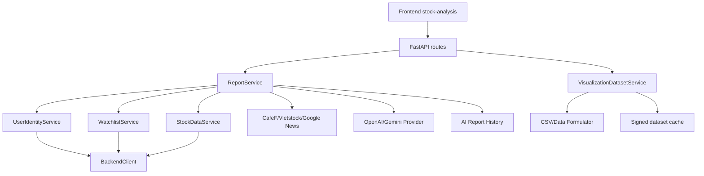

# AI Stock Trend - Analyse Service

`analyse` là service Python/FastAPI dùng để tạo báo cáo AI phân tích cổ phiếu Việt Nam cho frontend `stock-analysis`. Service nhận mã cổ phiếu và sàn, kiểm tra token/watchlist qua Backend API, tải dữ liệu cổ phiếu, bổ sung nguồn công khai CafeF/Vietstock/Google News khi được bật, gọi LLM OpenAI hoặc Gemini để sinh phần nhận định có cấu trúc, render Markdown/HTML, lưu lịch sử, và xuất dữ liệu biểu đồ/CSV/Data Formulator.

> Báo cáo sinh ra chỉ phục vụ tham khảo/học tập, không phải khuyến nghị đầu tư cá nhân hóa.

## Mục Đích Service

`analyse` đứng giữa frontend và các nguồn dữ liệu/LLM:

```text
Frontend stock-analysis
  -> analyse FastAPI
  -> Backend API: current user, watchlists, stock detail, chart, analysis-data
  -> CafeF/Vietstock/Google News research/crawler
  -> OpenAI/Gemini provider
  -> report Markdown/HTML + history storage
  -> visualization.v1 tables + visualization.v2 ECharts payload
  -> CSV/Data Formulator/signed dataset URL
```

Service hiện tập trung vào endpoint chính `POST /api/ai-reports/analyse-one`; các endpoint legacy `/api/analyse/stock`, `/api/analyse/watchlist`, `/api/analyse/fetch-and-analyse/stock` vẫn tồn tại nhưng trả `501 NOT_IMPLEMENTED`.

## Tính Năng Chính

- Health check và config diagnostic đã mask secret.
- Phân tích một mã cổ phiếu có xác thực `Authorization: Bearer <TOKEN>`.
- Kiểm tra mã nằm trong watchlist người dùng trước khi phân tích.
- Tải dữ liệu Backend qua endpoint mới `/api/stocks/{symbol}/analysis-data`, fallback sang stock detail/chart nếu endpoint mới lỗi không phải auth.
- Hỗ trợ OpenAI và Gemini, có cấu hình bật/tắt provider và model mặc định.
- CafeF company/financial fallback, Vietstock BCTC/peer fallback, Google News RSS và source-backed evidence.
- Playwright-safe crawler: bắt `TargetClosedError`, timeout, cleanup page/context/browser và ghi warning/debug thay vì làm sập luồng chính.
- Lưu history bằng SQL Server hoặc JSON file fallback.
- Report detail/history/delete theo user hiện tại.
- Visualization dataset deterministic từ report đã lưu, không gọi LLM/crawler.
- ECharts payload compact trong `data.visualization` và các bảng `prices`, `financial_periods`, `scores`, `peers`, `market_context`, `ai_signals`, `data_quality`.
- CSV export an toàn, có sanitize giá trị bắt đầu bằng `=`, `+`, `-`, `@`.
- Data Formulator package JSON cho `prices` và `financial_periods`.
- Signed URL HMAC cho JSON/CSV visualization dataset, public read nhưng protected create.

## Kiến Trúc Thư Mục

```text
analyse/
  run.py
  README.md
  ANALYSE_PROJECT_FLOW_AND_USAGE_REPORT.md
  .env.example
  pyproject.toml
  requirements.txt
  migrations/
    sqlserver/001_create_ai_report_histories.sql
  docs/
    ANALYSE_SIGNED_DATASET_AUTH_FIX_REPORT.md
    ANALYSE_SIGNED_DATASET_CACHE_FULL_FIX_REPORT.md
    ANALYSE_VISUALIZATION_AND_DATA_FORMULATOR_SIMPLIFICATION_REPORT.md
  src/analyse/
    app.py
    main.py
    api/
    assets/
    clients/
    config/
    db/
    examples/
    prompts/
    providers/
    repositories/
    research/
    schemas/
    services/
    utils/
  tests/
```

| Folder/file | Vai trò |
|---|---|
| `run.py` | Entrypoint local, load `.env`, set Windows Proactor event loop cho Playwright, chạy Uvicorn. |
| `src/analyse/app.py` | App factory FastAPI, CORS, route `/`, docs `/api/analyse/docs`. |
| `src/analyse/api/routes.py` | Toàn bộ HTTP routes của service. |
| `src/analyse/api/dependencies.py` | Dependency factory cho BackendClient, ReportService, history, visualization, signed URL. |
| `src/analyse/config/settings.py` | Pydantic settings đọc `.env`, defaults, aliases và effective properties. |
| `src/analyse/clients/` | HTTP helper và Backend API client. |
| `src/analyse/providers/` | OpenAI/Gemini provider abstraction. |
| `src/analyse/research/` | Google News RSS, CafeF, Vietstock, source registry, source-backed evidence, article extractor. |
| `src/analyse/services/` | Business orchestration: report, summary, scoring, history, visualization, CSV/export, debug. |
| `src/analyse/repositories/` | SQL Server repository và file JSON fallback cho AI report history. |
| `src/analyse/db/` | SQLAlchemy model/session cho SQL Server history. |
| `src/analyse/schemas/` | Pydantic request/response/internal schemas. |
| `tests/` | Unit/contract/integration-style tests cho routes, providers, history, visualization, crawlers, settings. |

## Luồng Hoạt Động Tổng Quan



## Luồng Nghiệp Vụ Chi Tiết

### 1. Analyse One Report

1. Frontend gửi `POST /api/ai-reports/analyse-one` với `symbol`, `scopeExchange`/`exchange`, `provider`, `model`, `options`.
2. Route đọc bearer token bằng `get_bearer_token_from_request`.
3. `ReportService.analyse_one_report()` validate symbol và bắt buộc Authorization.
4. Nếu history persistent khả dụng, service gọi Backend current-user để lấy `mongo_user_id`.
5. Service gọi Backend watchlists, giới hạn theo `MAX_WATCHLIST_SYMBOLS`, và kiểm tra mã yêu cầu có trong watchlist.
6. Service tải stock data: ưu tiên Backend `analysis-data`; nếu lỗi không phải auth thì fallback stock detail/chart.
7. Nếu thiếu dữ liệu doanh nghiệp/tài chính/peer, service thử CafeF company, Vietstock BCTC, CafeF financial, Vietstock peer và peer enrichment.
8. Nếu bật research, service lấy Google News RSS/domain adapters và source-backed evidence.
9. `SummaryService`, scoring, forecast normalizer, presentation normalizer, numeric fact validator dựng summary có cấu trúc.
10. Provider OpenAI/Gemini sinh phần narrative/forecast/checklist/action plan. Nếu provider lỗi hoặc thiếu key, response vẫn có summary deterministic kèm warning/provider status `failed`.
11. Markdown/HTML được render và ghi file nếu options/env cho phép.
12. Nếu history persistent khả dụng, report được lưu vào SQL Server hoặc JSON file fallback.
13. Route warm visualization cache/file từ report vừa tạo, rồi trả response.

Các bước chậm nhất: Backend API, Playwright crawler, Google News/source extraction, OpenAI/Gemini.

### 2. Visualization Flow

Visualization không chạy lại phân tích. Với `reportId` hoặc `history_id`, service:

- đọc in-memory cache;
- nếu miss thì đọc `.data_formulator/exports/{report_id}_visualization_v2.json`;
- nếu vẫn miss thì load report đã lưu từ history và build dataset deterministic;
- ghi lại cache/file;
- trả `visualization.v1` tables và `visualization.v2` ECharts charts compact.

Nếu không có `report_id` và không có symbol cache, `POST /api/ai-reports/analyse-one/visualization-data` trả `400 VISUALIZATION_REPORT_ID_REQUIRED`.

### 3. Data Formulator / CSV Flow

CSV và Data Formulator package được dựng từ visualization dataset đã cache hoặc từ report history. Luồng này không gọi LLM, không crawler, không gọi full `analyse_one_report()`. Bảng hiện có:

- `prices`
- `financial_periods`
- `scores`
- `peers`
- `market_context`
- `ai_signals`
- `data_quality`

Data Formulator package JSON chỉ include `prices` và `financial_periods`, kèm filename CSV và rows để upload thủ công.

### 4. History Flow

History route luôn resolve current user qua Backend current-user bằng bearer token. Storage selection:

- `AI_REPORT_HISTORY_STORAGE=sql|sqlserver|mssql`: dùng SQL Server.
- `AI_REPORT_HISTORY_STORAGE=file|local|json`: dùng file JSON.
- `auto`: dùng SQL Server khi `ENABLE_AI_REPORT_HISTORY=true` và `AI_REPORT_DB_URL` có cấu hình, ngược lại dùng file fallback.
- `disabled|none|off`: tạo SQL repository nhưng `_ensure_enabled()` sẽ trả disabled nếu feature/env chưa bật.

File fallback lưu index và detail trong `AI_REPORT_HISTORY_DIR` mặc định `storage/ai_reports`. Empty history trả `200` với `items: []`, không fatal.

### 5. Signed URL Flow

`POST /api/ai-reports/analyse-one/visualization-data/signed-url` yêu cầu Authorization và `DATA_FORMULATOR_SIGNED_URL_SECRET`. Endpoint này chỉ ký dataset đã có/cache hoặc build từ saved report theo `reportId`; không gọi LLM/crawler/full analysis.

Public read:

- `GET /api/ai-reports/visualization-datasets/{dataset_id}.json?expires=...&signature=...`
- `GET /api/ai-reports/visualization-datasets/{dataset_id}.csv?table=prices&expires=...&signature=...`

Chữ ký HMAC cover `dataset_id`, `format`, `expires`; CSV cover thêm `table`. Dataset được lưu RAM class-level và metadata file trong `.data_formulator/signed_datasets`; nếu TTL hết hạn hoặc file dataset bị mất thì read trả `404 SIGNED_DATASET_NOT_FOUND`.

## API Reference

Tất cả JSON success dùng envelope:

```json
{
  "code": 200,
  "success": true,
  "message": "...",
  "data": {}
}
```

Tất cả JSON error do service tự trả dùng envelope:

```json
{
  "code": 404,
  "success": false,
  "message": "...",
  "error": {
    "type": "HISTORY_NOT_FOUND",
    "code": "HISTORY_NOT_FOUND",
    "details": []
  },
  "data": null
}
```

| Method | Path | Mục đích | Auth | Body/query | LLM | Crawler | Storage/cache | Status chính |
|---|---|---|---|---|---|---|---|---|
| GET | `/` | Root health/info | Không | Không | Không | Không | Không | 200 |
| GET | `/api/analyse/health` | Health check | Không | Không | Không | Không | Không | 200 |
| GET | `/api/analyse/config-check` | Config diagnostic, optional backend reachability | Không | `checkBackend=false` | Không | Không | Backend ping nếu bật | 200 |
| POST | `/api/analyse/stock` | Legacy placeholder | Không | `StockAnalysisRequest` | Không | Không | Không | 501 |
| POST | `/api/analyse/watchlist` | Legacy placeholder | Không | `WatchlistAnalysisRequest` | Không | Không | Không | 501 |
| POST | `/api/analyse/fetch-and-analyse/stock` | Legacy placeholder | Không | `StockFetchAnalysisRequest` | Không | Không | Không | 501 |
| POST | `/api/ai-reports/analyse-one` | Tạo AI report một mã | Có | `AnalyseOneReportRequest` | Có | Có thể | History, report files, visualization warm cache | 200, 400, 401, 403, 502, 503 |
| POST | `/api/ai-reports/analyse-one/visualization-data` | Lấy dataset biểu đồ theo `reportId` | Có nếu cache miss cần history | `AnalyseOneReportRequest`, `options.reportId`, `chartRange` | Không | Không | RAM/file/history | 200, 400, 401, 404, 422, 503 |
| POST | `/api/ai-reports/analyse-one/visualization-data.csv` | Tải CSV từ dataset/report đã có | Có nếu cần history | body như trên, query `table=prices` | Không | Không | RAM/file/history/export file | 200, 401, 404, 503 |
| GET | `/api/ai-reports/history` | List history user hiện tại | Có | `symbol`, `exchange`, `provider`, `model`, `fromDate`, `toDate`, `page`, `limit` | Không | Không | SQL/file history | 200, 401, 500, 503 |
| GET | `/api/ai-reports/history/{history_id}/visualization-data` | Build/load visualization từ saved history | Có | path `history_id` | Không | Không | SQL/file history + visualization cache | 200, 401, 404, 422, 500, 503 |
| GET | `/api/ai-reports/history/{history_id}/visualization-data.csv` | CSV từ saved history | Có | query `table=prices` | Không | Không | history + export file | 200, 401, 404, 422, 500, 503 |
| GET | `/api/ai-reports/history/{history_id}/data-formulator-package.json` | Tải Data Formulator package | Có | path `history_id` | Không | Không | history + export file | 200, 401, 404, 422, 500, 503 |
| GET | `/api/ai-reports/history/{history_id}` | Detail saved report | Có | path `history_id` | Không | Không | SQL/file history | 200, 401, 404, 500, 503 |
| DELETE | `/api/ai-reports/history/{history_id}` | Xóa history của user hiện tại | Có | path `history_id` | Không | Không | SQL/file history | 200, 401, 404, 500, 503 |
| POST | `/api/ai-reports/analyse-one/visualization-data/signed-url` | Tạo public signed JSON/CSV URLs | Có | `AnalyseOneReportRequest`, `options.reportId` | Không | Không | visualization cache + signed metadata | 200, 401, 404, 422, 503 |
| GET | `/api/ai-reports/visualization-datasets/{dataset_id}.csv` | Public CSV signed read | Không | `table`, `expires`, `signature` | Không | Không | signed cache/metadata | 200, 400, 401, 403, 404, 503 |
| GET | `/api/ai-reports/visualization-datasets/{dataset_id}.json` | Public JSON signed read | Không | `expires`, `signature` | Không | Không | signed cache/metadata | 200, 401, 403, 404, 503 |

## Request/Response Examples

### Analyse one

Schema request thật:

```json
{
  "provider": "openai",
  "model": "gpt-4.1-mini",
  "symbol": "HPG",
  "scopeExchange": "HOSE",
  "options": {
    "language": "vi",
    "riskProfile": "medium",
    "timeHorizon": "medium",
    "includeExternalResearch": true,
    "renderMarkdown": true,
    "renderHtml": true,
    "capitalVnd": 100000000,
    "riskPerTradePct": 1.0,
    "maxPositionPct": 12.0
  }
}
```

Compatibility: `scopeExchange`, `exchange`, hoặc `scope_exchange` đều được schema nhận; response serialize field trong `data` là `scope_exchange`.

```json
{
  "symbol": "HPG",
  "exchange": "HOSE"
}
```

Response rút gọn:

```json
{
  "code": 200,
  "message": "Tạo dữ liệu report thành công",
  "data": {
    "report_id": "HPG_HOSE_20260630_153000",
    "generated_at": "2026-06-30T15:30:00+07:00",
    "symbol": "HPG",
    "company": "...",
    "scope_exchange": "HOSE",
    "language": "vi",
    "analysis_status": "success",
    "history_status": "success",
    "source_status": "partial",
    "report_status": "partial",
    "provider": {
      "name": "openai",
      "model": "gpt-4.1-mini",
      "status": "success",
      "latency_ms": 1234
    },
    "data_sources": [],
    "summary": {},
    "markdown_report": {
      "available": true,
      "output_path": "reports/HPG_HOSE_....md",
      "content": "..."
    },
    "html_report": {
      "available": true,
      "output_path": "reports/HPG_HOSE_....html",
      "content": null,
      "template_name": "HtmlService.build"
    },
    "warnings": []
  }
}
```

### Visualization request

```json
{
  "symbol": "HPG",
  "scopeExchange": "HOSE",
  "options": {
    "reportId": "HPG_HOSE_20260630_153000",
    "chartRange": "1y"
  }
}
```

Response rút gọn:

```json
{
  "code": 200,
  "success": true,
  "message": "Tải dữ liệu biểu đồ thành công.",
  "data": {
    "schema_version": "visualization.v1",
    "symbol": "HPG",
    "exchange": "HOSE",
    "generated_at": "...",
    "meta": {
      "source_report_id": "HPG_HOSE_20260630_153000",
      "chart_range": "1y"
    },
    "tables": [],
    "visualization": {
      "schema_version": "visualization.v2",
      "charts": [],
      "meta": {
        "chart_count": 0,
        "omitted_charts": [],
        "cache_hit": false,
        "duration_ms": 85
      }
    }
  }
}
```

## Environment Variables

Đọc từ `analyse/.env` theo `settings.py`; `.env.example` có ví dụ đầy đủ. Không commit secret thật.

### App/backend/history

| Variable | Required? | Default | Purpose | Example/notes |
|---|---:|---|---|---|
| `ANALYSE_HOST` | No | `0.0.0.0` | Host Uvicorn | `127.0.0.1` |
| `ANALYSE_PORT` | No | `5100` | Port service | `5100` |
| `ANALYSE_ENV` | No | `development` | Bật reload khi chạy `run.py` | `production` để tắt reload |
| `LOG_LEVEL`/`ANALYSE_LOG_LEVEL` | No | `INFO` | Log level | `DEBUG` |
| `TIMEZONE`/`ANALYSE_TIMEZONE` | No | `Asia/Ho_Chi_Minh` | Timezone report/log | `Asia/Saigon` vẫn nên chuẩn hóa về `Asia/Ho_Chi_Minh` |
| `PYTHONPATH` | No | `src` | Import path local | `src` |
| `CORS_ALLOWED_ORIGINS` | No | `http://localhost:5173,http://127.0.0.1:5173` | Frontend origins | `*` sẽ tự tắt credentials |
| `CORS_ALLOW_CREDENTIALS` | No | `true` | CORS credentials | `true` |
| `BACKEND_API_BASE_URL` | Yes local | `http://localhost:5000` | Backend Node API base, không thêm `/api` cuối | Aliases: `BACKEND_API_URL`, `BACKEND_BASE_URL`, `API_BASE_URL` |
| `BACKEND_API_TIMEOUT_MS` | No | `30000` | Timeout Backend API | `30000` |
| `BACKEND_API_VERIFY_SSL` | No | `true` | Verify SSL khi gọi backend | `false` local self-signed |
| `BACKEND_API_TOKEN` | Deprecated | empty | Không dùng cho analyse-one user-triggered | Token phải lấy từ request Authorization |
| `BACKEND_API_AUTH_SCHEME` | No | `Bearer` | Legacy diagnostic | Request token luôn gửi Bearer |
| `BACKEND_USE_ANALYSIS_DATA_ENDPOINT` | No | `true` | Ưu tiên endpoint analysis-data | `true` |
| `BACKEND_ANALYSIS_DATA_ENDPOINT` | No | `/api/stocks/{symbol}/analysis-data` | Path analysis-data | Có params `quarters/chartRange/includePeers/includeMarketContext/exchange` |
| `BACKEND_ANALYSIS_DATA_QUARTERS` | No | `6` | Số quý BCTC | `6` |
| `BACKEND_ANALYSIS_DATA_CHART_RANGE` | No | `3m` | Range chart backend | `3m` |
| `BACKEND_ANALYSIS_DATA_INCLUDE_PEERS` | No | `true` | Include peers | `true` |
| `BACKEND_ANALYSIS_DATA_INCLUDE_MARKET_CONTEXT` | No | `true` | Include market context | `true` |
| `BACKEND_WATCHLIST_ENDPOINT` | No | `/api/watchlists` | Watchlist endpoint | Protected by user token |
| `BACKEND_CURRENT_USER_ENDPOINT` | No | `/api/users/me` | Current user endpoint | Protected by user token |
| `BACKEND_WATCHLIST_REQUIRED` | No | `false` | Có trong settings nhưng luồng hiện vẫn gọi watchlist | Giữ để compatibility |
| `BACKEND_STOCK_DETAIL_ENDPOINT` | No | `/api/stocks/{symbol}` | Legacy fallback stock detail | Protected |
| `BACKEND_STOCK_CHART_ENDPOINT` | No | `/api/stocks/{symbol}/chart` | Legacy fallback chart | Query `range` nếu endpoint không có `{range}` |
| `ENABLE_AI_REPORT_HISTORY` | No | `false` | Bật SQL history khi có DB URL | File fallback vẫn có thể dùng khi storage auto |
| `AI_REPORT_HISTORY_STORAGE` | No | `auto` | `auto/sqlserver/file/disabled` | `file` cho local không SQL |
| `AI_REPORT_HISTORY_DIR` | No | `storage/ai_reports` | File fallback history dir | Ignored by git |
| `AI_REPORT_DB_URL` | SQL only | empty | SQLAlchemy URL SQL Server | Mask khi log |
| `AI_REPORT_HISTORY_SAVE_FAILURE_POLICY` | No | `non_blocking` | `non_blocking` hoặc `strict` | strict có thể trả 503 khi save history fail |

### LLM/report/visualization

| Variable | Required? | Default | Purpose | Example/notes |
|---|---:|---|---|---|
| `DEFAULT_LLM_PROVIDER` | No | `openai` | Provider mặc định | `openai` hoặc `gemini` |
| `ALLOW_REQUEST_MODEL_OVERRIDE` | No | `false` | Cho phép request override model | Nếu false, request `model` chỉ tạo warning |
| `OPENAI_ENABLED` | No | `true` | Bật OpenAI | `false` |
| `OPENAI_API_KEY` | OpenAI | empty | Secret OpenAI | Không commit |
| `OPENAI_MODEL` | No | `gpt-4.1-mini` | Model OpenAI | `gpt-4.1-mini` |
| `OPENAI_TEMPERATURE` | No | `0.2` | Temperature | `0.2` |
| `OPENAI_MAX_OUTPUT_TOKENS` | No | `8192` | Output tokens | `8192` |
| `OPENAI_TIMEOUT_MS` | No | `60000` | OpenAI timeout | `60000` |
| `OPENAI_JSON_MODE` | No | `true` | Giữ compatibility; provider dùng `responses.parse` | `true` |
| `GEMINI_ENABLED` | No | `true` | Bật Gemini | `false` |
| `GEMINI_API_KEY` | Gemini | empty | Secret Gemini | Không commit |
| `GEMINI_MODEL` | No | `gemini-1.5-flash` | Model Gemini | `gemini-1.5-flash` |
| `GEMINI_TEMPERATURE` | No | `0.2` | Temperature | `0.2` |
| `GEMINI_TOP_P` | No | `0.9` | Top-p | `0.9` |
| `GEMINI_MAX_OUTPUT_TOKENS` | No | `8192` | Output tokens | `8192` |
| `GEMINI_TIMEOUT_MS` | No | `60000` | Timeout | `60000` |
| `GEMINI_JSON_MODE` | No | `true` | Gửi response schema JSON nếu có | `true` |
| `REPORT_OUTPUT_DIR` | No | `reports` | Markdown/HTML/debug output | Ignored by git |
| `REPORT_RENDER_MARKDOWN`/`REPORT_WRITE_MARKDOWN` | No | `true` | Ghi Markdown file | Alias legacy |
| `REPORT_RENDER_HTML`/`REPORT_WRITE_HTML` | No | `true` | Ghi HTML file | Alias legacy |
| `REPORT_INCLUDE_MARKDOWN_CONTENT_IN_RESPONSE` | No | `true` | Include markdown content trong response | Có thể nặng |
| `REPORT_INCLUDE_HTML_CONTENT_IN_RESPONSE` | No | `false` | Include HTML content trong response | Nên false |
| `REPORT_LANGUAGE` | No | `vi` | Ngôn ngữ report mặc định | `vi` |
| `REPORT_CHART_ENGINE` | No | `echarts` | Engine chart HTML report | `echarts` |
| `REPORT_CHART_ASSET_MODE` | No | `local` | Asset mode chart HTML | `local` |
| `REPORT_CHART_ASSET_DIR` | No | `reports/assets` | Asset output | Có `echarts.min.js` source asset |
| `REPORT_ECHARTS_LOCAL_FILE` | No | `echarts.min.js` | ECharts local file |  |
| `REPORT_CHART_FALLBACK` | No | `inline_svg` | Fallback chart HTML |  |
| `REPORT_CHART_ALLOW_CDN` | No | `false` | Cho phép CDN ECharts |  |
| `REPORT_ECHARTS_CDN_URL` | No | empty | CDN URL |  |
| `REPORT_MARKET_CHART_TYPE` | No | `segmented_bar` | Chart type market |  |
| `SUMMARY_SCHEMA_VERSION` | No | `1.0` | Version summary |  |
| `MAX_WATCHLIST_SYMBOLS` | No | `5` | Giới hạn watchlist check |  |
| `ANALYSE_ONE_SYMBOL_ONLY` | No | `true` | Bắt buộc mã nằm trong watchlist |  |
| `VISUALIZATION_EXPORT_ENABLED` | No | `true` | Bật visualization/export | false trả 503 |
| `VISUALIZATION_SCHEMA_VERSION` | No | `visualization.v1` | Dataset schema | Response chart có nested `visualization.v2` |
| `VISUALIZATION_DEFAULT_CHART_RANGE` | No | `1y` | `7d/1m/3m/6m/1y/all` | Invalid fallback `1y` |
| `VISUALIZATION_MAX_ROWS` | No | `5000` | Giới hạn rows/table | Clamp 1..100000 |
| `VISUALIZATION_DATASET_TTL_SECONDS` | No | `1800` | TTL RAM/signed cache | Min 60 |
| `VISUALIZATION_CSV_EXPORT_ENABLED` | No | `true` | Bật CSV | false trả 503 |
| `DATA_FORMULATOR_ENABLED` | No | `false` | Flag sidecar, hiện không auto-import | Manual CSV/package |
| `DATA_FORMULATOR_BASE_URL` | No | `http://localhost:5567` | Sidecar base URL |  |
| `DATA_FORMULATOR_PUBLIC_URL` | No | `http://localhost:5567` | Public URL |  |
| `DATA_FORMULATOR_HOME` | No | `.data_formulator` | Export/signed dataset root | Ignored by git |
| `DATA_FORMULATOR_PLUGIN_DIR` | No | `tools/data-formulator/plugins` | Plugin dir metadata |  |
| `DATA_FORMULATOR_SIGNED_URL_SECRET` | Signed URL | empty | HMAC secret | Required for signed create/read |
| `DATA_FORMULATOR_ALLOWED_ORIGINS` | No | `http://localhost:5567` | Data Formulator CORS list |  |
| `DATA_FORMULATOR_AUTO_IMPORT_ENABLED` | Deprecated | `false` | Compatibility only | Auto-import không dùng |
| `DATA_FORMULATOR_SESSION_EXPORT_ENABLED` | Deprecated | `false` | Compatibility only | Session export không dùng |
| `ANALYSE_API_BASE_URL` | No | `http://localhost:5100` | Base URL tạo signed URL | Set public origin khi deploy |

### Research/crawler/scoring

| Variable | Default | Purpose |
|---|---|---|
| `ENABLE_EXTERNAL_RESEARCH` | `true` | Bật external research trong report. |
| `ENABLE_VIETSTOCK` | `true` | Bật Vietstock via Google News adapter. |
| `ENABLE_CAFEF` | `true` | Bật CafeF via Google News adapter. |
| `ENABLE_GOOGLE_NEWS_RSS` | `true` | Bật Google News RSS adapter chính. |
| `RESEARCH_CACHE_DIR` | `.research_cache` | Cache RSS/static/rendered crawler. |
| `RESEARCH_CACHE_TTL_SECONDS` | `21600` | TTL cache research chung. |
| `RESEARCH_TIMEOUT_MS` | `20000` | Timeout HTTP research. |
| `MAX_RESEARCH_ITEMS` | `10` | Số tin tối đa đưa vào context. |
| `RESEARCH_USER_AGENT` | `Mozilla/5.0 analyse-service/1.0` | User-Agent nguồn ngoài. |
| `RESEARCH_GOOGLE_NEWS_RSS_ENABLED` | `true` | Flag riêng Google News RSS. |
| `RESEARCH_MAX_ARTICLE_AGE_DAYS` | `730` | Lọc tin quá cũ. |
| `RESEARCH_SOURCE_PRIORITY` | danh sách domain tài chính | Ưu tiên nguồn tin. |
| `RESEARCH_OFFICIAL_SOURCE_PRIORITY` | `hsx.vn,hnx.vn,ssc.gov.vn` | Nguồn công bố chính thức. |
| `ENABLE_SOURCE_BACKED_RESEARCH` | `true` | Bật evidence/source-backed enrichment. |
| `ENABLE_DEEP_RESEARCH_CRAWL` | `true` | Cờ crawl sâu, chủ yếu cho source-backed behavior. |
| `SOURCE_BACKED_RESEARCH_TIMEOUT_MS` | `45000` | Timeout article extraction. |
| `SOURCE_BACKED_RESEARCH_MAX_ARTICLES` | `20` | Max query/article source-backed. |
| `SOURCE_BACKED_RESEARCH_MAX_SOURCES_PER_SYMBOL` | `12` | Max source attempts. |
| `SOURCE_BACKED_RESEARCH_MAX_CRAWL_DEPTH` | `1` | Depth config hiện tại. |
| `SOURCE_BACKED_RESEARCH_CACHE_TTL_SECONDS` | `21600` | TTL source-backed. |
| `SOURCE_BACKED_RESEARCH_REQUIRE_SOURCE_FOR_NUMERIC_FACTS` | `true` | Guardrail numeric facts. |
| `SOURCE_BACKED_RESEARCH_ARTICLE_BODY_MAX_CHARS` | `4000` | Giới hạn body article. |
| `GOOGLE_NEWS_RSS_MAX_ITEMS` | `15` | Max item mỗi GoogleNews adapter. |
| `GOOGLE_NEWS_RSS_LANGUAGE` | `vi` | RSS language. |
| `GOOGLE_NEWS_RSS_COUNTRY` | `VN` | RSS country. |
| `ENABLE_FORECAST_SCENARIOS` | `true` | Bật scenario forecast. |
| `FORECAST_TIME_HORIZONS` | `short_term,base_term,medium_term` | Horizon list. |
| `FORECAST_SCENARIO_COUNT` | `3` | Số scenario. |
| `FORECAST_REQUIRE_TRIGGER_AND_INVALIDATION` | `true` | Bắt trigger/invalidation. |
| `FORECAST_ALLOW_PROBABILISTIC_LANGUAGE` | `true` | Cho phép ngôn ngữ xác suất. |
| `FORECAST_DEFAULT_PROBABILITY_METHOD` | `score_weighted` | Cách gán xác suất fallback. |
| `ENABLE_CAFEF_COMPANY_FALLBACK` | `true` | CafeF profile/leadership/ownership. |
| `CAFEF_COMPANY_URL_TEMPLATE` | CafeF leadership URL | Template source. |
| `CAFEF_COMPANY_TIMEOUT_MS` | `30000` | Timeout. |
| `CAFEF_COMPANY_CACHE_TTL_SECONDS` | `21600` | Cache TTL. |
| `CAFEF_COMPANY_USE_BROWSER_FALLBACK` | `true` | Dùng Playwright nếu static thiếu. |
| `ENABLE_CAFEF_FINANCIAL_FALLBACK` | `true` | CafeF financial. |
| `CAFEF_FINANCIAL_URL_TEMPLATE` | CafeF financial URL | Template source. |
| `CAFEF_FINANCIAL_TIMEOUT_MS` | `90000` | Timeout. |
| `CAFEF_FINANCIAL_CACHE_TTL_SECONDS` | `21600` | Cache TTL. |
| `CAFEF_FINANCIAL_MAX_PERIODS` | `8` | Max kỳ. |
| `CAFEF_FINANCIAL_UNIT` | `Tỷ đồng` | Unit. |
| `CAFEF_FINANCIAL_USE_BROWSER_FALLBACK` | `true` | Dùng Playwright fallback. |
| `ENABLE_FINANCIAL_SOURCE_MERGE` | `true` | Merge backend/Vietstock/CafeF. |
| `FINANCIAL_SOURCE_PRIORITY` | `backend_analysis_data,vietstock_bctc,cafef_financial` | Thứ tự nguồn. |
| `FINANCIAL_ALLOW_SUPPLEMENTARY_BACKFILL` | `true` | Cho backfill field thiếu. |
| `FINANCIAL_CONFLICT_TOLERANCE_PCT` | `5.0` | Ngưỡng conflict. |
| `FINANCIAL_REQUIRE_SOURCE_FOR_BACKFILL` | `true` | Yêu cầu source backfill. |
| `FINANCIAL_BACKFILL_WRITE_DEBUG` | `true` | Ghi debug backfill. |
| `ENABLE_VIETSTOCK_BCTC_FALLBACK` / `ENABLE_VIETSTOCK_FINANCIAL_FALLBACK` | `true` | Bật Vietstock BCTC; BCTC alias ưu tiên. |
| `VIETSTOCK_BCTC_*` / `VIETSTOCK_FINANCIAL_*` | xem `.env.example` | URL, timeout, TTL, max periods, unit, browser headless/wait/viewport. |
| `ENABLE_VIETSTOCK_PEER_FALLBACK` | `true` | Bật Vietstock peer. |
| `VIETSTOCK_PEER_*` | xem `.env.example` | URL, timeout, TTL, max items, browser wait/viewport/default tab. |
| `ENABLE_PEER_WEB_ENRICHMENT` | `true` | Bổ sung peer thiếu metric qua backend/Vietstock/CafeF. |
| `PEER_WEB_ENRICHMENT_MAX_PEERS` | `10` | Max peer enrich. |
| `PEER_WEB_ENRICHMENT_TIMEOUT_MS` | `30000` | Timeout peer enrich. |
| `PEER_RECOMMENDATION_TOP_N` | `5` | Số peer candidate. |
| `PLAYWRIGHT_HEADLESS` | `true` | Cấu hình browser chung. |
| `PLAYWRIGHT_VIEWPORT_WIDTH` / `PLAYWRIGHT_VIEWPORT_HEIGHT` | `1600` / `1100` | Viewport chung. |
| `PLAYWRIGHT_NAVIGATION_TIMEOUT_MS` | `90000` | Navigation timeout. |
| `PLAYWRIGHT_EXTRA_WAIT_MS` | `5000` | Extra wait. |
| `PLAYWRIGHT_WAIT_UNTIL` | `domcontentloaded` | Wait strategy; `networkidle` được tránh ở vài path. |
| `PLAYWRIGHT_RETRY_COUNT` | `2` | Retry count. |
| `PLAYWRIGHT_RETRY_BACKOFF_MS` | `1500` | Retry backoff. |
| `EXTERNAL_DATA_DEBUG_SAVE_RENDERED_HTML` | `false` | Ghi HTML debug. |
| `EXTERNAL_DATA_DEBUG_SAVE_EXTRACTION_JSON` | `false` | Ghi JSON debug. |
| `VIETSTOCK_DEBUG_SAVE_RENDERED_HTML` | `false` | Ghi HTML debug Vietstock. |
| `VIETSTOCK_DEBUG_SAVE_EXTRACTION_JSON` | `false` | Ghi JSON debug Vietstock. |
| `DEFAULT_CAPITAL_VND` | `100000000` | Default mô phỏng vốn. |
| `DEFAULT_RISK_PER_TRADE_PCT` | `1.0` | Default risk/trade. |
| `DEFAULT_MAX_POSITION_PCT` | `12.0` | Default max position. |
| `ENABLE_SOURCE_BACKED_MISSING_FIELD_ENRICHMENT` | `true` | Missing-field enrichment. |
| `MISSING_FIELD_ENRICHMENT_TIMEOUT_MS` | `30000` | Timeout enrichment. |
| `MISSING_FIELD_ENRICHMENT_MAX_ATTEMPTS` | `2` | Attempts. |
| `MISSING_FIELD_ENRICHMENT_ALLOWED_SOURCES` | `backend,cafef,vietstock,google_news_rss` | Allowed sources. |
| `MISSING_FIELD_ENRICHMENT_WRITE_DEBUG` | `true` | Debug. |
| `REPORT_MISSING_VALUE_POLICY` | `source_backed_then_model_inference` | Missing value policy. |
| `REPORT_ALLOW_SAFE_ACTION_FALLBACK` | `true` | Fallback action plan. |
| `REPORT_ALLOW_SAFE_SCENARIO_FALLBACK` | `true` | Fallback scenarios. |
| `REPORT_ALLOW_SAFE_CHECKLIST_FALLBACK` | `true` | Fallback checklist. |
| `REPORT_ALLOW_MODEL_INFERENCE_FOR_QUALITATIVE_FIELDS` | `true` | Cho model infer qualitative. |
| `REPORT_REQUIRE_SOURCE_FOR_NUMERIC_FACTS` | `true` | Guardrail numeric facts. |
| `REPORT_SHOW_MISSING_REASON` | `true` | Hiển thị lý do thiếu. |
| `ENABLE_SCORING` | `true` | Bật scoring deterministic. |
| `SCORING_MIN_FINANCIAL_PERIODS` | `3` | Min kỳ tài chính. |
| `SCORING_REQUIRE_FINANCIALS_FOR_OVERALL` | `false` | Có yêu cầu financial cho overall. |
| `SCORING_ENABLE_MARKET_CONTEXT` | `true` | Include market context. |
| `SCORING_ENABLE_PEER_CONTEXT` | `true` | Include peer context. |

## Installation Và Chạy Local Trên Windows PowerShell

```powershell
cd analyse
uv sync
uv run playwright install chromium
uv run python run.py
```

Nếu dùng `requirements.txt`:

```powershell
cd analyse
uv pip install -r requirements.txt
uv run playwright install chromium
uv run python run.py
```

Fallback Python thuần:

```powershell
cd analyse
python -m venv .venv
.venv\Scripts\activate
pip install -r requirements.txt
playwright install chromium
python run.py
```

Docs Swagger: `http://127.0.0.1:5100/api/analyse/docs`

## Testing

```powershell
cd analyse
uv run python -m compileall -q src
uv run python -m pytest -q
```

Static tools đã khai báo trong `pyproject.toml` optional dev:

```powershell
uv sync --extra dev
uv run ruff check .
uv run ruff format --check .
uv run pyright .
uv run mypy .
uv run vulture .
```

Nếu môi trường chưa có dev tools:

```powershell
uv add --dev ruff pyright mypy vulture
```

## Manual API Verification

PowerShell nên dùng `curl.exe` để tránh alias `Invoke-WebRequest`.

Health:

```powershell
curl.exe http://127.0.0.1:5100/api/analyse/health
```

Config:

```powershell
curl.exe "http://127.0.0.1:5100/api/analyse/config-check?checkBackend=false"
```

History:

```powershell
curl.exe "http://127.0.0.1:5100/api/ai-reports/history?page=1&limit=20" `
  -H "Authorization: Bearer <TOKEN>"
```

Analyse one:

```powershell
curl.exe -X POST "http://127.0.0.1:5100/api/ai-reports/analyse-one" `
  -H "Content-Type: application/json" `
  -H "Authorization: Bearer <TOKEN>" `
  --data "{\"symbol\":\"HPG\",\"scopeExchange\":\"HOSE\",\"provider\":\"openai\",\"options\":{\"language\":\"vi\"}}"
```

Visualization:

```powershell
curl.exe -X POST "http://127.0.0.1:5100/api/ai-reports/analyse-one/visualization-data" `
  -H "Content-Type: application/json" `
  -H "Authorization: Bearer <TOKEN>" `
  --data "{\"symbol\":\"HPG\",\"scopeExchange\":\"HOSE\",\"options\":{\"reportId\":\"<REPORT_ID>\",\"chartRange\":\"1y\"}}"
```

CSV:

```powershell
curl.exe -X POST "http://127.0.0.1:5100/api/ai-reports/analyse-one/visualization-data.csv?table=prices" `
  -H "Content-Type: application/json" `
  -H "Authorization: Bearer <TOKEN>" `
  --data "{\"symbol\":\"HPG\",\"scopeExchange\":\"HOSE\",\"options\":{\"reportId\":\"<REPORT_ID>\"}}" `
  -o prices.csv
```

History CSV:

```powershell
curl.exe -OJ "http://127.0.0.1:5100/api/ai-reports/history/<HISTORY_ID>/visualization-data.csv?table=prices" `
  -H "Authorization: Bearer <TOKEN>"
```

Signed URL create:

```powershell
curl.exe -X POST "http://127.0.0.1:5100/api/ai-reports/analyse-one/visualization-data/signed-url" `
  -H "Content-Type: application/json" `
  -H "Authorization: Bearer <TOKEN>" `
  --data "{\"symbol\":\"HPG\",\"scopeExchange\":\"HOSE\",\"options\":{\"reportId\":\"<REPORT_ID>\"}}"
```

## Troubleshooting

### History 503

Symptom:

```text
GET /api/ai-reports/history -> 503
Tính năng lịch sử báo cáo AI chưa được bật
```

Nguyên nhân thường gặp: `AI_REPORT_HISTORY_STORAGE=sqlserver` nhưng thiếu `ENABLE_AI_REPORT_HISTORY=true` hoặc `AI_REPORT_DB_URL`; storage bị set `disabled`; env file không được load đúng; SQL Server không reachable. Với local nhanh, đặt `AI_REPORT_HISTORY_STORAGE=file`.

### History 401

Thiếu hoặc sai `Authorization: Bearer <TOKEN>`. History routes luôn gọi Backend current-user để lấy `mongo_user_id`; tests có thể mock dependency, runtime thật thì cần token backend hợp lệ.

### Visualization timeout

Luồng hiện tại không rerun analysis. Timeout thường do cache miss phải đọc history/file chậm, Backend current-user chậm, filesystem/antivirus chậm, hoặc frontend timeout quá thấp. Frontend không nên gọi lại `analyse-one`; chỉ retry visualization endpoint.

### Visualization 503

Kiểm tra `VISUALIZATION_EXPORT_ENABLED`, `VISUALIZATION_CSV_EXPORT_ENABLED`, history storage, signed URL secret nếu đang đọc signed route. Missing optional chart data không nên là 503; nếu gặp, kiểm tra log `MALFORMED_REPORT_DATA` hoặc storage error.

### Playwright TargetClosedError

Các crawler có `playwright_safe.py` để bắt và cleanup. Lỗi này nên đi vào `warnings`/`technical_warnings`, không được làm hỏng visualization/export/history. Cài Chromium nếu thiếu:

```powershell
uv run playwright install chromium
```

### LLM BadRequestError hoặc provider failed

OpenAI/Gemini provider sẽ trả warning dạng `Không thể tạo phân tích...` hoặc `LLM_UNAVAILABLE`. Kiểm tra model, API key, JSON schema/prompt, quota và timeout. Nếu `ALLOW_REQUEST_MODEL_OVERRIDE=false`, request `model` không được dùng.

### CSV slow hoặc 404

CSV không chạy full analysis. `404 VISUALIZATION_NOT_FOUND` nghĩa là chưa có dataset cache/file và request thiếu `reportId` hoặc không load được saved report. Gọi visualization bằng `reportId` trước, hoặc dùng route history CSV.

### CORS/frontend không kết nối

Frontend thường ở `http://localhost:5173`. Kiểm tra `CORS_ALLOWED_ORIGINS`, `ANALYSE_PORT`, và base URL frontend trỏ về `http://localhost:5100`.

## Performance Notes

Kỳ vọng local khi dependency sẵn sàng:

```text
Health: < 200ms
Config-check không ping backend: < 300ms
History file/SQL local: < 500ms
Report detail: < 500ms
Visualization cached: < 300ms
Visualization build từ saved report: thường < 1s
CSV cached: < 500ms
CSV build từ saved report: thường < 2s
Analyse-one: chậm hơn vì Backend + crawler + LLM
```

## Security Và Safety Notes

- Không log API key, bearer token, DB URL raw, signed URL secret.
- Protected routes dùng Authorization header, không dùng `BACKEND_API_TOKEN` cho user-triggered flow.
- Signed URL cần secret và expiry; public read không cần Authorization nhưng chữ ký phải hợp lệ.
- CSV sanitize formula-like values bằng prefix `'`.
- `reports/`, `storage/`, `.research_cache/`, `.data_formulator/` phải nằm ngoài git.
- Không đưa secret vào `.env.example`, docs, debug artifact.

## Development Checklist

```text
[ ] uv run python -m compileall -q src
[ ] uv run python -m pytest -q
[ ] uv run ruff check .
[ ] Health endpoint works
[ ] History endpoint works with token
[ ] Analyse-one returns report
[ ] Visualization does not call LLM/crawler
[ ] CSV downloads correctly
[ ] Signed URL does not leak bearer token
[ ] No generated storage/report files are committed
```

## Tài Liệu Liên Quan

- Báo cáo chi tiết mới: `ANALYSE_PROJECT_FLOW_AND_USAGE_REPORT.md`
- `docs/ANALYSE_VISUALIZATION_AND_DATA_FORMULATOR_SIMPLIFICATION_REPORT.md`
- `docs/ANALYSE_SIGNED_DATASET_AUTH_FIX_REPORT.md`
- `docs/ANALYSE_SIGNED_DATASET_CACHE_FULL_FIX_REPORT.md`
- `ANALYSE_VISUALIZATION_EXPORT_FIX_REPORT.md`
- `ANALYSE_VISUALIZATION_TIMEOUT_FIX_REPORT.md`
- `ANALYSE_VISUALIZATION_UI_PERFORMANCE_FIX_REPORT.md`
