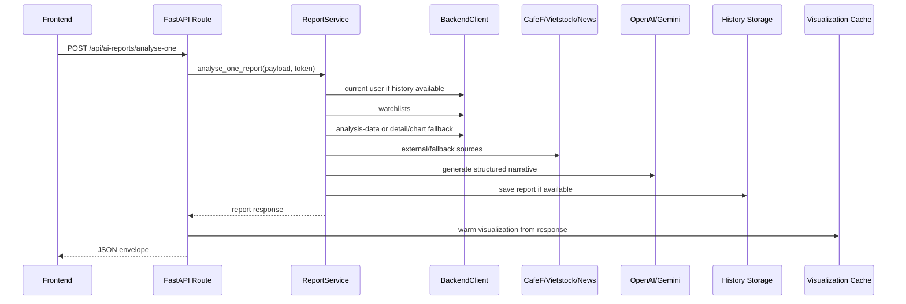
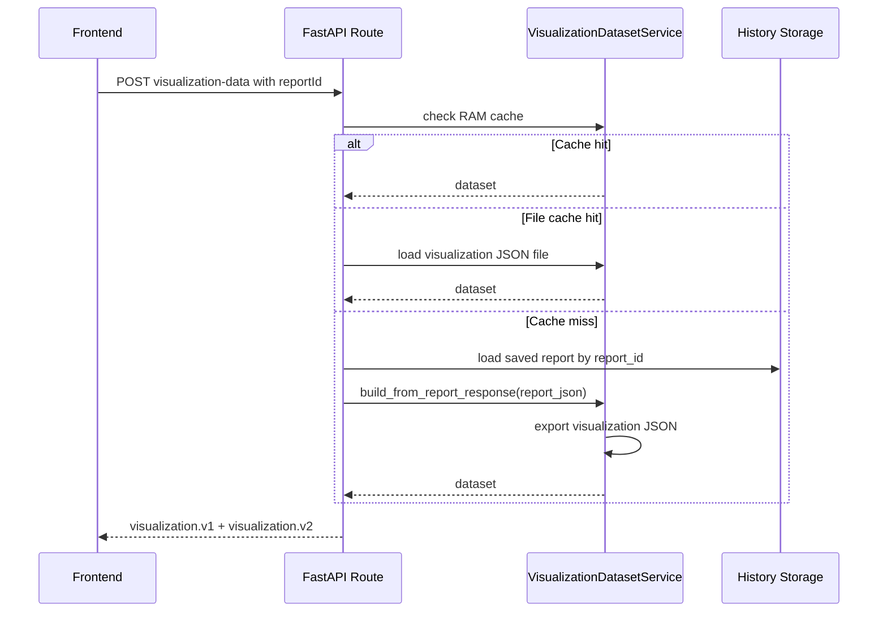
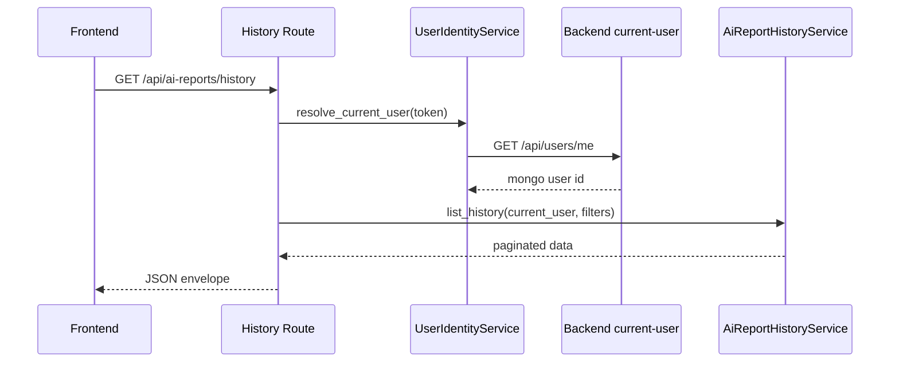
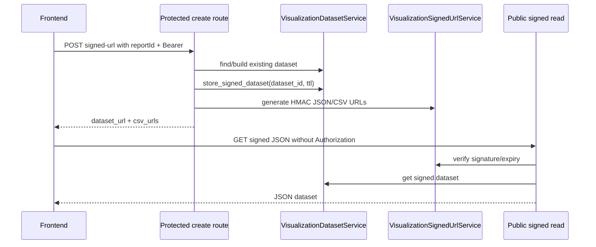

# ANALYSE PROJECT FLOW AND USAGE REPORT

Tài liệu này mô tả chi tiết service `analyse` theo source code hiện tại trong `analyse/src/analyse`, `analyse/tests`, migrations và các report kỹ thuật sẵn có. Ngôn ngữ mặc định của service/report là tiếng Việt.

## 1. Executive Summary

`analyse` là FastAPI service tạo báo cáo AI phân tích cổ phiếu Việt Nam cho frontend `stock-analysis`. Service không tự xác thực người dùng bằng database riêng; nó nhận bearer token từ frontend, chuyển token sang Backend API để lấy current user, watchlist, stock data, chart và analysis-data. Sau đó service chuẩn hóa dữ liệu, bổ sung nguồn công khai CafeF/Vietstock/Google News, gọi OpenAI hoặc Gemini để sinh phần narrative có cấu trúc, dựng Markdown/HTML, lưu history và xuất dataset biểu đồ/CSV/Data Formulator.

Điểm thiết kế quan trọng:

- `POST /api/ai-reports/analyse-one` là luồng nặng duy nhất được phép gọi Backend data, crawler và LLM.
- Visualization/export/history/signed read không được gọi lại LLM/crawler/full analysis.
- History storage có SQL Server và file JSON fallback.
- Signed URL public read dựa trên HMAC + TTL + dataset cache/metadata, không dựa vào bearer token.
- Các source ngoài là best-effort: lỗi phải trở thành warning/source status, không làm hỏng report nếu dữ liệu lõi còn đủ.

## 2. Full Architecture Map

| Layer | Files | Responsibility | Main dependencies | Risk notes |
|---|---|---|---|---|
| Entrypoint | `run.py`, `src/analyse/main.py` | Load env, set Windows event loop policy, expose ASGI app | `uvicorn`, `dotenv` | `run.py` bật reload khi `ANALYSE_ENV=development`. |
| App factory | `src/analyse/app.py` | FastAPI app, CORS, root route, docs URL | `get_settings`, `router` | CORS wildcard tự tắt credentials. |
| Routes | `src/analyse/api/routes.py` | HTTP contract, status/error mapping, visualization/history/signed URL orchestration | Services via dependencies | Route file lớn, cần regression tests khi đổi contract. |
| Dependencies | `src/analyse/api/dependencies.py` | Construct service/client instances | Settings, BackendClient, services | Visualization/signed services có `lru_cache`; ReportService tạo mới theo dependency. |
| Config | `src/analyse/config/settings.py` | `.env` parsing, aliases, defaults, validators | Pydantic Settings | Nhiều alias legacy; docs phải cập nhật khi thêm key. |
| Backend client | `src/analyse/clients/` | HTTP GET, auth header, Backend URL builder | `httpx` | User token bắt buộc cho protected backend calls; env token deprecated. |
| Providers | `src/analyse/providers/` | OpenAI/Gemini structured output | `openai`, `google-genai` | Provider failure trả warning/status failed, không tự raise ra route. |
| Research/crawlers | `src/analyse/research/` | Google News RSS, CafeF/Vietstock data, evidence/source scoring | `httpx`, Playwright | Crawler phụ thuộc HTML public; cần giữ best-effort. |
| Business services | `src/analyse/services/` | Report orchestration, summary, scoring, history, visualization, rendering | Clients, providers, research | `ReportService` lớn nhất và có nhiều responsibility. |
| Storage/repository | `src/analyse/repositories/`, `src/analyse/db/`, `migrations/` | SQL Server/file history | SQLAlchemy, pyodbc, filesystem | File fallback không phù hợp multi-user production nếu filesystem không bền. |
| Schemas | `src/analyse/schemas/` | Pydantic request/response/internal contracts | Pydantic | `AnalysisOptions.extra="allow"` cho phép `reportId/chartRange`. |
| Tests | `tests/` | Contract, services, crawlers, providers, visualization, history | pytest, TestClient | Tests là nguồn quan trọng để giữ visualization không rerun analysis. |

## 3. Full Source Map

| File | Purpose | Important classes/functions | Input | Output | Notes |
|---|---|---|---|---|---|
| `run.py` | Local runner | `main()` | `.env` | Uvicorn server | Adds `src` to `sys.path`. |
| `src/analyse/app.py` | FastAPI app factory | `create_app()` | Settings | `FastAPI` | Root `/` returns service metadata. |
| `src/analyse/main.py` | ASGI module | `app` | none | FastAPI app | Used by Uvicorn import string. |
| `src/analyse/api/routes.py` | HTTP routes | `analyse_one_report`, history/visualization/signed handlers | Requests | JSON/FileResponse | Main contract file. |
| `src/analyse/api/dependencies.py` | Dependency providers | `get_report_service`, `get_visualization_dataset_service` | none | Service instances | Visualization services cached. |
| `src/analyse/config/settings.py` | Runtime config | `Settings`, `get_settings()` | Env | Settings object | Uses `.env` at analyse root. |
| `src/analyse/clients/http_client.py` | HTTP helper | `HttpClient`, `HttpClientError` | URL/headers/params | JSON/text or categorized error | Maps 401/404/timeouts. |
| `src/analyse/clients/backend_client.py` | Backend API client | `get_watchlists`, `get_current_user`, `get_stock_analysis_data`, `get_stock_detail`, `get_stock_chart` | user token, symbol | Backend JSON | Normalizes base URL, removes trailing `/api`. |
| `src/analyse/db/models.py` | SQLAlchemy model | `AiReportHistory` | SQL rows | ORM row | SQL Server UUID/default UTC timestamps. |
| `src/analyse/db/session.py` | DB session factory | `get_engine`, `get_db_session`, `safe_db_url_for_log` | DB URL | SQLAlchemy session | Raises if SQL history disabled/missing. |
| `src/analyse/repositories/ai_report_history_repository.py` | History repositories | `AiReportHistoryRepository`, `FileAiReportHistoryRepository`, `create_ai_report_history_repository` | report values/user filters | Rows/list/count/detail/delete | File fallback stores `index.json` and per-report JSON. |
| `src/analyse/providers/base.py` | Provider abstraction/schema normalization | `BaseLLMProvider`, `normalize_llm_report_output` | raw provider JSON | normalized LLM output | Coerces action/scenario/checklist. |
| `src/analyse/providers/provider_factory.py` | Provider selector | `get_llm_provider` | provider name | provider instance | Supports `openai`, `gemini`. |
| `src/analyse/providers/openai_provider.py` | OpenAI provider | `OpenAIProvider.generate_report_json` | report context/schema | `LLMGenerateResult` | Uses `AsyncOpenAI.responses.parse`. |
| `src/analyse/providers/gemini_provider.py` | Gemini provider | `GeminiProvider.generate_report_json` | report context/schema | `LLMGenerateResult` | Runs sync client in thread with timeout. |
| `src/analyse/prompts/report_prompts.py` | Main LLM prompt | `build_report_prompt` | context/schema | prompt text | Used by both providers. |
| `src/analyse/prompts/json_schema_prompts.py` | Schema prompt helpers | constants/functions | schema | prompt pieces | Provider support. |
| `src/analyse/prompts/system_prompts.py` | System prompt text | constants | none | prompt text | Provider support. |
| `src/analyse/research/base.py` | Research primitives | `BaseResearchAdapter`, keyword/tone/date helpers | text/RSS dates | normalized flags/dates | Used by Google News adapters. |
| `src/analyse/research/google_news.py` | Google News RSS adapter | `GoogleNewsResearchAdapter` | symbol/company/domain | `ResearchItem[]` | Cached RSS under `RESEARCH_CACHE_DIR`. |
| `src/analyse/research/cafef.py` | CafeF via Google News | `CafeFResearchAdapter` | symbol/company | research items | Domain filter `cafef.vn`. |
| `src/analyse/research/vietstock.py` | Vietstock via Google News | `VietstockResearchAdapter` | symbol/company | research items | Domain filter `vietstock.vn`. |
| `src/analyse/research/research_service.py` | External research orchestrator | `ExternalResearchService.search` | symbol/company | `ExternalResearchContext` | Dedup, sort, limit, source statuses. |
| `src/analyse/research/research_query_builder.py` | Search query builder | `ResearchQueryBuilder` | symbol/company/domains | query list | Builds bounded Vietnamese queries. |
| `src/analyse/research/article_extractor.py` | Article body extractor | `ArticleExtractor` | URL/HTML | title/body/published_at | Used for source-backed evidence. |
| `src/analyse/research/source_registry.py` | Source metadata | `SourceRegistry`, `SourceDefinition` | settings/symbol | source attempts | Structured/news/official source definitions. |
| `src/analyse/research/source_quality.py` | Evidence scoring | `SourceQualityScorer` | evidence metadata | reliability/relevance/freshness | Official/backend sources score highest. |
| `src/analyse/research/evidence_normalizer.py` | Evidence builder/dedupe | `EvidenceNormalizer` | summary/research | `SourceEvidence[]` | Converts backend/financial/company/peer/news into evidence. |
| `src/analyse/research/source_backed_enrichment_service.py` | Source-backed enrichment | `SourceBackedEnrichmentService.enrich` | summary/research | enriched summary | Adds evidence bundle/forecast support. |
| `src/analyse/research/cafef_company_adapter.py` | CafeF company crawler | `CafeFCompanyAdapter`, `PlaywrightCafeFCompanyRenderer` | symbol/exchange | company profile dict | Static/AJAX/Playwright fallback. |
| `src/analyse/research/cafef_financial_adapter.py` | CafeF financial crawler | `CafeFFinancialAdapter`, renderer | symbol/exchange | financial periods dict | Static/Playwright parse. |
| `src/analyse/research/vietstock_financial_adapter.py` | Vietstock BCTC crawler | `VietstockFinancialAdapter`, `PlaywrightVietstockRenderer` | symbol | periods dict | BCTC aliases supported. |
| `src/analyse/research/vietstock_peer_adapter.py` | Vietstock peer crawler | `VietstockPeerAdapter`, `PlaywrightVietstockPeerRenderer` | symbol | peers/industry dict | Static then browser fallback. |
| `src/analyse/services/report_service.py` | Main report orchestrator | `ReportService.analyse_one_report` | `AnalyseOneReportRequest`, user token | report envelope | Calls backend, crawlers, LLM, history, renderers. |
| `src/analyse/services/stock_data_service.py` | Stock data normalization | `StockDataService` | backend/fallback payloads | normalized stock detail | Financial/peer validation and merge helpers. |
| `src/analyse/services/watchlist_service.py` | Watchlist parsing/validation | `WatchlistService` | backend watchlist payload | allowed items/symbol check | Limits to `MAX_WATCHLIST_SYMBOLS`. |
| `src/analyse/services/user_identity_service.py` | Current user resolver | `UserIdentityService` | bearer token | `CurrentUserIdentity` | Requires backend `data.id`/`id`/`_id`. |
| `src/analyse/services/summary_service.py` | Deterministic summary | `SummaryService.build_summary` | stock detail/research | summary dict | Builds scoring, presentation, commentary, coverage. |
| `src/analyse/services/scoring_service.py` | Deterministic scoring | `ScoringService.build_scores` | normalized stock detail | scores dict | Valuation/quality/growth/momentum/liquidity/size/risk. |
| `src/analyse/services/report_assembly_service.py` | Report assembly helpers | `ReportAssemblyService` | summary/provider | presentation/status pieces | Enforces mandatory forecast via helpers. |
| `src/analyse/services/report_forecast_normalizer.py` | Forecast normalization | `ReportForecastNormalizer` | summary | normalized forecast | Keeps scenarios/checklist/action sections sane. |
| `src/analyse/services/report_presentation_normalizer.py` | Presentation normalization | `ReportPresentationNormalizer` | summary | normalized presentation | Used by presentation contract. |
| `src/analyse/services/report_presentation_contract_service.py` | Presentation contract service | `ReportPresentationContractService` | summary | contract-compliant summary | Tested for frontend contract. |
| `src/analyse/services/presentation_contract.py` | UI-facing source/status helpers | many normalize/sanitize functions | raw sources | user-facing source rows | Removes technical details/secrets. |
| `src/analyse/services/report_missing_field_auditor.py` | Missing-field debug | `ReportMissingFieldAuditor` | report response | debug artifacts | Controlled by debug flags. |
| `src/analyse/services/numeric_fact_validation_service.py` | Numeric guardrails | `NumericFactValidationService` | summary/source payload | payload + warnings | Flags unsupported numeric facts. |
| `src/analyse/services/financial_source_merge_service.py` | Financial merge/backfill | `FinancialSourceMergeService.merge` | backend + external financial payloads | normalized detail + merge report | Tracks contribution/conflict. |
| `src/analyse/services/source_collection_coordinator.py` | Source loading coordinator | `collect_backend_stock_sources`, `collect_source_backed_enrichment` | symbol/token/summary | `SourceCollectionResult` | Backend source loading moved here. |
| `src/analyse/services/report_status_service.py` | Status aggregation | `build_report_status` | history/source/warnings | statuses + warnings | Derives partial/success/failed. |
| `src/analyse/services/markdown_service.py` | Markdown renderer | `MarkdownService` | summary/narrative | markdown string | Used before file write/HTML. |
| `src/analyse/services/html_service.py` | HTML renderer/ECharts options | `HtmlService`, chart helpers | summary/markdown | HTML string | Large template code. |
| `src/analyse/services/report_file_service.py` | File writer | `ReportFileService` | report_id/content | path | Prevents path traversal. |
| `src/analyse/services/report_debug_service.py` | Debug artifact writer | `ReportDebugService` | symbol/payload | files | Scrubs secrets. |
| `src/analyse/services/ai_report_history_service.py` | History service | `save_report_after_analysis`, `list_history`, `get_history_detail`, `delete_history` | user/report/filter | schema data | Wraps repository errors into service errors. |
| `src/analyse/services/visualization_dataset_service.py` | Visualization/CSV/Data Formulator | `build_from_report_response`, `export_csv_file`, signed dataset methods | saved report/dataset | dataset/files/cache | Does not call LLM/crawler. |
| `src/analyse/services/visualization_signed_url_service.py` | HMAC signed URLs | `generate_*`, `verify_*` | dataset_id/table/expires | URL/verification | HMAC SHA-256, allowlisted tables. |
| `src/analyse/services/config_diagnostic_service.py` | Safe config diagnostics | `ConfigDiagnosticService.build` | settings | masked config dict | Optional backend reachability check. |
| `src/analyse/utils/auth.py` | Auth parser | `get_bearer_token_from_request` | request | token string | Empty string if missing. |
| `src/analyse/utils/asyncio_windows.py` | Windows Playwright support | `ensure_windows_proactor_event_loop_policy` | runtime | policy/thread helper | Required by `run.py`. |
| `src/analyse/utils/playwright_safe.py` | Safe Playwright cleanup | `cleanup_playwright_runtime_safely`, `gather_safely` | page/context/browser/tasks | cleanup/warnings/debug | Handles `TargetClosedError`. |
| `src/analyse/utils/debug_scrub.py` | Secret scrubbing | `scrub_debug_payload`, `scrub_debug_text` | text/dict/list | redacted value | Used before logs/debug/export. |
| `src/analyse/utils/datetime_utils.py` | Date formatting | `now_iso`, `timestamp_for_filename`, formatters | datetime/value | string | Timezone-aware output. |
| `src/analyse/utils/safe_json.py` | JSON helpers | `safe_json_dumps`, `safe_json_loads` | Any/string | JSON/string/dict | Used by Gemini parsing. |
| `src/analyse/utils/symbol_utils.py` | Symbol normalization | `normalize_symbol`, `normalize_symbols` | string/list | uppercase dedup symbols | Used everywhere. |
| `src/analyse/examples/*.json` | Sample payload/result | examples | JSON | developer examples | Useful for API smoke tests. |

## 4. Complete Route Map

| Method | Path | Handler | Request model | Response shape | Auth | Backend | Crawler | LLM | History | Viz cache | Status codes |
|---|---|---|---|---|---|---|---|---|---|---|---|
| GET | `/` | `root` | none | `api_success(data.service/docs/target_endpoint)` | No | No | No | No | No | No | 200 |
| GET | `/api/analyse/health` | `health` | none | `api_success(data=null)` | No | No | No | No | No | No | 200 |
| GET | `/api/analyse/config-check` | `config_check` | query `checkBackend` | masked config dict | No | Optional ping | No | No | No | No | 200 |
| POST | `/api/analyse/stock` | `analyse_stock` | `StockAnalysisRequest` | error envelope | No | No | No | No | No | No | 501 |
| POST | `/api/analyse/watchlist` | `analyse_watchlist` | `WatchlistAnalysisRequest` | error envelope | No | No | No | No | No | No | 501 |
| POST | `/api/analyse/fetch-and-analyse/stock` | `fetch_and_analyse_stock` | `StockFetchAnalysisRequest` | error envelope | No | No | No | No | No | No | 501 |
| POST | `/api/ai-reports/analyse-one` | `analyse_one_report` | `AnalyseOneReportRequest` | `ReportGenerateResponse` dict | Yes | Yes | Yes, if enabled/needed | Yes | Save if available | Warm/write | 200, 400, 401, 403, 502, 503 |
| POST | `/api/ai-reports/analyse-one/visualization-data` | `analyse_one_visualization_data` | `AnalyseOneReportRequest` + `options.reportId/chartRange` | `VisualizationDatasetData` envelope | Required if cache miss/history load | Current user only | No | No | Load by report id | Read/build/write | 200, 400, 401, 404, 422, 503 |
| POST | `/api/ai-reports/analyse-one/visualization-data.csv` | `analyse_one_visualization_csv` | same + query `table` | `FileResponse` CSV or error | Required if cache miss/history load | Current user only | No | No | Load by report id | Read/build/write CSV | 200, 401, 404, 503 |
| GET | `/api/ai-reports/history` | `list_report_history` | query filters/page/limit | `ReportHistoryListData` envelope | Yes | Current user | No | No | List | No | 200, 401, 500, 503 |
| GET | `/api/ai-reports/history/{history_id}/visualization-data` | `get_report_history_visualization_data` | path id | visualization envelope | Yes | Current user | No | No | Detail | Read/build/write | 200, 401, 404, 422, 500, 503 |
| GET | `/api/ai-reports/history/{history_id}/visualization-data.csv` | `get_report_history_visualization_csv` | path id + `table` | `FileResponse` CSV | Yes | Current user | No | No | Detail | Read/build/write | 200, 401, 404, 422, 500, 503 |
| GET | `/api/ai-reports/history/{history_id}/data-formulator-package.json` | `get_report_history_data_formulator_package` | path id | `FileResponse` JSON | Yes | Current user | No | No | Detail | Read/build/write package | 200, 401, 404, 422, 500, 503 |
| GET | `/api/ai-reports/history/{history_id}` | `get_report_history_detail` | path id | `ReportHistoryDetailData` envelope | Yes | Current user | No | No | Detail | No | 200, 401, 404, 500, 503 |
| DELETE | `/api/ai-reports/history/{history_id}` | `delete_report_history` | path id | `{deleted:true}` envelope | Yes | Current user | No | No | Delete | No | 200, 401, 404, 500, 503 |
| POST | `/api/ai-reports/analyse-one/visualization-data/signed-url` | `create_visualization_signed_url` | `AnalyseOneReportRequest` + `options.reportId` | signed URLs envelope | Yes | Current user if cache miss | No | No | Detail by report id if needed | Read/build/store signed | 200, 401, 404, 422, 503 |
| GET | `/api/ai-reports/visualization-datasets/{dataset_id}.csv` | `get_visualization_csv_signed` | path id + `table/expires/signature` | `FileResponse` CSV | No | No | No | No | No | Signed cache/metadata | 200, 400, 401, 403, 404, 503 |
| GET | `/api/ai-reports/visualization-datasets/{dataset_id}.json` | `get_visualization_dataset_signed` | path id + `expires/signature` | raw `VisualizationDatasetData` JSON | No | No | No | No | No | Signed cache/metadata | 200, 401, 403, 404, 503 |

## 5. Business Workflow Details

### 5.1 User analyses one stock

1. Frontend submits symbol/exchange/provider/options and bearer token.
2. `ReportService` normalizes symbol and rejects missing token.
3. If persistent history is available, current user is resolved immediately so history can attach `mongo_user_id`.
4. Watchlists are loaded and symbol must be found if `ANALYSE_ONE_SYMBOL_ONLY=true`.
5. Backend stock sources are loaded through `SourceCollectionCoordinator`.
6. Company profile fallback runs when backend profile is insufficient.
7. Financial fallback runs: Vietstock BCTC first if primary financials missing, CafeF financial for supplement/cross-check, then `FinancialSourceMergeService` merges/backfills fields.
8. Peer fallback/enrichment runs when backend peer context is missing or incomplete.
9. External research collects news items and source statuses.
10. Source-backed enrichment converts backend/financial/company/peer/news into evidence, adds evidence table/context and helps forecast sections.
11. Summary, scoring, presentation, risk defaults, forecast normalizer and numeric validator produce deterministic base report.
12. OpenAI/Gemini adds narrative sections. Failure is warning/status, not a fatal exception.
13. Markdown/HTML files are rendered depending on request options and env write flags.
14. History is saved if persistent storage is available; save failure is non-blocking unless policy is `strict`.
15. Final response is returned and visualization cache/file is warmed by the route.

### 5.2 User views report history

1. Route extracts bearer token.
2. `UserIdentityService` calls Backend current-user.
3. `AiReportHistoryService.list_history()` applies user filter and query filters.
4. SQL repository filters by `mongo_user_id`; file repository filters `index.json`.
5. Empty result returns `200` with `items=[]`.

### 5.3 User opens saved report detail

Detail route resolves current user, loads row by `history_id` and current `mongo_user_id`, then returns:

```json
{
  "id": "<history_id>",
  "report_id": "<report_id>",
  "report_json": {}
}
```

The saved `report_json` is the original full response envelope, including `data.summary`.

### 5.4 User opens visualization tab

Frontend should prefer `GET /api/ai-reports/history/{history_id}/visualization-data` when `history_id` exists. If only `report_id` exists, call POST visualization with `options.reportId`. Dataset builder extracts tables from saved `data.summary`, derives indicators from price history, builds compact ECharts options and omits charts with insufficient real data.

Missing optional data becomes `omitted_charts` or `missing_fields`; malformed saved report returns `422`.

### 5.5 User downloads CSV/Data Formulator

CSV routes use `VisualizationDatasetService.export_csv_file()`. If file exists, it is reused; if not, it serializes the selected table. Data Formulator package writes JSON containing `prices` and `financial_periods` table metadata/rows. Neither path calls LLM/crawler.

### 5.6 User uses signed URL

Create endpoint is protected. It finds an existing dataset via RAM/file cache or builds from saved report. It creates a unique `dataset_id`, stores signed metadata under `.data_formulator/signed_datasets/{dataset_id}.json`, exports visualization JSON/CSV files, and returns signed public URLs.

Read endpoint verifies HMAC and expiry. If RAM cache is gone, it reloads metadata and visualization JSON path from disk. If service restarted and files remain, read can still work until TTL; if exported file/metadata is missing, it returns `404`.

### 5.7 External source enrichment

- CafeF company: profile, industry, leadership, ownership.
- CafeF financial: financial periods/ratios, cross-check/backfill.
- Vietstock BCTC: financial periods and ratios.
- Vietstock peer: industry/peer table, same-industry recommendation.
- Google News RSS: news/context from Google News plus domain filters for trusted/official sources.
- Source-backed evidence: creates `SourceEvidence`, reliability/relevance/freshness scores and evidence table.

### 5.8 LLM provider generation

Provider selection uses request `provider` or `DEFAULT_LLM_PROVIDER`. Request `model` is ignored unless `ALLOW_REQUEST_MODEL_OVERRIDE=true`. OpenAI uses structured output parsing; Gemini asks JSON via response schema and parses text. Both return `LLMGenerateResult` with status/warnings. Missing key or provider disabled does not crash the report.

## 6. Sequence Diagrams

### Analyse one



### Visualization



### History



### Signed URL



## 7. Data Model And Schema Explanation

| Schema | Fields | Notes |
|---|---|---|
| `AnalyseOneReportRequest` | `provider`, `model`, `symbol`, `scope_exchange`, `options` | `scope_exchange` accepts `scopeExchange`, `exchange`, `scope_exchange`; default `HOSE`. |
| `AnalysisOptions` | `language`, `riskProfile`, `timeHorizon`, `includeExternalResearch`, `renderMarkdown`, `renderHtml`, `capitalVnd`, `riskPerTradePct`, `maxPositionPct` | `extra="allow"` enables `reportId`, `chartRange`. |
| `ReportGenerateResponse` | `code`, `message`, `data` | Does not include `success` because this response is model-dumped directly; other route helpers include `success`. |
| `ReportData` | `report_id`, `generated_at`, `symbol`, `company`, `scope_exchange`, statuses, `provider`, `data_sources`, `summary`, `markdown_report`, `html_report`, `warnings` | `history_id` is excluded by schema field config but service mutates dict to include it after save. |
| `ProviderMetadata` | `name`, `model`, `status`, `latency_ms` | Status can be success/failed/disabled/partial. |
| `DataSourceStatus` | `name`, `type`, `status`, `detail`, `evidence_count`, etc. | Sanitized before user-facing response. |
| `ReportHistoryListData` | `items`, `page`, `limit`, `total`, `total_pages` | `items` are `ReportHistoryListItem`. |
| `ReportHistoryDetailData` | `id`, `report_id`, `report_json` | `report_json` is full saved response envelope. |
| `VisualizationDatasetData` | `schema_version`, `symbol`, `exchange`, `generated_at`, `meta`, `tables`, `visualization` | `schema_version` default env `visualization.v1`; nested charts use `visualization.v2`. |
| `VisualizationTable` | `name`, `title`, `columns`, `rows`, `row_count`, `source` | CSV serializes this table. |
| `VisualizationDatasetMeta` | `source_report_id`, provider/data_sources/units/warnings/missing fields/chart_range/data_quality | Used for debugging/frontend. |
| `APIErrorResponse` | `code`, `success=false`, `message`, `error`, `data=null` | Manual error envelope from `api_error()`. |

## 8. Storage And Cache Design

| Storage | Path | Durable? | Used by | Can be regenerated? | Risk |
|---|---|---:|---|---:|---|
| Markdown/HTML report files | `REPORT_OUTPUT_DIR`, default `reports/` | Local disk | Analyse-one response artifacts | Yes by rerunning analysis | Rerun can call LLM/crawler. |
| Debug artifacts | `REPORT_OUTPUT_DIR/debug/` | Local disk | Crawler/report debug | Yes | Must scrub secrets; do not commit. |
| SQL history | `ai_report_histories` table | Durable DB | History/detail/visualization from saved report | No without rerun | Needs migration/ODBC/DB URL. |
| File history | `AI_REPORT_HISTORY_DIR`, default `storage/ai_reports` | Local disk | Local history fallback | No without rerun if deleted | Not multi-instance safe. |
| Research cache | `.research_cache` | Local disk TTL | Google News/static/rendered crawler | Yes | Stale public data until TTL. |
| Visualization export | `.data_formulator/exports` | Local disk | Visualization JSON, CSV, package | Yes from saved report | Missing saved report means cannot rebuild. |
| Dataset RAM cache | class-level dict in `VisualizationDatasetService` | Process memory TTL | Fast visualization/CSV | Yes from file/history | Lost on restart. |
| Signed metadata | `.data_formulator/signed_datasets` | Local disk until TTL | Signed public read | Partly, if visualization export exists | Multi-instance needs shared store. |

Ignored/generated folders from `.gitignore`: `.venv/`, `reports/`, `storage/`, `.research_cache/`, `.visualization_cache/`, `.data_formulator/`, caches.

## 9. Environment/Config Explanation

Use `.env.example` as template. Minimal local file for file history and OpenAI:

```env
ANALYSE_HOST=0.0.0.0
ANALYSE_PORT=5100
ANALYSE_ENV=development
CORS_ALLOWED_ORIGINS=http://localhost:5173,http://127.0.0.1:5173
BACKEND_API_BASE_URL=http://localhost:5000
AI_REPORT_HISTORY_STORAGE=file
AI_REPORT_HISTORY_DIR=storage/ai_reports
DEFAULT_LLM_PROVIDER=openai
OPENAI_ENABLED=true
OPENAI_API_KEY=<secret>
OPENAI_MODEL=gpt-4.1-mini
GEMINI_ENABLED=false
ENABLE_EXTERNAL_RESEARCH=true
ENABLE_CAFEF=true
ENABLE_VIETSTOCK=true
VISUALIZATION_EXPORT_ENABLED=true
VISUALIZATION_CSV_EXPORT_ENABLED=true
DATA_FORMULATOR_HOME=.data_formulator
DATA_FORMULATOR_SIGNED_URL_SECRET=<long-random-secret>
```

SQL Server history needs:

```env
ENABLE_AI_REPORT_HISTORY=true
AI_REPORT_HISTORY_STORAGE=sqlserver
AI_REPORT_DB_URL=mssql+pyodbc://<user>:<secret>@localhost:1433/AIStockAnalysis?driver=ODBC+Driver+17+for+SQL+Server&TrustServerCertificate=yes
```

Apply migration:

```powershell
cd analyse
# Run migrations/sqlserver/001_create_ai_report_histories.sql with your SQL Server tool
```

## 10. API Usage Guide

### Health

```powershell
curl.exe http://127.0.0.1:5100/api/analyse/health
```

Expected:

```json
{"code":200,"success":true,"message":"Analyse service đã sẵn sàng.","data":null}
```

### Analyse one

```powershell
curl.exe -X POST "http://127.0.0.1:5100/api/ai-reports/analyse-one" `
  -H "Content-Type: application/json" `
  -H "Authorization: Bearer <TOKEN>" `
  --data "{\"symbol\":\"HPG\",\"scopeExchange\":\"HOSE\",\"provider\":\"openai\",\"options\":{\"language\":\"vi\"}}"
```

Common auth error:

```json
{
  "code": 401,
  "success": false,
  "message": "Missing Authorization header. Please login again.",
  "error": {
    "type": "AUTH_REQUIRED",
    "code": "AUTH_REQUIRED",
    "details": [
      {"field": "Authorization", "message": "Authorization header là bắt buộc cho analyse-one."}
    ]
  },
  "data": null
}
```

### History list

```powershell
curl.exe "http://127.0.0.1:5100/api/ai-reports/history?page=1&limit=20&symbol=HPG" `
  -H "Authorization: Bearer <TOKEN>"
```

Expected data:

```json
{
  "items": [],
  "page": 1,
  "limit": 20,
  "total": 0,
  "total_pages": 1
}
```

### Visualization by reportId

```powershell
curl.exe -X POST "http://127.0.0.1:5100/api/ai-reports/analyse-one/visualization-data" `
  -H "Content-Type: application/json" `
  -H "Authorization: Bearer <TOKEN>" `
  --data "{\"symbol\":\"HPG\",\"scopeExchange\":\"HOSE\",\"options\":{\"reportId\":\"<REPORT_ID>\",\"chartRange\":\"1y\"}}"
```

If `reportId` is missing and no symbol cache exists:

```json
{
  "code": 400,
  "success": false,
  "message": "Thiếu report_id để tải dữ liệu biểu đồ đã lưu. Visualization không chạy lại phân tích cổ phiếu.",
  "error": {"type": "VISUALIZATION_REPORT_ID_REQUIRED", "code": "VISUALIZATION_REPORT_ID_REQUIRED", "details": []},
  "data": null
}
```

### CSV

```powershell
curl.exe -OJ "http://127.0.0.1:5100/api/ai-reports/history/<HISTORY_ID>/visualization-data.csv?table=prices" `
  -H "Authorization: Bearer <TOKEN>"
```

### Signed URL

```powershell
curl.exe -X POST "http://127.0.0.1:5100/api/ai-reports/analyse-one/visualization-data/signed-url" `
  -H "Content-Type: application/json" `
  -H "Authorization: Bearer <TOKEN>" `
  --data "{\"symbol\":\"HPG\",\"scopeExchange\":\"HOSE\",\"options\":{\"reportId\":\"<REPORT_ID>\"}}"
```

Expected data:

```json
{
  "dataset_id": "HPG_HOSE_1780000000_abcd1234",
  "dataset_url": "http://localhost:5100/api/ai-reports/visualization-datasets/....json?expires=...&signature=...",
  "csv_urls": {
    "prices": "http://localhost:5100/api/ai-reports/visualization-datasets/....csv?table=prices&expires=...&signature=..."
  },
  "expires_at": "2026-06-30T09:00:00+00:00",
  "available_tables": ["prices", "financial_periods"]
}
```

## 11. Frontend Integration Guide

- Base URL local: `http://localhost:5100`.
- Send `Authorization: Bearer <TOKEN>` for analyse-one, history, visualization create/build, CSV history, signed URL create.
- Do not send Authorization for public signed JSON/CSV read; signature is the auth mechanism.
- Analyse flow should call `POST /api/ai-reports/analyse-one` once per user action.
- History page should call `GET /api/ai-reports/history?page=1&limit=20`.
- Report detail should call `GET /api/ai-reports/history/{history_id}` when opening a saved report.
- Visualization tab should call history visualization when `history_id` exists; otherwise POST visualization with `options.reportId`.
- Frontend should not call analyse-one again when retrying visualization.
- Visualization failure must not break the whole report page.
- CSV download must not trigger full analysis; prefer history CSV when `history_id` exists.
- For `401`, redirect/login refresh. For `404`, show report/dataset not found. For `422`, show malformed saved report. For `503`, show feature/config unavailable. For timeout, retry same visualization/export endpoint only.

## 12. Error Handling Guide

| HTTP status | Meaning | Typical cause | User-facing action | Developer action |
|---:|---|---|---|---|
| 200 | Success | Request handled | Render data/file | Check `data.warnings` and statuses. |
| 400 | Bad request | Missing `reportId`, invalid signed CSV table, validation-like custom error | Ask user to reopen report or retry correct table | Validate frontend request body/options. |
| 401 | Unauthorized | Missing/invalid bearer; expired signed URL | Login again or regenerate link | Check Backend current-user and signed expiry. |
| 403 | Forbidden | Symbol not in watchlist; tampered signature | Show access denied | Verify watchlist and HMAC params. |
| 404 | Not found | History/report/dataset/table missing | Show not found; rebuild from saved report if possible | Check history storage/cache paths. |
| 422 | Malformed report data | Saved report lacks `data.summary` or builder fails | Show report data invalid | Inspect saved `report_json`. |
| 500 | Storage/export internal error | File history malformed; CSV write error; SQLAlchemy error mapped as storage error | Show retry later | Check logs and storage integrity. |
| 503 | Feature/config unavailable | History disabled, visualization disabled, CSV disabled, signed secret missing | Show feature unavailable | Fix env flags/secrets/storage. |

## 13. Debugging Guide

Start service:

```powershell
cd analyse
uv run python run.py
```

Useful logs/labels:

```text
[ai-report-history]
[visualization-data]
[visualization]
[export_csv]
[signed-dataset]
[playwright:<source>]
endpoint=<route_name>
Analyse config loaded
```

Debug steps:

1. Call `/api/analyse/config-check?checkBackend=false`.
2. Check env file path/existence in response.
3. For auth/history issues, call Backend current-user with the same bearer token.
4. For watchlist rejection, inspect Backend watchlist payload and `MAX_WATCHLIST_SYMBOLS`.
5. For visualization miss, confirm `report_id` exists in saved report and file `.data_formulator/exports/{report_id}_visualization_v2.json`.
6. For crawler issues, enable debug flags temporarily and inspect `reports/debug/*`.
7. For signed URL, inspect `.data_formulator/signed_datasets/{dataset_id}.json` and expiry.

## 14. Test And Quality Guide

Primary commands:

```powershell
cd analyse
uv run python -m compileall -q src
uv run python -m pytest -q
```

Focused groups:

- Endpoint contract: `tests/test_endpoint_contract.py`, `tests/test_analyse_one_flow.py`
- History: `tests/test_ai_report_history.py`
- Visualization/export/signed URLs: `tests/test_visualization_dataset_service.py`, `tests/test_visualization_routes.py`, `tests/test_visualization_signed_urls.py`
- Crawler/source safety: `tests/test_cafef_adapters.py`, `tests/test_vietstock_financial_adapter.py`, `tests/test_vietstock_peer_adapter.py`, `tests/test_playwright_safe.py`
- Providers: `tests/test_provider_factory.py`
- Settings/backend: `tests/test_settings.py`, `tests/test_backend_client.py`
- Report presentation/scoring: `tests/test_report_presentation_contract.py`, `tests/test_report_schema.py`, `tests/test_summary_scoring.py`, `tests/test_force_llm_forecast_sections.py`

Static tools are optional dev dependencies in `pyproject.toml`: `ruff`, `pyright`, `mypy`, `vulture`.

## 15. Known Risks And TODO

- `ReportService` vẫn rất lớn; refactor tiếp nên tách source loading, fallback crawler, LLM merge, render/history thành orchestrators nhỏ hơn.
- File history fallback là local filesystem; production nhiều instance nên dùng SQL Server hoặc shared durable storage.
- Signed dataset metadata đã bền hơn RAM, nhưng vẫn dựa vào local disk và TTL; multi-worker/multi-instance cần Redis/shared store.
- Public source crawlers phụ thuộc HTML/JS của CafeF/Vietstock; cần giữ tests parser và Playwright safety.
- Visualization cache file có thể stale nếu report JSON cùng `report_id` bị sửa thủ công; hệ thống đang xem report đã lưu là immutable.
- `ReportGenerateResponse` không dùng `api_success`, nên response analyse-one không có `success`; các route khác có `success`. Frontend nên chấp nhận cả hai shape.
- `BACKEND_WATCHLIST_REQUIRED` tồn tại nhưng flow hiện vẫn gọi watchlist để guard symbol; thay đổi behavior cần test contract.
- Manual smoke với token backend thật phụ thuộc môi trường local có backend/user/watchlist hợp lệ.

## 16. Maintenance Guide

```text
Do not call LLM from visualization/export/history.
Do not call crawler from visualization/export/history.
Do not return 503 for optional missing chart/source data.
Do not put secrets in logs, debug files, CSV, signed URL response or docs.
Do not commit local storage/report/cache files.
Add regression tests for every endpoint contract change.
Keep README and this API reference updated after route/schema/env changes.
When changing signed URL semantics, test missing signature, tampered id/table, expired URL and missing secret.
When changing crawlers, keep TargetClosedError/Timeout best-effort behavior.
```

## 17. Final Checklist

```text
[ ] README updated
[ ] API route map updated
[ ] .env docs updated
[ ] curl examples verified
[ ] tests documented
[ ] known risks documented
[ ] Visualization/export/history do not rerun analysis
[ ] Signed URL behavior documented honestly
```
